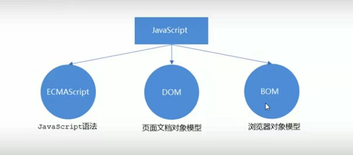
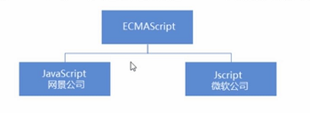

### 浏览器执行js简介

浏览器分成两部分：渲染引擎和js引擎

- `渲染引擎`：用来解析HTML和CSS，俗称内核，比如Chrome浏览器的blink内核，老版本中的webkit
- `JS引擎`：也称为JS解释器，用来读取网页中的JavaScript代码，对其处理后运行，比如Chrome浏览器中的V8引擎。


浏览器本身并不会执行js代码，而是通过内置JavaScript引擎（解释器）来执行js代码。js引擎执行代码时逐行解释每一句源码（转化为机器语言），然后由计算机去执行，所以JavaScript语言归为脚本语言，会`逐行`解释执行。


例子：

```js
    <script>
        alert("这是使用js中的alert进行弹窗的文字，第一条");
        alert("这是使用js中的alert进行弹窗的文字，第二条");
    </script>
```


### js三部分的组成




#### 1、ECMAScript

ECMAScript是由ECMA国际（原欧洲计算机制造商协会）进行标准化的一门编程语言，这种语言在万维网上应用广泛，它往往被称为JavaScript或JScript，但实际上规定了JS的编程语法和基础核心知识，是所有浏览器厂商共同遵守的一套JS语法工业标准。




ECMAScript：ECMAScript规定了JS的编程语法和基础核心知识，是所有浏览器厂商共同遵守的一套JS语法工业标准。


#### 2、DOM——文档对象模型

`文档对象模型`（Document Object Model，简称DOM），是W3C组织推荐的处理可扩展标记语言的标准编程接口。

通过DOM提供的接口可以对页面上的各种元素进行操作（大小、位置、颜色等）


#### 3、BOM——浏览器对象模型

BOM（Browser Object Model，简称BOM）是指`浏览器对象模型`，它提供了独立于内容的、可以与浏览器窗口进行互动的对象结构。通过BOM可以操作浏览器窗口，比如弹出框、控制浏览器跳转、获取分辨率等。

