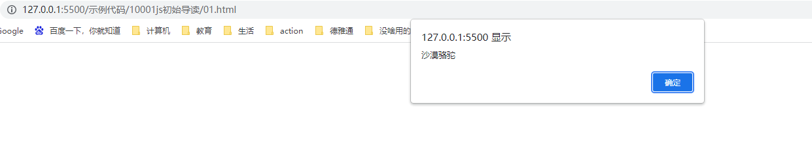

## js初体验

### js三种书写方式

js有三种书写位置，==行内、内嵌、外部==（类似css的三种引入方式）


例子：行内式的js，注意双引号内用之后使用单引号


```
<body>
    <input type="button" value="点击出现弹窗" onclick="alert('点击按钮，出现文字')";>
</body>
```

#### 行内式的js

- 可以将单行或少量js代码写在HTML标签的事件属性中（以on开头的属性），如：onclick。
- 注意单双引号的使用：在HTML中我们推荐使用双引号，js中我们推荐使用==单引号== 。
- 可读性差，在html中编写JS大量代码时，不方便阅读。
- 引号容易出错，引号多层嵌套匹配时，非常容易弄混。
- 行内式js建议在特殊情况下使用。


例子：



```
<head>
    <meta charset="UTF-8">
    <meta http-equiv="X-UA-Compatible" content="IE=edge">
    <meta name="viewport" content="width=device-width, initial-scale=1.0">
    <title>Document</title>
    <script>
        alert("沙漠骆驼");
    </script>
</head>
```


#### 内嵌式的js

- 可以将多行js代码写到<script>标签中
- 内嵌js是学习时常用的方式


例子：


```
<head>
    <meta charset="UTF-8">
    <meta http-equiv="X-UA-Compatible" content="IE=edge">
    <meta name="viewport" content="width=device-width, initial-scale=1.0">
    <title>Document</title>
    <script src="./02.js"></script>
</head>
```

#### 外部引入式js文件

- 利于HTML页面代码结构化，把大段js代码独立到HTML页面之外，既美观，也方便文件级别的复用。
- 利用外部js文件的script标签中间不可以写代码。
- 适合于js代码量比较大的情况。


### js注释

#### 单行注释	两个斜杠	==//== 

语法：

```
<script>
	//	js代码
</script>
```

例子：

```
    <script>
        //1.单行注释
        // alert("这是一个弹窗");
    </script>
```

==快捷键：ctrl + /==


#### 多行注释	==/*  js 代码  */==

语法：

```
    <script>
            /* js代码
            js代码 */
    </script>
```

例子：

```
    <script>
        /* alert("这个一个弹窗");
        alert("这个一个弹窗"); */
    </script>
```

默认==快捷键：shift+alt+A==


推荐修改一下快捷键为==shift+ctrl+/==，vscode中修改快捷键的方法


1、点击左下角的设置按钮，选择键盘快捷方式。


###### 


2、输入js默认设置多行代码的键位 ==shift+alt+A==


3、鼠标双击改行，出现此此页面。


4、按下推荐设置==shift+ctrl+/==组合键，出现此页面，点击回车，即设置成功。


