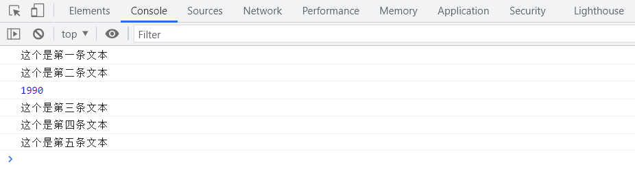
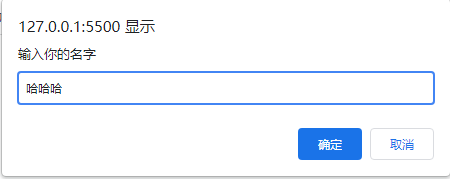
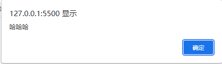
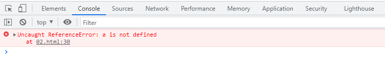
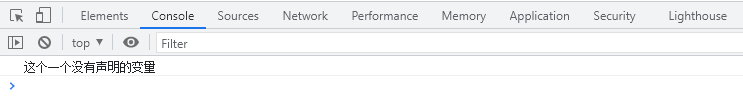
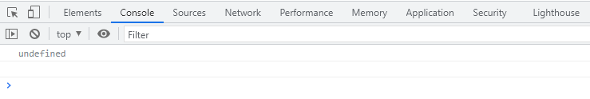
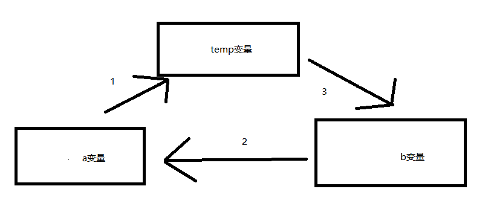

### 变量使用

变量在使用时分为两步：

1、声明变量

2、赋值


#### 1、声明变量

```
<script>
      // 声明变量
      var age;    //声明一个名称为age的变量
</script>
```

- var是一个js关键字，用来声明变量(variable变量的意思)。使用该关键字声明变量。
- age是程序员定义的变量名，我们要通过变量名来访问内存中分配的空间。


#### 2、赋值

```
    <script>
        //声明一个名称为age的变量
        var age;    
        // 赋值，给age这个变量赋值为19
        age = 19;
        // 输出变量
        console.log(age);
    </script>
```

- `=`用来把右边的值赋给左边的变量空间中，代表赋值的意思
- 变量值是保存到变量空间的值。


#### 3、变量初始化

```
  <script>
      // 声明变量赋值为20
      var age = 20;
      console.log(age);
      var myname = '这是我的名字';
      console.log(myname);
  </script>
```

- 声明一个变量并赋值，我们称之为`变量的初始化`
- 写法简介，代码量少。

注意：变量不要使用`name`，name是关键字。


#### 4、案例


1、使用所学知识，做出以下效果。




```
    <script>
        var a = '这个是第一条文本';
        var b = '这个是第二条文本';
        var c = 1990;
        var d = '这个是第三条文本';
        var e = '这个是第四条文本';
        var f = '这个是第五条文本';
        console.log(a);
        console.log(b);
        console.log(c);
        console.log(d);
        console.log(e);
        console.log(f);
    </script>
```


2、完成以下效果

- 弹出一个输入框，提示用户输入姓名。

- 然后弹出一个提示框，输出用户刚才输入的名字。

  

  

  

  

  

  ```
      <script>
          var myname = prompt('输入你的名字');
        	alert(myname);
      </script>
  ```

  

#### 5、变量的语法拓展

##### 		5.1更新变量

一个变量被重新赋值后，它原有的值就会被覆盖，变量值将以最后一次赋的值为准。

```
    <script>
        var myname = '测试';
        //console.log(demo);
        myname = '第二个测试';
        console.log(demo);
    </script>
```

##### 5.2同时声明多个变量

同时声明多个变量时，只需要写一个var，多个变量名之间使用英文逗号隔开。

```
    <script>
        // 声明多个变量写法1
        var demo1 = '测试1',demo3 = '测试2',demo3 = '测试3';
        // 声明多个变量的写法2
        var demo1 = '测试1',
            demo2 = '测试2',
            demo3 = '测试3';
        console.log(demo1);
        console.log(demo2);
        console.log(demo3);
    </script>
```

##### 5.3声明变量的特殊情况

###### 只声明，不赋值，输出结果为`undefined`

```
    <script>
        var a;
        console.log(a); //结果为undefined
    </script>
```

###### 不声明，不赋值，直接使用，输出结果显示为`报错`

```
    <script>
        console.log(a);
    </script>
```




###### 不声明，只赋值，输出结果为`本身的值`，因为JavaScript语言是一个弱类型语言。

```
    <script>
        a = '这个一个没有声明的变量';
        console.log(a);
    </script>
```





| 情况                                 | 说明                       | 结果      |
| ------------------------------------ | -------------------------- | --------- |
| var age;<br />console.log（age）;    | 只声明   不赋值            | undefined |
| console.log(age);                    | 不声明   不赋值   直接使用 | 报错      |
| age = 10；<br />console.log（age）； | 不声明   只赋值            | 10        |


#### 6、变量的命名规范

- 由字母(A-Za-2)、数字(09)、下划线（)、美元符号(＄)組成，如：UsTAge,num01, _name

- 变量名之间不能加空格，例如：var a b;

- 严格区分大小写。var app;和 var App;是两个变量

- 不能以数字开头。例子：18age 是错误的

- 不能 是关键字、保留字。例如：var、 for、 while

- 变量名必须有意义。nl （年龄）——> age，少用中文简写，用英文比较符合规范。

- 遵守宛峰命名法。首字母小写，后面单词的首字母需要大写。myFirstName

- 推荐翻译网站：有道 爱词霸

- 尽量不要使用==name==进行变量命名。

  ```
      <script>
          var tel;
          var name;
          console.log(tel);
          console.log(name);
      </script>
  ```

  

  

  ##### 以下变量名哪些为符合规范的变量名

  | 第一组    | 第二组       | 第三组        |
  | --------- | ------------ | ------------- |
  | var a     | var userName | var theWorld  |
  | var 1     | var $name    | var the world |
  | var age18 | var _sex     | var the_world |
  | var 18age | var &sex     | var for       |


#### 课堂练习

交换两个变量的值（实现思路：使用一个临时变量来做中间存储）。




```
    <script>
        //1、首先先建立一个临时变量
        // 2、把a给临时变量temp
        // 3、把b给临时变量a
        // 4、把temp变量再给b
        var a = '第一个变量';
        var b = '第二个变量';
        var temp;   //声明一个为空的变量
        temp = a;   //把a给临时变量temp
        a = b;      //把b给临时变量a
        b = temp;   //把temp变量再给b
        console.log(a);
        console.log(b);
    </script>
```


### 学完该节应该了解的内容

- 学会创建变量

- 明白变量的命名规范

- 学会交换变量

  