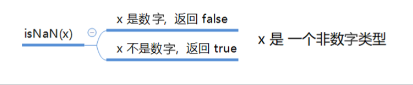
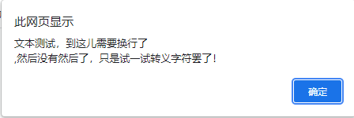

## 数据类型

### 为什么需要数据类型

在计算机中，不同的数据所需占用的存储空间是不同的，为了便于把数据分成所需内存大小不同的数据，充分利用存储空间，于是定义了不同的数据类型。

简单来说，数据类型就是数据的类别型号。比如姓名“张三”，年龄18，这些数据的类型是不一样的。

### 变量的数据类型

变量是用来存储值的所在处，它们有名字和数据类型。变量的数据类型决定了如何将代表这些值的位存储到计算机的内存中。==JavaScript 是一种弱类型或者说动态语言==。这意味着不用提前声明变量的类型。在程序运行过程中，类型会被自动确定，

```
    <script>
        var age = 10;                       //这是一个数字类型
        var str = '这是一个字符串类型';       //这是一个字符串类型
    </script>
```

在代码运行时，变量的数据类型是由JS 引擎 根据==等号==右边变量值的类型来判断的，运行完毕之后，变量就确定
了数据类型。

JavaScript 拥有==动态类型==，同时也意味着==相同的变量可用作不同的类型。==

```
    <script>
        var a = 10;
        a = 'a变量由数字类型变为字符串类型';
    </script>
```

### 数据类型的分类

js数据类型分为两类

- 基本数据类型（Number，String，Boolean，Undefined，Null）
- 复杂数据类型（object）

## 基本数据类型


| 简单数据类型 | 说明                                                   | 默认值    |
| ------------ | ------------------------------------------------------ | --------- |
| Number       | 数字型，包含整形值和浮点型的值，如21、0.21             | 0         |
| Boolean      | 布尔值类型，如true、false，等价与1和0                  | false     |
| String       | 字符串类型，如'张三'，注意js中，字符串类型都是带引号的 |           |
| Undefined    | var a;声明变量但是没有赋值，输出变量就是undefined      | undefined |
| Null         | var a = null;声明变量a为空值                           | null      |

### 数字型==Number==（重要）

JavaScript数字类型可以保存整数值，也可以保存小数（浮点类型）

```
    <script>
        var age = 18;   //整数
        var age = 18.5; //小数，浮点类型
        console.log(age);
    </script>
```

##### 1、数字类型的进制（了解）

最常见的进制有二进制、八进制、十进制、十六进制

js中设置数字类型时，==八进制前面加0，十六进制前面加0x==

```
    <script>
        var age = 022;
        console.log(age);   //输出18
        var age1 = 0x9;     //输出9
        var age1 = 0xa;     //输出10
        console.log(age1);
    </script>
```

注意：在设置数字类型时，如果不要设置此类型，避免使用==0开头==或者==0x开头==，除非数值类型中需要用到进制。

##### 2、数字型范围（了解）

JavaScript中数字类型的最大值（MAX_VALUE）和最小值（MIN_VALUE）

```
    <script>
        console.log(Number.MAX_VALUE);  // 1.7976931348623157e+308
        console.log(Number.MIN_VALUE);  // 5e-324
    </script>
```

##### 3、数字型的三个特殊值

```
    <script>
        console.log(Infinity);  //Infinity
        console.log(Number.MAX_VALUE*2);    //Infinity
        console.log(-Infinity); //-Infinity
        console.log(-Number.MAX_VALUE*2);  //-Infinity
        console.log('字符串类型'-123);  //NaN
        console.log(12-11); //1
    </script>
```

- Infinity，无穷大，大于任何数值

- -Infinity，无穷小，小于任何数值

- NaN，Not a Number ,不是一个数值


##### isNaN()

这个方法用来判断==值==是否为==非数字==，并且返回一个值，如果是数字返回的是false，如果不是数字返回的是true




```
    <script>
        console.log(isNaN('数字')); //true
        console.log(isNaN(123123)); //false
    </script>
```

### 字符串型String

字符串型可以是引号中的任意文本，其语法为 “**双引号**” 和 "**单引号**’’

```
var strMsg = "我爱北京天安门~";		//使用双引号表示字符串
var strMsg = '我爱北京';			  //使用单引号表示字符串
```

因为 HTML 标签里面的属性使用的是双引号，JS 这里我们更推荐**使用单引号**。


#### 字符串引号嵌套

JS可以用 **单引号嵌套双引号**，或者用 **双引号嵌套单引号**（**外双内单，外单内双**）

```
    <script>
        // var a = '这是一个'字符串'文本'; //报错
        // console.log(a);
        //外单内双
        var b = '这是一个"字符串"文本';    //这是一个"字符串"文本
        console.log(b);
        //外双内单
        var c = "这是一个'字符串'文本";    //这是一个'字符串'文本
        console.log(c);
    </script>
```


提问：如何让控制台的文本有换行效果？

```
var d = "这是一个'字<br/>符串'文本";    //这是一个'字<br/>符串'文本
```


#### 字符串转义符

类似HTML里面的特殊字符，字符串中也有特殊字符，我们称之为转义符。

转义符都是 \ 开头的，常用的转义符及其说明如下：

| 转义符 | 解释说明             |
| ------ | -------------------- |
| \n     | 换行符，n是newline   |
| \ \    | 斜杠\                |
| \ ’    | ’ 单引号             |
| \ ‘’   | ‘’ 双引号            |
| \ t    | tab 缩进             |
| \ b    | 空格，b是blank的意思 |

举例：使用==\n==转义符来看是否有换行效果

```
        var d = "这是一个'字\n'符串'文本";
        console.log(d);
```


##### 案例：弹出网页警示框



文本测试，到这儿需要换行了,然后没有然后了，只是试一试转义字符罢了！


#### 字符串的长度

字符串是由若干字符组成的，这些字符的数量就是字符串的长度。通过字符串的 **length** 属性可以获取整个字符串的长度。

```
    <script>
        var a = "这是一个字符串，一共有15个字";     //15
        console.log(a.length);
    </script>
```

注意：字符串内的**空格**也属于字符串中的长度

```
    <script>
        var a = "这是一个   字符串，一共有18个字";     //18
        console.log(a.length);
    </script>
```

#### 字符串的拼接

- 多个字符串之间可以使用 + 进行拼接，其拼接方式为 **字符串 + 任何类型 = 拼接之后的新字符串**
- 拼接前会把与字符串相加的任何类型转成字符串，再拼接成一个新的字符串

```
    <script>
        //字符串+字符串
        console.log('这是一个字符串'+'后面加了一串字'); //这是一个字符串后面加了一串字
        //字符串+数字的字符串
        console.log('字符串'+'110');//字符串110
        //字符串+数值类型
        console.log('字符串'+100);//字符串110
        //数值类型+数值类型
        console.log(100+100);   //200
        //数字的字符串+数值类型
        console.log('100'+100); //?
    </script>
```

**注意**：字符串 + 任何类型 =拼接之后的新字符串

- `+` 号总结口诀：**数值相加，字符相连**

  

#### 字符串拼接加强

```
    <script>
        var age1 = 10;
        console.log('测试今年age1岁了');    //测试今年age1岁了
        var age2 = 10;
        console.log('测试今年'+age2);   //测试今年10岁了
        // 引引加加 
        var age = 20;
        console.log('测试'+20+'岁');
    </script>
```

- 我们经常会将字符串和变量来拼接，因为变量可以很方便地修改里面的值
- 变量是不能添加引号的，因为加引号的变量会变成字符串
- 如果变量两侧都有字符串拼接，口诀"引引加加"，删掉数字，变量写在加号中间


#### 案例：显示年龄案例

要求：

1、弹出一个输入框（prompt），让用户输入年龄

2、随后使用alert语句弹出一个警示框（我今年多少岁了）


```
    <script>
        var age = prompt("请输入年龄");
        var str = '您今年已经'+age+'岁了';
        alert(str);
    </script>
```


### 布尔型Boolean 

- 布尔类型有两个值：true 和 false ，其中 true 表示真（对），而 false 表示假（错）。
- 布尔型和数字型相加的时候， true 的值为 1 ，false 的值为 0。

```
    <script>
        var flag = true;    //true为真，在加法运算中为1
        var flag1 = false;  //false为假，加法运算中为0
        console.log(flag+1);    //2
        console.log(flag1+1);   //1
    </script>
```

### undefined未定义

- 一个**声明后没有被赋值**的变量会有一个默认值 undefined

```
    <script>
        var a;
        console.log(a);     //undefined
    </script>
```

如果进行相连或者相加时，注意结果

1.undefined 和 字符串 相加，会==拼接字符串==

```
    <script>
        console.log(undefined+'字符串');    //undefined字符串
    </script>
```

2.undefined 和 数字相加，最后结果是**NaN**

```
    <script>
        console.log(undefined+123); //NaN
    </script>
```

### Null空值

- 一个声明变量给 null 值，里面存的值为空

```
    <script>
        var a = null;
        console.log(a); //null
        console.log(a+'字符串');    //null字符串
        console.log(a+12);  //12
    </script>
```

1.null和字符串相加，拼接字符串

2.null和数字相加，为空值加数字
