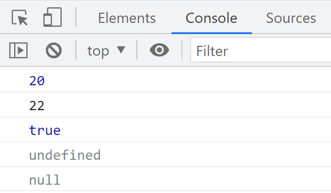

### `typeof`检测变量的数据类型

**typeof** 可用来获取检测变量的数据类型

```
    <script>
        var num = 12;
        console.log(typeof num);    //number
        var str = ' a string';
        console.log(typeof str);    //  string
        var flag = true;
        console.log(true);          //true
        var un  = undefined;
        console.log(undefined);     //undefined
        var time = null;
        console.log(typeof time);     //object
    </script>
```

不同类型的返回值

| 类型      | 例               | 结果        |
| --------- | ---------------- | ----------- |
| string    | typeof “小白”    | “string”    |
| number    | typeof 18        | “number”    |
| boolean   | typeof true      | “boolean”   |
| undefined | typeof undefined | “undefined” |
| null      | typeof null      | “object”    |

**注意：prompt文本输入框的值，使用typeof检测全显示为字符串。**

```
var pr = prompt('请输入字符内容');
alert( typeof pr);		//string
```


### 字面量

字面量是在源代码中一个固定值的表示法，通俗来说，就是字面量表示如何表达这个值。

- 数字字面量：8，9，10
- 字符串字面量：‘大前端’，‘后端’
- 布尔字面量：true、false

例如：数字类型在**控制台**是蓝色，字符串是黑色，布尔值是蓝色、undefined和null是灰色。

```
    <script>
        console.log(20);
        console.log('22');
        console.log(true);
        console.log(undefined);
        console.log(null);
    </script>
```




通过**控制台**的颜色判断属于哪种数据类型

| 黑色 | 字符串            |
| ---- | ----------------- |
| 蓝色 | 数值和布尔值      |
| 灰色 | undefined 和 null |

