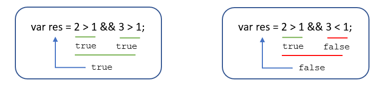
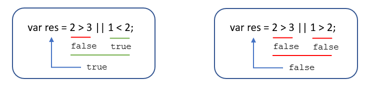

## 09运算符

运算符（operator）也被称为**操作符**，是用于实现赋值、比较和执行算数运算等功能的符号

JavaScript 中常用的运算符有：

- 算术运算符
- 递增和递减运算符
- 比较运算符
- 逻辑运算符
- 赋值运算符

### 算术运算符

概念：算术运算使用的符号，用于执行两个变量或值的算术运算。

| 运算符 |      描述      |          实例           |
| :----: | :------------: | :---------------------: |
|   +    |       加       |       10 + 20 =30       |
|   -    |       减       |      10 - 20 =-10       |
|   *    |       乘       |      10 * 20 =200       |
|   /    |       除       |      10 / 20 =0.5       |
|   %    | 取余数（取模） | 返回出发的余数 9 % 2 =1 |

```
    <script>
        console.log(1+1);   //2
        console.log(1-1);   //0
        console.log(1*1);   //1
        console.log(1/1);   //1
        //取余数
        console.log(4%2);   //0
        console.log(5%3);   //2
        console.log(4%5);   //4,小值取大值，等于小数
    </script>
```


#### 	浮点数的精度问题

浮点数值的最高精度是**17位小数**，但在进行算数计算时其精确度远远不如整数

```
    <script>
        var a = 0.1+0.2;
        console.log(a);     //0.30000000000000004
        console.log(0.07*100);  //7.000000000000001
        var num = 0.1+0.2;
        console.log(num==0.3);     //false
    </script>
```

所以**不要直接判断两个浮点数是否相等**

#### 算术运算符优先级

先乘除，后加减，有小括号先算小括号里面。

### 表达式和返回值

`表达式`概念：由数字、运算符、变量等能求得数值的有意义的排列方法所得的组合。（由数字、运算符、变量等组成的式子）

```
    <script>
        console.log(1+1);   //2
        //数学里面1+1=2
        //编程中2 = 1+1
        var num = 1+1;  //2
    </script>
```

### 递增和递减运算符

递增（++）

递减（- -）

放在`变量`前面时，我们称为**前置递增(递减)运算符**

放在`变量`后面时，我们称为**后置递增(递减)运算符**

**注意**：递增和递减运算符必须和变量配合使用。


#### 	前置递增运算符

++num	展示效果等于	 num = num + 1，++num使用起来更加简单

使用口诀:**先自加1，后返回值**

```
    <script>
        var num = 10;
        alert (++num + 10); // 21
    </script>
```

先自加 10+1=11，返回11，此时num=11


#### 	后置递增运算符

num ++   展示效果等于   num = num +1，前置那个自增和后置自增单独使用时，效果相同

使用口诀:**先返回原值，后自加1**

```
    <script>
        var num = 10;
        console.log(10 + num++); // 20
        console.log(num);   //11
    </script>
```

#### 	总结

- 前置递增和后置递增运算符可以简化代码的编写，让变量的值 + 1 比以前写法更简单
- 单独使用时，运行结果相同，与其他代码联用时，执行结果会不同
- 后置：先原值运算，后自加
- 前置：先自加，后运算
- 开发时，大多使用后置递增/减，并且代码独占一行，num ++   ，num--

#### 练习

```
    <script>
        // 前置自增运算
        var a = 10;
        ++a;    //11 a=11
        var b = ++a +2; //a=12 ++a=12
        console.log(b); //14
        //后置自增运算
        var c = 10;
        c++;    //c++=11 c=11
        var d = c++ +2; //c++ = 11
        console.log(d); //13
        console.log(c); //12
        //汇总练习
        var e = 10;
        var f = e++ + ++e;  //e++ 后置递增,先返回原值，后自加1  e++  = 10  e = 11;
        //++e 前置递增，先自加1，后返回值。此时e = 11; ++e = 12
        console.log(f); //22
    </script>
```


### 比较（关系）运算符

比较运算符是**两个数据进行比较时所使用的运算符**，比较运算后，会**返回一个布尔值**(true / false)作为比较运算的结果。

| 运算符名称 | 说明                        | 案例        | 结果  |
| ---------- | --------------------------- | ----------- | ----- |
| <          | 小于号                      | 1 < 2       | true  |
| >          | 大于号                      | 1 > 2       | false |
| >=         | 大于等于号(大于或者等于)    | 2 >= 2      | true  |
| <=         | 小于等于号(小于或者等于)    | 3 <= 2      | false |
| ==         | 判等号(会转型)              | 37 == 37    | true  |
| !=         | 不等号                      | 37 != 37    | false |
| === ! ==   | 全等 要求值和数据类型都一致 | 37 === ‘37’ | false |

#### 	 = 小结

| 符号 | 作用 | 用法                                   |
| ---- | ---- | -------------------------------------- |
| =    | 赋值 | 把右边给左边                           |
| ==   | 判断 | 判断两边值是否相等(注意此时有隐士转换) |
| ===  | 全等 | 判断两边的值和数据类型是否完全相同     |

```
    <script>
        console.log(18 == '18');		//true
        console.log(18 === '18');		//false
    </script>
```

### 逻辑运算符

逻辑运算符是用来进行布尔值运算的运算符，其返回值也是布尔值

| 逻辑运算符 | 说明                   | 案例            |
| ---------- | ---------------------- | --------------- |
| &&         | “逻辑与”，简称"与" and | true && false   |
| \|\|       | “逻辑或”，简称"或" or  | true \|\| false |
| ！         | “逻辑非”，简称"非" not | ！true          |

逻辑与：两边都是 true才返回 true，否则返回 false 



逻辑或	：两边都为 false 才返回 false，否则都为true




逻辑非：逻辑非（!）也叫作取反符，用来取一个布尔值相反的值，如 true 的相反值是 false

```
    <script>
        var isOk = !true;
        console.log(isOk);  // false
        //逻辑非（!）也叫作取反符，用来取一个布尔值相反的值，如 true 的相反值是 false
    </script>
```

#### 逻辑运算符练习

```
    <script>
        var num = 7;
        var str = '这是不是7个字';
        console.log(num > 5 && str.length >=num) ;      //ture,&&逻辑与（和）结果为真
        console.log(num < 5 && str.length >=num);       //false
        console.log(!(num<10)); //false
        console.log(!(num <10 || str.length == num));   //false
    </script>
```


#### 	短路运算(逻辑中断)

短路运算的原理：当有多个表达式（值）时,左边的表达式值可以确定结果时,就不再继续运算右边的表达式的值

如果有空的或者否定的为假，其余都是真的 `0 '' null undefined NaN`

##### 		逻辑与

- 语法：表达式1 && 表达式2

- 如果第一个表达式的值为真，则返回表达式2

- 如果第一个表达式的值为假，则返回表达式1

  例子：

  ```
  console.log(123 && 456);   //456
  console.log(0 && 456);     //0
  console.log(123 && 456 && 789);  //789
  console.log(0 && 1 + 2 && 45 * 10000);  //0
  console.log('' && 1 + 2 && 45 * 10000);  // 
  console.log(null && 1 + 2 && 45 * 10000);  // null
  console.log(undefined && 1 + 2 && 45 * 10000);  //undefined
  console.log(NaN && 1 + 2 && 45 * 10000);        //NaN
  ```

##### 		逻辑或

- 语法：表达式1 || 表达式2

- 如果第一个表达式的值为真，则返回表达式1

- 如果第一个表达式的值为假，则返回表达式2

  ```
  console.log(123 || 456); //123
  console.log(0 || 456);   //456
  console.log(123 || 456 || 789);  //123
  ```

  **逻辑中断很重要，会影响程序运行的结果。**
  
  ```
  var num = 0;
  //逻辑中断很重要，会影响程序运行的结果。
  console.log(123 || num++);
  // 先返回在加，相当于 (123 || 0)
  console.log(num);    // 123
  ```

### 赋值运算符

概念：用来把数据赋值给变量的运算符。

| 赋值运算符 | 说明                 | 案例                        |
| ---------- | -------------------- | --------------------------- |
| =          | 直接赋值             | var usrName = ‘我是值’      |
| += ，-=    | 加，减一个数后再赋值 | var age = 10； age+=5；//15 |
| *=，/=，%= | 成，除，取模后再赋值 | var age = 2; age*=5; //10   |

```
var age = 10;
age += 5;  // 相当于 age = age + 5;
age -= 5;  // 相当于 age = age - 5;
age *= 10; // 相当于 age = age * 10;
```


### 运算符优先级

| 优先级 |   运算符   |             顺序              |
| :----: | :--------: | :---------------------------: |
|   1    |   小括号   |              ()               |
|   2    | 一元运算符 |           ++ -- ！            |
|   3    | 算数运算符 |        先 \* / 后 + -         |
|   4    | 关系运算符 |      **>, >= , < , <=,**      |
|   5    | 相等运算符 |        ，！=，=，！==         |
|   6    | 逻辑运算符 | **先 && 后 \|\|（先与后或）** |
|   7    | 赋值运算符 |               =               |
|   8    | 逗号运算符 |              ，               |

1.一元运算符里面的**逻辑非**优先级很高

2.**逻辑与** 比 **逻辑或** 优先级高

#### 	练习题：

```
console.log( 4 >= 6 || '人' != '阿凡达' && !(12 * 2 == 144) && true)	// true
```

```
var a = 3 > 5 && 2 < 7 && 3 == 4; 
console.log(a); 	//false 

var b = 3 <= 4 || 3 > 1 || 3 != 2; 
console.log(b); 	//true

var c = 2 === "2"; 
console.log(c);  	//false

var d = !c || b && a ;
console.log(d);		//true
```

