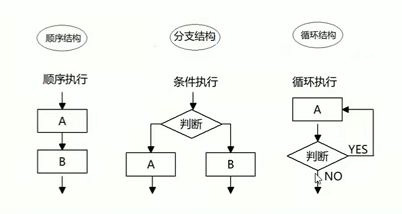
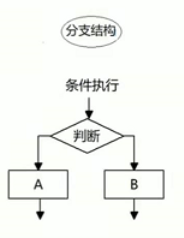
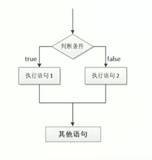

### 流程控制概念

在一个程序执行的过程中，各条代码的执行顺序对程序的结果是有直接影响的。我们可以通过控制代码的执行顺序来实现想要显示的效果。

简单来说：流程控制就是来控制代码按照哪一种结构来执行。

流程控制主要有三种结构，分别是`顺序`结构、`分支`结构和`循环`结构，这三种结构代表三种代码执行的顺序




### 顺序结构的流程控制（了解）

顺序结构是程序中最简单、最基本的流程控制，没有特定的语法结构，程序会按照代码的`先后顺序，依次执行`，程序中大部分代码都是这样执行的。

### 分支结构的流程控制（重要）

由上到下执行代码的过程中，根据不同的代码路径（通过不同的条件选择不同的代码路径），从而得到不同的结果。



JS 语言提供了两种分支结构语句：**if语句**     **switch语句**

#### if分支语句

```
    <script>
        //if的语法结构 ，if如果
        if (条件表达式) {
            //执行语句
        }
        //执行顺序，如果if里面的条件表达式为真true时，则执行大括号里面的执行语句，如果条件表达式为false时，则不执行大括号里面的语句，按照顺序结构执行代码。
    </script>
```

```
    <script>
        if (3 < 5) {
            console.log('测试');
        }
    </script>
```

##### 案例：

弹出一个输入框，要求用户输入年龄，如果年龄大于等于 18 岁，允许进网吧

```

<script>
    var age = prompt('....');
    if (age >= 18 ) {
        console.log('欢迎光临');
    }
</script>
```

#### if else 分支语句

##### 语法结构

```
<script>
    // 条件成立，执行if里面代码，否则执行else里面的代码
    if(条件表达式)
    {
        //[如果]条件成立执行的代码
    }
    else{
        //[否则]执行的代码
    }
</script>
```

##### 案例：

```
<script>
    var age = prompt('输入值');
    if (age >=18) {
        console.log('大于等于18');
    } else {
        console.log('小于18');
    }
</script>
```

##### 执行流程



#### if else if 语句（多分支语句）

利用多个条件来选择不同的语句执行，得到不同的结果。

##### 语法结构

```
<script>
    if(条件表达式1){
        语句1;
    }else if(条件表达式2){
        语句2;
    }else if(条件表达式3){
        语句3;
    }else{
        //上述条件都不成立执行此处代码

    }
</script>
```

如果条件表达式1满足就执行，语句1执行完毕后，退出整个if分支语句

如果表达式1不满足，则判断表达式2，满足的话，执行语句2，以此类推。

注意点：

1、多分支语句是多选1，最后`只有一个语句执行`。

2、else if 理论上可以创建任意多个的`判断语句`

##### 练习：判断成绩级别

接收用户输入的分数，根据分数输出对应的等级字母 A、B、C、D、E

其中：

90分(含)以上 ，输出：A

80分(含)~ 90 分(不含)，输出：B

70分(含)~ 80 分(不含)，输出：C

60分(含)~ 70 分(不含)，输出：D

60分(不含) 以下，输出： E


案例分析：

按照从大到小的判断的思路

```
    <script>
        var fenshu = prompt('分数');
        if (fenshu >= 90) {
            console.log('90分以上');
        } 
        else if(fenshu >= 80){
            console.log('80分以上');
        }
        else if(fenshu >= 70){
            console.log('70分以上');
        }
        else if(fenshu >= 60){
            console.log('60分以上');
        }
        else {
            alert('啊这，分数。');
        }
    </script>
```

#### 三元表达式

##### 语法结构

条件表达式 ？表达式1 ：表达式2

如果条件表达式结果为真，则  `返回` 表达式1的值，如果条件表达式结果为假 则`返回`表达式2的值

```
    <script>
        var num = 10;
        var re = num > 5 ? '是的' : '不是的'; //10>5,为真，返回表达式1的值。
        console.log(re);
    </script>
    
    
    //使用if如何做出以上效果。
    <script>
        var num = 10;
        if(num > 5 ){
            console.log('正确');
        }else{
            console.log('错误');
        }
    </script>
```

