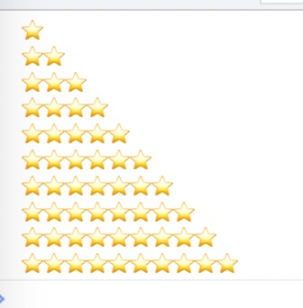
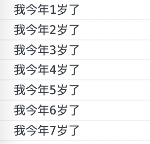

### 循环

`循环`的目的：重复执行某些代码。

```
    <script>
        //循环的目的：可以重复执行某些代码。
        console.log('哈哈哈');
        console.log('哈哈哈');
        console.log('哈哈哈');
        console.log('哈哈哈');
        console.log('哈哈哈');
        console.log('--------------------------');
        for(var i = 1;i <= 100; i++){
            console.log('哈哈哈');
        }
    </script>
```

#### JS中的循环

js中，主要有三种类型的循环语句。

- for循环
- while循环
- do...while循环

#### for循环

在程序中，一组被重复执行的语句被称为`循环体`，能够继续重复执行，取决于循环的`终止条件`。循环体及循环的终止条件组成的语句，被称为`循环语句`。

##### 语法结构

for循环主要用于把某些代码循环若干次，通常跟计数有关系。语法结构如下：

```
<script>
    //for 语法结构
    // for(初始化变量;条件表达式;操作表达式){
    //     //循环体
    // }
    //1、初始化变量，使用var声明的一个普通变量，通常用于作为计数器使用
    //2、条件表达式，用来决定每一次循环是否继续执行，简单来说是终止条件。
    //3、操作表达式，每次循环最后执行的代码，通常用于计数器变量进行更新（递增或者递减）
    //4、代码演示，循环100句，hello world
    for(var i=1;i<=100;i++){
        console.log('hello world');
    }
</script>
```


##### for循环的执行过程

```
    <script>
        //for   循环的执行过程
        for(var i=1;i<=100;i++){
            console.log('hello world');
        }
        // 1、首先执行里面的计数器变量 var i = 1,在for里面只执行一次。
        // 2、i<=100 用来判断是否满足条件。如果满足条件，就去执行循环体，不满足条件则退出循环。
        // 3、最后去执行 i++  i++是单独写的代码，表示递增。
        // 4、接着去执行 i <= 100 ,如果满足条件，则接着执行循环体，不满足条件退出循环(第二轮)。
    </script>
```


##### 断点调试

断点调试是指自己在程序的某一行设置一个断点，调试时，程序运行到这一行就会停住。然后就可以一步一步往下调试，调试过程中可以看到各个变量当前的值，出错的话，调试到出错的代码行会显示错误，停止。

断点调试可以放我们看到程序的运行过程。

使用方法:

浏览器中按`F12-`->`sources`-->`找到需要调试的文件`-->`在js程序中某一行设置断点`。

watch：监视，通过watch可以监视变量的值的变化，很常用。

F11：程序单步执行，让程序一行一行的执行，这个时候，可以观察watch中变量的值的变化。

目前只介绍这几个功能，后面涉及到会深入讲解。


##### for循环重复执行相同代码

```
    <script>
        // for循环可以执行相同的代码
        for (var i = 1;i < 10;i++) {
            console.log('123123');
        }
        // 通过prompt来控制输出循环的次数
        var a = prompt('...');
        for(var i = 1;i <= a;i++){
            console.log('我是可以被控制得');
        }
    </script>
```


##### for循环重复不相同的代码

```
    <script>
        // 循环金额一重复执行不同的代码 ，因为我们有计数器变量 i 的存在 i 每次循环值都在变化
        // 我们想要输出1个人的年龄，1~99岁
        for(var i = 1; i < 100;i++){
            console.log('我今年是'+ i +'岁');
        }
        
        
        // for循环中使用if else if多分支语句
        for(var i = 1;i < 100 ;i++){
            if(i == 1){
                console.log('1岁刚出生');
            }else if(i == 99){
                console.log('真棒，活到了99岁了呢');
            }else{
                console.log('我今年是'+ i +'岁');
            }
        }
    </script>
```

##### for循环重复某些相同的操作

for循环因为有了计数器的存在，我们还可以重复的执行某些操作，比如做一些算数运算。


###### 案例1：求1-100之间所有整数的累加和（答案：5050）

思路：

1、1-100，需要循环100次。计数器限制为100

2、其次需要一个储存结果的变量`sum`，初始值为`0`

3、核心算法研究：1+2+3+4+5+6+7.......，sum = sum + i；

```
1+2+3+4+5+6+7+8+9+10
  3+3
    6+4
      10+5
      	 15+6
      	 		sum + i
sum = sum + i;
```

```
<script>
    var sum = 0;  //和的变量，值为0
    for(var i = 1;i <= 100;i++){
        // sum = sum + i;
        // 赋值运算符  += 的写法
        sum += i;
    }
    console.log(sum);
</script>
```


###### 案例2：求1~100之间所有数总和的平均值（5050/100=50.5 答案50.5）

思路：

1、先求1~100的和，方法同上。

2、需要一个求`average` 平均数变量。

3、用总和`average = sum/100`求平均值。

```
<script>
    var sum = 0;  //和的变量，值为0
    var average = 0; //存储平均数的变量
    for(var i = 1;i <= 100;i++){
        // sum = sum + i;
        // += 赋值运算符的写法
        sum += i;
    }
    average = sum / 100;
    console.log(average);
</script>
```


###### 案例3：求1~100之间所有偶数和奇数的和  （偶数的和答案为2550，奇数的和答案为2500）

思路：

1、能够被 2 整除的是偶数，否则就是奇数。

2、还是需要先设置储存变量的值，一个为偶数变量的值 `even`，一个为奇数变量的值`odd`

```
<script>
    var even = 0;
    var odd = 0;
    for(var i = 1;i <= 100; i++){
        if(i % 2 == 0){
            even += i;
        }else{
            odd += i;
        }
    }
    console.log('偶数和为'+even);
    console.log('奇数和为'+odd);
</script>
```


###### 案例4：求1~100之间所有能被3整除的数字之和。（答案：1683）

思路：

1、只要能够被 3 整除的数字。 `i % 3 == 0`

```
<script>
    var res = 0; //存储1~100能够被3整除的数字之和的变量
    for(var i = 1;i <= 100;i++){
        if(i % 3 ===0){
            res += i;
        }
    }
    console.log('1~100能够被3整除的数字之和为'+res);
</script>
```

#### 双重for循环

概念：**循环嵌套**是指在一个循环语句中再定义一个循环语句的语法结构，例如在for循环语句中，可以再嵌套一个for 循环，这样的 for 循环语句我们称之为双重for循环。

##### 语法结构

```
    <script>
        //双重for循环
        for(外循环的初始;外循环的条件;外形循环的操作表达式){
            for(内循环的初始;内循环的条件;内循环的操作表达式){
                需执行的代码;
            }
        }
        //1、内循环可以理解为 console.log(）
        //2、外层循环一次，里面的循环将全部执行。
    </script>
```

例子：

```
    <script>
        // 例子：
        for(var i = 1;i < 4;i++){
            console.log('外层循环第'+i+'次');
            for(var j = 1;j < 3; j++){
                console.log('内循环'+j+'次');
            }
        }
    </script>
```

案例：打印五行星星。

```
    <script>
        // 用双重for循环打印3行3列⭐
        var str = '';
        for(var i = 1; i <= 3;i++){ //负责打印3行
            for(var j = 1; j <= 3; j++){    //内循环负责每一次打印出来的内容
                str = str + '⭐';
            }
            str = str + '\n'    //当内循环的星星循环完后，需要添加转移字符 \n , 否则就是以一堆的状态显示出来的
            // str += '\n';
        }
        console.log(str);
    </script>
```

案例：尝试自定义打印n行n列的星星效果。

```
    <script>
        var a = prompt('几行');
        var b = prompt('几列');
        var str = '';
        for(var i = 1; i <= a;i++){ //负责打印n行
            for(var j = 1; j <= b; j++){    //内循环负责每一次打印出来的内容
                str = str + '⭐';
            }
            str = str + '\n'    //当内循环的星星循环完后，需要添加转移字符 \n , 否则就是以一堆的状态显示出来的
            // str += '\n';
        }
        console.log(str);
    </script>
```

案例：打印倒三角的星星图


```
    <script>
        var str = '';
        for(var i = 1;i <= 10;i++){     //i = 1 时，外循环一次，内循环10次
            // str = str + '⭐' + '\n'; 
            for(var j = i;j <= 10; j++){        //当内循环10次后，跳出，执行第二次外循环，此时i = 2；内循环j=2，运行9次。依次类推。
                str = str + '⭐'; 
            }
            str = str + '\n';
        }
        console.log(str);
    </script>
```

案例：打印正三角的星星图



```
    <script>
        var str= '';        
        // 外循环第一次，i = 1;
        for(var i = 1; i <= 10;i++){
            // 外循环第一次时，内循环，j = 1，i=1， j<=1, 此时，j只循环一次，显示为一颗星
            for(var j= 1; j <= i;j++){
                str = str + '⭐';
            }
            str = str +'\n';
        }
        console.log(str);
    </script>
```

案例：打印 `九九` 乘法表

```
    <script>
        // 99乘法表
        // 一共有9行，因为每行个数不一样，所有需要用到双重 for 循环
        // 外层的 for 循环控制 行数 i 
        // 内循环 for 循环控制 公示的循环 j
        // 核心算法，每一行的公示个数正好要和行数一致。j<=i
        // 每行打印完后，需要重新换行，使用 \n 换行符进行换行。
        var str= '';        
        // 外循环第一次，i = 1;
        for(var i = 1; i <= 9;i++){
            // 外循环第一次时，内循环，j = 1， j<=1, 此时，j只循环一次
            for(var j= 1; j <= i; j++){
                // 1 * 1 = 1;
                // 1 * 2 = 2;
                str += i +'*'+ j + '=' + i * j + '\t';
            }
            str = str +'\n';
        }
        console.log(str);
    </script>
```

#### for循环总结

- for 循环可以重复执行某些相同的代码
- for循环可以重复执行不同的代码，使用计数器进行显示效果判断。
- for循环可以重复执行一些操作，例如算术运算符加法操作。
- 双重for循环可比for循环的使用方法要更加全面。
- 双重for循环，外层循环一次，内层for循环全部执行。

#### while循环

##### 语法结构

```
    <script>
        while (条件表达式) {
            //循环制行语句
        }
        // 执行思路：当条件表达式为true时，执行循环体，否则，退出循环体。
    </script>
```

##### 执行思路：

1、先执行条件表达式，如果结果为 true，则执行循环体代码；如果为 false，则退出循环，执行后面代码

2、执行循环体代码

3、循环体代码执行完毕后，程序会继续判断执行条件表达式，如条件仍为true，则会继续执行循环体，直到循环条件为 false 时，整个循环过程才会结束

4、和for循环一样，需要有计数器、初始化变量

**注意：**

1、使用 while 循环时一定要注意，它必须要有退出条件，否则会称为死循环

2、while 循环和 for 循环的不同之处在于 while 循环可以做较为复杂的条件判断，比如判断用户名和密码

##### 语法例子：

```
    <script>
        var a = 1;
        while (a <= 100) {
            console.log('执行'+a+'次');
            a++;
        }
    </script>
```

##### 案例1：使用while 语句，打印1~100岁的岁数



```
    <script>
        var a = 1;
        while (a <= 100) {
            console.log('我今年'+a+'岁了');
            a++;
        }
    </script>
```

##### 案例2：计算1~100之间所有整数的和

```
    <script>
        var sum = 0;
        var j = 1;
        while(j <= 100){
            sum += j;
            j++
        }
        console.log(sum);
    </script>
```

##### 案例3：弹出一个提示框，输入相对应123，方可进入下一个流程。

```
    <script>
        var msg = prompt('请输入123');
        while(msg !== '123'){
            msg = prompt('不输入123，是看不到后面的内容的');
        }
        alert('真乖！');
    </script>
```

#### do while循环

##### 语法结构

```
    <script>
        do {
            // 循环体，条件表达式为 true 时，重复执行循环体代码
        } while (条件表达式);
    </script>
```

##### 执行思路

执行思路：

1. 先执行一次循环体代码
2. 再执行表达式，如果结果为true，则继续执行循环体代码，如果为false，则退出循环，继续执行后面的代码
3. 先执行再判断循环体，所以dowhile循环语句至少会`执行一次循环体代码`

##### 语法例子：

```
    <script>
        var i = 1;
        do {
            console.log('今年我'+i+'岁了');
            i++
        } while (i <= 10);
    </script>
```

##### 案例1：计算1~100之间所有整数的和。

```
    <script>
        var sum = 0;
        var i = 1;
        do {
            sum += i;
            i++
        } while (i <= 100);
        console.log(sum);
    </script>
```

##### 案例2：弹出一个提示框，输入相对应123，方可进入下一个流程。

```
    <script>
        do {
            var msg = prompt('请输入123');
        } while (msg !== '123');
        alert('真乖~');
    </script>
```

#### 循环总结

- JS循环中有for、while、do...while
- 三个循环大部分情况下可以相互替换使用
- 用来计次数，和数字相关的，三者使用基本相同，大部分情况下用for
- while 和 do...while 执行顺序不一样，while先判断后执行，do...while 先执行一次，再进行判断执行。
- while 和 do...while执行次数不一样，do...while至少会执行一次循环体，while则一次也不执行。

#### continue 关键字

`continue` 关键字用于**立即跳出本次循环，继续下一次循环**（本次循环体中 continue 之后的代码就会少执行一次）。

例子：

```
    <script>
        for (var i = 1; i <= 5; i++) {
            if (i == 3) {
                console.log('这个包子有虫子，扔掉');
                continue; // 跳出本次循环，跳出的是第3次循环 
            }
            console.log('我正在吃第' + i + '个包子呢');
        }
    </script>
```


案例：求1~100之间，除了能够被7整除之外的整数和。（ 答案 4315 ）

```
    <script>
        // 求1~100之间，除了能够被7整除之外的整数和
        var sum = 0;
        for(var i = 1; i <= 100; i++){
            if(i % 7 == 0){
                continue;
            }
            sum += i;
        }
        console.log(sum);
    </script>
```

#### break关键字

`break` 关键字用于**立即跳出整个循环**（直接结束）

```
    <script>
        for (var i = 1; i <= 5; i++) {
            if (i == 3) {
                console.log('这个包子有虫子，扔掉,后面的我也不吃了。。。。');
                break; // 当 i == 3 时，直接结束循环 
            }
            console.log('我正在吃第' + i + '个包子呢');
        }
    </script>
```

#### 案例：

##### 案例1：水仙花数     https://blog.51cto.com/u_15060467/4115259
