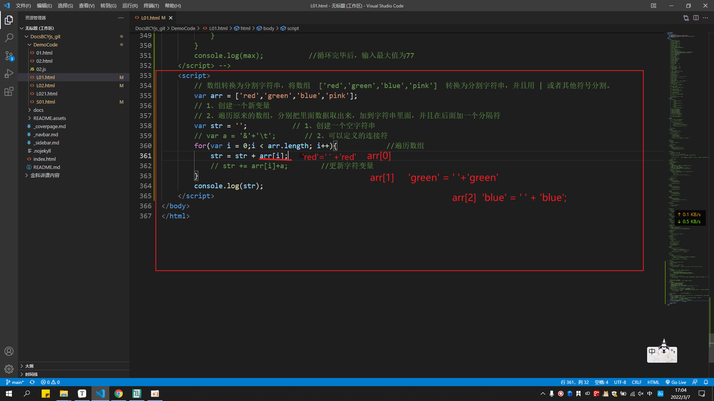
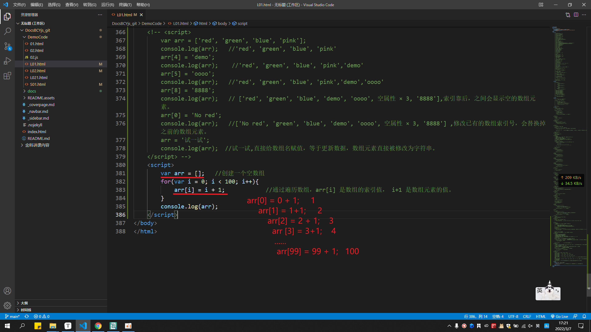
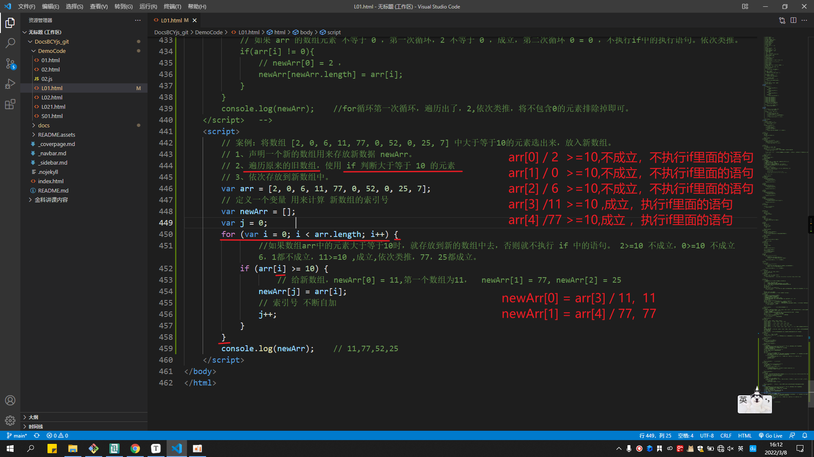
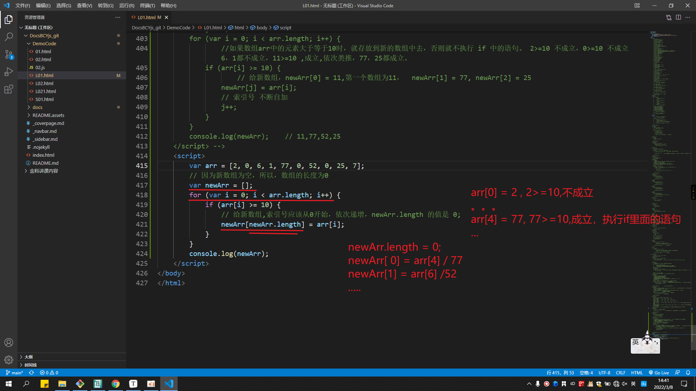
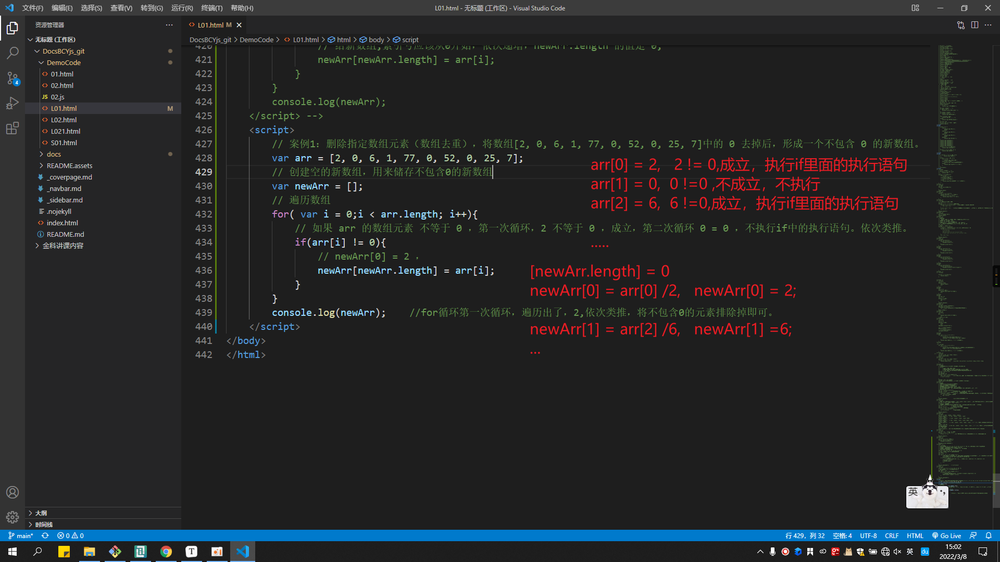

## 数组的概念

数组(Array)是指`一组数据的集合`，其中的每个数据被称作`元素`，在数组中可以`存放任意类型的元素`。数组是一种将`一组数据存储在单个变量名下`的优雅方式。

```
    <script>
        var a = 1;
        var b = [1,2,3,4,5,6];
    </script>
```

### 数组的创建方式

JavaScript 中创建数组有两种方式：

- 利用 new 创建数组
- 利用数组字面量创建数组

#### 利用 new 创建数组

```
    <script>
        var 数组名 = new Array();
        var arr = new Array(); //创建一个新的空数组
    </script>
```

- 这种方式暂且了解，
- 注意 `Array()`，A要大写

#### 利用数组字面量创建数组

```
    <script>
        // 1.利用数组字面量方式创建空的数组 
        var 数组名 =[];
        // 2.使用数组字面量方式创建带初始值的数组
        var 数组名 =['小白','小黑','小黄','瑞奇'];
        // 3.数组中可以存放任意类型的数据，例如字符串，数字，布尔值等
        var arrStus =['小白',12,true,28.9];
    </script>
```

- 数组的字面量是方括号 `[]`
- 声明数组并赋值称为数组的初始化
- 这种字面量方式也是我们以后最多使用的方式
- 数组之间的值需要用`英文逗号`隔开
- 数组里面的数据，被称为数组元素

#### 数组元素类型

数组中可以存放任意类型的数据，例如字符串，数字，布尔值等

```
var arrStus =['小白',12,true,28.9];
```

### 访问数组中的元素

#### 数组的索引（下标）

索引（下标）：用来访问数组元素的序号（数组的下标是从0开始的）

```
var arr = ['甲','已','丙','丁'];
//索引:      0,1,2,3
```

数组可以通过索引来访问、设置、修改对应的数组元素，我们可以通过"`数组名[索引值]`"的形式来获取数组中的元素。

```
    <script>
        var arrStus =['小白',12,true,28.9];
        console.log(arrStus[0]);    //小白
        console.log(arrStus[1]);    //12
        console.log(arrStus[2]);    //true
        console.log(arrStus[3]);    //28.9
        console.log(arrStus[4]);    //undefined
    </script>
```

如果数组元素中，没有对应的数组元素的值，输出结果会为`undefined`


##### 案例：定义一个数组，里面存放星期一、星期二.....一直到星期日（共7天），使用弹窗的方式弹出：星期日。	

```
    <script>
        var arr = ['星期一','星期二','星期三','星期四','星期五','星期六','星期七'];
        console.log(arr[6]);
    </script>
```


### 遍历数组

从头到尾将数组元素访问一遍。

如果通过下标的方式获取，只能一个个获取。通过遍历数组，可以将所有数组元素全部提取出来。

```
    <script>
        var arrStus =['小白',12,true,28.9];
        console.log(arrStus[0]);    //小白
        console.log(arrStus[1]);    //12
        console.log(arrStus[2]);    //true
        console.log(arrStus[3]);    //28.9
        console.log(arrStus[4]);    //undefined
    </script>
```

获取数组的元素时，代码是重复的，变化的是索引的值，并且索引值一直是递增的。可以通过循环的方式将数组元素遍历出来。

```
    <script>
        // 数组索引访问数组中的元素
        var arr = ['red','green', 'blue'];
        console.log(arr[0]) // red
        console.log(arr[1]) // green
        console.log(arr[2]) // blue

        // for循环遍历数组
        var arr = ['red','green', 'blue'];
        for (var i = 0; i < 3; i++){
            console.log(arr[i]);
        }
        //1、因为数组索引值是从0开始的，所以初始化变量也是从0开始， i<3; 0、1、2,三个值
        //2、输出的时候,arr[i], i 计数器作为索引号进行使用。
    </script>
```

1、因为数组索引值是从0开始的，所以初始化变量也是从0开始， i<3;  0、1、2,三个值
        2、输出的时候,arr[i], i 计数器作为索引号进行使用。

##### 案例：使用遍历数组，将此数组中的元素在控制台打印出来。

```
var arr = [1,2,'哈哈哈','成龙',100,900];
```

```
    <script>
        var arr = [1,2,'哈哈哈','成龙',100,900];
        for(var i = 0;i < 6; i++){
            console.log(arr[i]);
        }
    </script>
```

#### 数组的长度

使用“`数组名.length`”可以访问数组元素的数量（数组长度）

```
var arrStus = [1,2,3];
alert(arrStus.length);  // 3
```


```
    <script>
        var arr = [1,2,'哈哈哈','成龙',100,900];
        for(var i = 0;i < arr.length; i++){
            console.log(arr[i]);
        }
    </script>
```

- 此处数组的长度是**数组元素的个数** ，不要和**数组的索引号**混淆。
- 当我们数组里面的元素个数发生了变化，这个 length 属性跟着一起变化，arr.length 是动态监测数组元素的个数的。


##### 案例1：求数组[2,6,1,7,4]里面所有元素的和以及平均值。

```
    <script>
        // 1、求数组[2,6,1,7,4]里面所有元素的和以及平均值。
        // 思路：
        //      1.声明一个求和变量 sum。
        //      2.遍历这个数组，把里面每个数组元素加到 sum 里面。
        //      3.用求和变量 sum 除以数组的长度就可以得到数组的平均值。
        var arr = [2,6,1,7,4];
        var sum = 0;
        var average = 0;
        for(var i = 0; i < arr.length;i++){
            sum = sum + arr[i];     //i是计数器，我们需要加的是数组的元素，所以需要 arr[i] 来获取。 
            // sun += arr[i];   
        }
        average = sum / arr.length;
        console.log('arr这个数组的总和是'+sum+',平均数是'+average);
    </script>
```


##### 案例2：求数组[2,6,1,77,52,25,7]中的最大值

```
    <script>
        // 求数组[2,6,1,77,52,25,7]中的最大值
        // 声明一个保存最大元素的变量max
        // 默认最大值可以取第一个数组的元素
        // 遍历数组，将每个数组元素和 max 进行比较
        // 如果这个数组元素大于 max ，就讲数组元素存在 max 里面，否则进行下一轮匹配
        // 最后输入 max
        var arr = [2,6,1,77,52,25,7];   
        var max = arr[0];          //默认数组中的第一个元素为当前最大值。
        for(var i = 0; i < arr.length; i++ ){   //遍历数组元素
            if(arr[i] > max){       //当循环第一个数组元素时，如果数组元素大于默认的第一个值时，就通过变量更新，使 max 的值为6。通过 for 循环，依次进行判断。
                max = arr[i];
            }
        }
        console.log(max);           //循环完毕后，输入最大值为77   
    </script>
```


##### 扩展案例：求数组[2,6,1,77,52,25,7]中的最小值

```
    <script>
        // 求数组[2,6,1,77,52,25,7]中的最大值
        // 声明一个保存最大元素的变量max
        // 默认最大值可以取第一个数组的元素
        // 遍历数组，将每个数组元素和 max 进行比较
        // 如果这个数组元素大于 max ，就讲数组元素存在 max 里面，否则进行下一轮匹配
        // 最后输入 max
        var arr = [2,6,1,77,52,25,7];   
        var min = arr[0];          //默认数组中的第一个元素为当前最小值。
        for(var i = 0; i < arr.length; i++ ){   //遍历数组元素
            if(arr[i] < min){       //当循环第一个数组元素时，如果数组元素小于默认的第一个值时，就通过变量更新，使 min 的值为2。通过 for 循环，依次进行判断。
                min = arr[i];
            }
        }
        console.log(min);           //循环完毕后，输入最小值为1   
    </script>
```


##### 案例：数组转换为分割字符串，将数组  ['red','green','blue','pink']  转换为分割字符串，并且用 | 或者其他符号分割。

```
    <script>
        // 数组转换为分割字符串，将数组  ['red','green','blue','pink']  转换为分割字符串，并且用 | 或者其他符号分割。
        var arr = ['red','green','blue','pink'];
        // 1、创建一个新变量
        // 2、遍历原来的数组，分别把里面数据取出来，加到字符串里面，并且在后面加一个分隔符
        var str = '';           // 1、创建一个空字符串
        var a = '&'+'\t';       // 2、可以定义的连接符
        for(var i = 0;i < arr.length; i++){            //遍历数组
            str += arr[i]+a;        //更新字符变量
        }
        console.log(str);
    </script>
```



### 数组中新增元素

#### 通过修改length 长度新增数组元素（忽略）

- 可以通过修改 length 长度来实现数组扩容的目的
- length 属性是可读写的

```
    <script>
        var arr = ['red', 'green', 'blue', 'pink'];
        arr.length = 7;
        console.log(arr);
        console.log(arr[4]);
        console.log(arr[5]);
        console.log(arr[6]);
	</script>
```


#### 通过修改数组索引新增数组元素

- 可以通过修改数组索引的方式追加数组元素，`没有的索引值是新增，修改已有的索引值会替换掉之前的元素。`
- 不能直接给数组名赋值，否则会覆盖掉以前的数据
- 这种方式也是我们最常用的一种方式

```
    <script>
        var arr = ['red', 'green', 'blue', 'pink'];
        console.log(arr);   //'red', 'green', 'blue', 'pink'
        arr[4] = 'demo';    
        console.log(arr);    //'red', 'green', 'blue', 'pink','demo'
        arr[5] = 'oooo';
        console.log(arr);   //'red', 'green', 'blue', 'pink','demo','oooo'
        arr[8] = '8888';
        console.log(arr);   // ['red', 'green', 'blue', 'demo', 'oooo', 空属性 × 3, '8888'],索引靠后，之间会显示空的数组元素。
        arr[0] = 'No red';
        console.log(arr);   //['No red', 'green', 'blue', 'demo', 'oooo', 空属性 × 3, '8888'] ,修改已有的数组索引号，会替换掉之前的数组元素。
        arr = '试一试';
        console.log(arr);  //试一试,直接给数组名赋值，等于更新数据，数组元素直接被修改为字符串。
    </script>
```

##### 案例：数组新增元素。新建一个空数组，存放1-100的整数

思路：

1、声明一个空数组 arr

2、循环中的计数器 i ，可以作为数组元素存入。

3、由于数组的索引号是从0开始的，因此计数器从0 开始更合适，存入的数组元素需要加1，因为数组元素是从1开始的。

```
    <script>
        var arr = [];   //创建一个空数组
        for(var i = 0; i < 100; i++){       
            arr[i] = i + 1;            //通过遍历数组，arr[i] 是数组的索引值， i+1 是数组元素的值。
        }
        console.log(arr);
    </script>
```




##### 案例：将数组 [2, 0, 6, 1, 77, 0, 52, 0, 25, 7] 中大于等于 10 的元素选出来，放入新数组

###### 方法一：思路

①声明一个新的数组用于存放新数据。

②遍历原来的数组，找出大于等于 10 的元素。

③依次追加给新数组 newArr。

```
    <script>
        // 案例：将数组 [2, 0, 6, 11, 77, 0, 52, 0, 25, 7] 中大于等于10的元素选出来，放入新数组。
        // 1、声明一个新的数组用来存放新数据 newArr。
        // 2、遍历原来的旧数组，使用 if 判断大于等于 10 的元素
        // 3、依次存放到新数组中。
        var arr = [2, 0, 6, 11, 77, 0, 52, 0, 25, 7];
        // 定义一个变量 用来计算 新数组的索引号
        var newArr = [];        
        var j = 0;              
        for (var i = 0; i < arr.length; i++) {
        		//如果数组arr中的元素大于等于10时，就存放到新的数组中去，否则就不执行 if 中的语句。 2>=10 不成立，0>=10 不成立 6，1都不成立，11>=10 ,成立,依次类推，77，25都成立。
            if (arr[i] >= 10) {     
             		// 给新数组，newArr[0] = 11,第一个数组为11，  newArr[1] = 77, newArr[2] = 25         
                newArr[j] = arr[i];  
                // 索引号 不断自加
                j++;        
            }
        }
        console.log(newArr);    // 11,77,52,25
    </script>
```



###### 方法二：思路

```
    <script>
        var arr = [2, 0, 6, 1, 77, 0, 52, 0, 25, 7];
        // 因为新数组为空，所以，数组的长度为0
        var newArr = [];
        for (var i = 0; i < arr.length; i++) {
            if (arr[i] >= 10) {
                // 给新数组,索引号应该从0开始，依次递增，newArr.length 的值是 0;
                newArr[newArr.length] = arr[i];
            }
        }
        console.log(newArr);
    </script>
```



### 数组案例

##### 案例1：删除指定数组元素（数组去重），将数组[2, 0, 6, 1, 77, 0, 52, 0, 25, 7]中的 0 去掉后，形成一个不包含 0 的新数组。

思路：

1、需要一个数组用于存放筛选之后的数据。

2、遍历原来的数组，把不是0的数据添加到新数组里面去。

3、新数组里面的个数，用length不断累加。

```
    <script>
        // 案例1：删除指定数组元素（数组去重），将数组[2, 0, 6, 1, 77, 0, 52, 0, 25, 7]中的 0 去掉后，形成一个不包含 0 的新数组。
        var arr = [2, 0, 6, 1, 77, 0, 52, 0, 25, 7];
        // 创建空的新数组，用来储存不包含0的新数组
        var newArr = [];
        // 遍历数组
        for( var i = 0;i < arr.length; i++){    
            // 如果 arr 的数组元素 不等于 0 ，第一次循环，2 不等于 0 ，成立，第二次循环 0 = 0 ，不执行if中的执行语句。依次类推。
            if(arr[i] != 0){        
                // newArr[0] = 2 ，
                newArr[newArr.length] = arr[i];
            }
        }
        console.log(newArr);    //for循环第一次循环，遍历出了，2,依次类推，将不包含0的元素排除掉即可。
    </script>  
```




##### 案例2：将数组 ['red','green','blue','pink'] 的内容翻过来存放。

```
    <script>
        // 案例2：将数组 ['red','green','blue','pink'] 的内容翻过来存放。
        // 1、声明一个新数组 
        // 2、需要把旧数组索引号第3个取过来 （arr.length - 1）——>数组长度减1，给新数组索引号第0个元素（newArr.length）
        // 3、因为需要需要翻转数组，索引是从3,2,1,0 依次递减的。所以需要采用 i-- 的方式。从3-2-1-0
        var arr = ['red','green','blue','pink'];
        var newArr = [];
        for(var i = arr.length - 1;i >= 0;i--){
            newArr[newArr.length] = arr[i];
        }
        console.log(newArr);
    </script>
```


##### 复习案例：交换两个变量的值

```
    <script>
        var a = 100;
        var b = 1000;
        var temp;
        temp = a;
        a = b;
        b = temp;
        console.log(a,b);
    </script>
```


##### 案例3：数组排序（冒泡排序）<font color=red>了解</font>

```
    <script>
        // 冒泡排序
        var arr = [5,4,2,1,3];
        for(var i = 0; i <= arr.length - 1;i++){    //外循环一次
            for(var j = 0;j <= arr.length - i - 1;j++){     //内循环全部执行
                if(arr[j] < arr[j+1]){
                    var temp = arr[i];
                    arr[j] = arr[j+1]
                    arr[j+1] = temp;
                }
            }
        }
    </script>
```

### 回顾：

1、为什么有数组

2、如何创建数组

3、如果获取数组中的元素

4、是否会数组遍历

5、是否会给数组新增元素。
