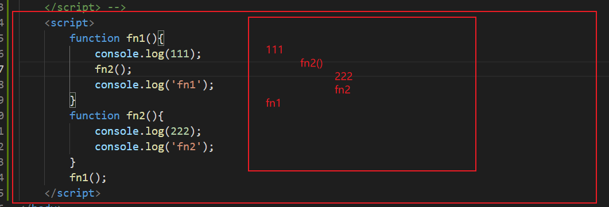

## 13函数

### 函数概念

​	在js里面，会有定义非常多的相同代码或者功能相似的代码，通过封装了一段**可被重复调用执行的代码块**。通过此代码块可以实现大量代码的重复使用。

##### 案例：

```
    <script>
        // 1、求1~100的累加和
        var sum = 0;
        for(var i = 1;i <= 100; i++){
            sum = sum + i;
            // sum += i;
        }
        console.log(sum);
        // 2、求10~50的累加和
        var sum = 0;
        for(var i = 10;i <= 50;i++){
            sum += i ;
        }
        console.log(sum);

        // 3、使用函数,通过封装的方法将一段可以重复调用的代码块，进行重复使用。
        function getSum(num1,num2) {
            var sum = 0;
            for(var i = num1;i <= num2;i++){
                sum += i ;
            }
            console.log(sum);
        }
        getSum(1,2);    //3
        getSum(3,7);    //25
    </script>
```


### 函数的使用

函数在使用时分为两步：**声明函数**和**调用函数**


#### 声明函数

```
    <script>
        // 声明函数
        function 函数名(){
            //函数体代码
        }
    </script>
```

###### 例子：

```
    <script>
        function hh() {
            console.log('hello world');
        }
    </script>
```

- function 是声明函数的关键字,**必须小写**
- 由于函数一般是为了实现某个功能才定义的， 所以通常我们将函数名命名为动词，比如 `getSum`
- 函数不调用，自己不会执行。


#### 调用函数

```
//调用函数
函数名();	//通过调用函数名来执行函数题代码
```

###### 例子：

```
    <script>
        function hh() {
            console.log('hello world');
        }
        hh();
    </script>
```

- 调用的时候**千万不要忘记添加小括号**
- **注意**：声明函数本身并不会执行代码，只有调用函数时才会执行函数体代码。


#### 函数的封装

- 函数的封装是把一个或者多个功能通过**函数的方式**封装起来，对外只提供一个简单的函数接口<font color=red>(后续会提)</font>

##### 案例：使用函数计算1~100之间的累加和

```
    <script>
        function getSum() {
            var sum = 0;
            for(var i = 1;i <= 100; i++){
                sum = sum + i;
                // sum += i;
            }
            console.log(sum);
        }
        getSum();
    </script>
```


### 函数的参数

#### 形参和实参

**在声明函数时**，可以在函数名称后面的小括号中添加一些参数，这些参数被称为**形参**，而在**调用该函数**时，同样也需要传递相应的参数，这些参数被称为**实参**。参数之间用英文逗号分割。

|   参数   |                           说明                            |
| :------: | :-------------------------------------------------------: |
| **形参** | 形式上的参数 函数定义的时候 传递的参数 当前并不知道是什么 |
| **实参** | 实际上的参数 函数调用的时候 传递的参数 实参是传递给形参的 |

**参数的作用** : 在**函数内部**某些值不能固定，我们可以通过参数在**调用函数时传递不同的值**进去

##### 语法结构

```
    <script>
        //声明函数
        function 函数名(形参1,形参2,形参3....){
						代码块
        }
        // 调用函数
        函数名(实参1,实参2,实参3);
    </script>
```

##### 例子：

```
    <script>
        function look(aru,aru2) {       //形参是接受实参的，aru = '内容',形参类似于一个变量
            console.log(aru,aru2);
        }
        look('这就是实参，aru这个就是形参，形参和实参都是可以自定义的。','呐，这是第二个实参');
        look('实参是可以变的，你看我现在就输出的是另外的内容。','呐,呐，呐。');
    </script>
```

##### 注意：函数的参数可以有，也可以没有，个数不限。

##### 案例：利用函数求任意两个数的和

```
    <script>
        function getboth(a,b) {
            console.log(a+b);
        }
        getboth(1,2);
    </script>
```

##### 案例：利用函数求任意两个数之间的和

```
    <script>
        function getSum(start,end){
            sum = 0;
            for(var a = start;a <= end; a++){
                sum += a;
            }
            console.log(sum);
        }
        getSum(1,3)
    </script>
```

#### 函数的形参和实参不匹配问题

|       参数个数       |                说明                |
| :------------------: | :--------------------------------: |
| 实参个数等于形参个数 |            输出正确结果            |
| 实参个数多于形参个数 |          只取到形参的个数          |
| 实参个数小于形参个数 | 多的形参定义为undefined，结果为NaN |

```
    <script>
        function sum(num1, num2) {
            console.log(num1 + num2);
        }
        sum(100, 200);             // 300，形参和实参个数相等，输出正确结果

        sum(100, 400, 500, 700);   // 500，实参个数多于形参，只取到形参的个数

        sum(200);                  // 实参个数少于形参，多的形参定义为undefined，结果为NaN
    </script>
```

#### 函数参数的小结

- 函数可以带参数也可以不带参数
- 声明函数的时候，函数名括号里面的是形参，形参的默认值为 undefined
- 调用函数的时候，函数名括号里面的是实参
- 多个参数中间用逗号分隔
- 形参的个数可以和实参个数不匹配，但是结果不可预计，我们尽量要匹配

### 函数的返回值

有的时候，我们会希望函数将值返回给调用者，此时通过使用 return 语句就可以实现。

##### 语法格式

```
    <script>
        // 声明函数
        function 函数名（）{
            ...
            return  需要返回的值;
        }
        // 调用函数
        函数名();    // 此时调用函数就可以得到函数体内return 后面的值
    </script>
```

###### 例子：

```
    <script>
        // 声明函数
        function sum(){
            return  666;
        }
        // 调用函数
        console.log(sum());     // 此时 sum 的值就等于666，因为 return 语句会把自身后面的值返回给调用者 
        
        function sum1(num1,num2){
            return num1+num2;
        }
        console.log(sum1(1,2));
    </script>
```

- 在使用 return 语句时，函数会停止执行，并返回指定的值
- 如果函数没有 return ，返回的值是 undefined

##### 案例：利用函数求任意两个数的最大值。

```
    <script>
        function getmax(a,b) {
            if(a > b){
                return a;
            }else{
                return b;
            }
            // return a > b ? a : b;   //三元表达式写法
        }
        console.log(getmax(3,10));
    </script>
```

##### 案例：利用函数求任意一个数组中的最大值。

1、利用函数求数组 [5,2,99,101,67,77]	中最大的数值

```
    <script>
        // 利用函数求数组[5,2,99,101,67,77] 中的最大数值
        function getArrMax(arr) {    //形参，接受一个数组
            var max = arr[0];
            for(var i = 1;i <=arr.length; i++){
                if(arr[i] > max){
                    max = arr[i];
                }
            }
            return max;
        }
        // console.log(getArrMax([5,2,99,101,67,77]));     //实参，传一个数组过去
        var re = getArrMax([5,2,99,101,67,77]);         //通过变量的方式将 调用函数，保存起来
        console.log(re);    //输出变量
    </script>
```

#### return终止函数

return 语句之后的代码不被执行

```
    <script>
        function add(num1,num2){
            //函数体
            return num1 + num2; // 注意：return 后的代码不执行
            alert('我不会被执行，因为前面有 return');
        }
        var resNum = add(21,6); // 调用函数，传入两个实参，并通过 resNum 接收函数返回值
        alert(resNum);          // 27
    </script>
```

#### return 的返回值，只能返回一个值

`return` **只能返回一个值**。如果用逗号隔开多个值，**以最后一个为准**。

```
    <script>
        function add(num1,num2){
            //函数体
            return num1,num2;
        }
        var resNum = add(21,6); // 调用函数，传入两个实参，并通过 resNum 接收函数返回值
        alert(resNum);          // 6
    </script>
```

如果想返回多个值，可以使用数组来实现。数组可以存放多个值。

```
    <script>
        function getfn(num1,num2){
            return [num1 + num2,num1 - num2,num1 * num2,num1 / num2];
        }
        var re = getfn(1,2);
        console.log(re);
    </script>
```

#### 函数都是有返回值的

1. 如果有 return ，则返回 return 后面的值

   ```
       <script>
           // 声明函数
           function sum(){
               return  666;
           }
           // 调用函数
           console.log(sum());     // 此时 sum 的值就等于666，因为 return 语句会把自身后面的值返回给调用者 
       </script>
   ```

2. 如果没有 return，则返回 undefined

   ```
       <script>
           function fun() {
               
           }
           console.log(fun());     //undefined
       </script>
   ```

#### break，continue，return 的区别

- `break` ： 结束当前循环体(如 for、while)
- `continue` ：跳出本次循环，继续执行下次循环(如for、while)
- `return` ：不仅可以退出循环，还能够返回 return 语句中的值，同时还可以结束当前的函数体内的代码


### arguments的使用

当我们不确定有多少个参数传递的时候，可以用 `arguments` 来获取。在 JavaScript 中，arguments 实际上它是当前函数的一个内置对象。所有函数都内置了一个 `arguments` 对象，`arguments` 对象中存储了传递的所有实参。

- **arguments**存放的是传递过来的实参
- **arguments**展示形式是一个伪数组，因此可以进行遍历。伪数组具有以下特点
  - 具有 length 属性
  - 按索引方式储存数据
  - 不具有数组的 push , pop 等方法

###### 例子：

```
		<script>
        // arguments的使用，只有函数才有arguments对象，而且每个函数都内置好了这个arguments；
        // 函数声明
        function fn() {
            console.log(arguments);  //里面存储了所有传递过来的实参
            console.log(arguments); // 3
            console.log(arguments[2]); // 3
        }
        // 函数调用
        fn(1,2,3);
    </script>
```

```
    <script>
        // 可以按照数组的方式遍历arguments,来获取实际参数的个数
        function fn() {
            for(var i = 0;i < arguments.length;i++){
                console.log(arguments[i]);
            }
        }
        fn(10,11);
        fn(1,2,3,4,5,6,7,8);
    </script>
```


##### 案例：arguments的使用，利用函数求任意个数的最大值。

```
    <script>
        // 使用arguments,来用函数求任意个数的最大值。
        function getmax(){
            var max = arguments[0];
            for(var i = 1;i<arguments.length; i++){
                if(arguments[i] > max){
                    max = arguments[i];
                }
            }
            return max;
        }
        var re = getmax(1,4,23,23,5,3,43);
        var re1 = getmax(100,123,1231231123,123123);
        console.log(re,re1);
    </script>
```

#### 函数练习

##### 案例1：利用函数封装方式，翻转任意一个数组

```
    <script>
        function reverse(arr) {
            var newArr = [];
            for (var i = arr.length - 1; i >= 0; i--) {
                newArr[newArr.length] = arr[i];
            }
            return newArr;
        }
        var arr1 = reverse([1, 3, 4, 6, 9]);
        console.log(arr1);
        var arr2 = reverse(['qwe','asd','zxv']);
        console.log(arr2);
    </script>
```

##### 案例2：利用函数封装方式，对数组排序 – 冒泡排序              <font  color=red>了解</font>

```
    <script>
        function sort(arr) {
            for (var i = 0; i < arr.length - 1; i++) {
                for (var j = 0; j < arr.length - i - 1; j++) {
                    if (arr[j] > arr[j+1]) { 
                        var temp = arr[j];
                        arr[j] = arr[j + 1]; 
                        arr[j + 1] = temp;
                    }
                }
            }
            return arr;
        }
        var re = sort([5,7,3,8,1]);
        console.log(re);
    </script>
```

##### 案例3：输入一个年份，判断是否是闰年（闰年：能被4整除并且不能被100整数，或者能被400整除）

```
    <script>
        // 利用函数判断是否为闰年，闰年特性，能被4整除并且不能被100整数，或者能被400整除
        function getYear(year){
            // 如果是闰年我们返回 true ，否则返回 false
            var flag = false;
            if(year % 4 == 0 && year % 100 != 0 || year % 400 == 0){
                flag = true;
            }
            return flag;
        }
        var re = getYear(2000); //true
        console.log(re);
        var re2 = getYear(1999);    //false
    </script>
```

### 函数可以调用另外一个函数

每个函数都是独立的代码块，用于完成特殊任务，因此经常会用到函数相互调用的情况

###### 例子：

```
    <script>
        //函数是可以相互调用的
        function fn1(){
            console.log(11);
            fn2();    
        }
        
        function fn2(){
            console.log(22);
        }
        fn1();
    </script>
```

###### 例子：

```
    <script>
        function fn1(){
            console.log(111);
            fn2();
            console.log('fn1');
        }
        function fn2(){
            console.log(222);
            console.log('fn2');
        }
        fn1();
    </script>
```




##### 案例：用户输入年份，输出当前年份2月份的天数，如果是闰年，则2月份是 29天， 如果是平年，则2月份是 28天

```
    <script>
        function monthDay(){
            var year = prompt('请输入年份');
            if(getYear(year)){
                alert('是闰年，2月有29天');
            }else{
                alert('是平年，2月有28天');
            }
        }
        monthDay();

         // 利用函数判断是否为闰年，闰年特性，能被4整除并且不能被100整数，或者能被400整除
         function getYear(year){
            // 如果是闰年我们返回 true ，否则返回 false
            var flag = false;
            if(year % 4 == 0 && year % 100 != 0 || year % 400 == 0){
                flag = true;
            }
            return flag;
        }
    </script>
```

### 函数的两种声明方式

#### 自定义函数方式（命名函数）

利用函数关键字`function`自定义函数方式

```
		<script>
        // 自定义函数（命名函数）
        function 自定义函数名(){

        }
    </script>
```

1. **因为有名字，所以也被称为命名函数**
2. **调用函数的代码既可以放到声明函数的前面，也可以放在声明函数的后面**

#### 函数表达式方式(匿名函数)

利用函数表达式方式的写法如下：

```
    <script>
        var 变量名 = function(){
	
        }
    </script>
```

###### 例子：

```
    <script>
        var fn = function(a){
            console.log('哈哈哈哈');
            console.log(a);
        }
        fn('真好玩');
    </script>
```

1、fun是变量名，不是函数名

2、函数表达式声明方式和声明变量差不多，只不过变量里面存的是值，而函数表达式里面存放的是函数

3、函数表达式也可以进行传递参数

4、函数调用的代码必须写到函数体后面

