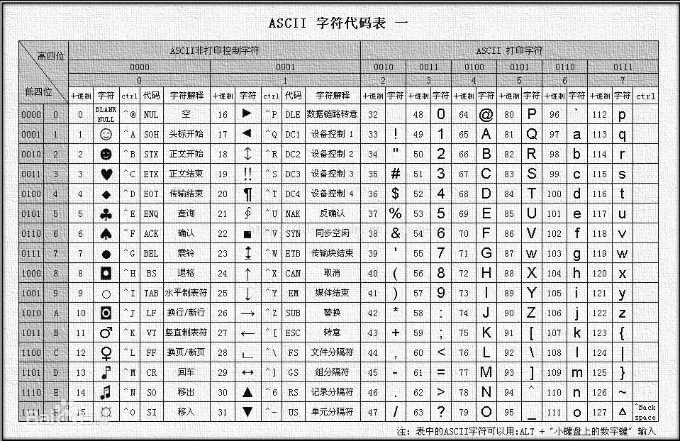

## 内置对象

- JavaScript 中的对象分为3种：自定义对象 、内置对象、 浏览器对象
- 内置对象就是指 JS 语言自带的一些对象，这些对象供开发者使用，并提供了一些常用的或是最基本而必要的功能
- JavaScript 提供了多个内置对象：Math、 Date 、Array、String等

### 查阅文档

学习一个内置对象的使用，只要学会其常用成员的使用即可，我们可以通过查文档学习，可以通过MDN/W3C来查询

MDN: https://developer.mozilla.org/zh-CN/

1. 查阅该方法的功能
2. 查看里面参数的意义和类型
3. 查看返回值的意义和类型
4. 通过 demo 进行测试


### Math对象

Math 对象不是构造函数，它具有数学常数和函数的属性和方法。跟数学相关的运算（求绝对值，取整、最大值等）可以使用 Math 中的成员。

通过`MDN`上的`Math`对象 里面的 `max` 方法我们可以通过练习来熟悉

```
    <script>
        // Math数学对象，不是一个构造函数，所以我们不需要new 来调用，而是直接使用里面的属性和方法即可

        //Math.PI   圆周率    是静态属性，使用中不带括号
        console.log(Math.PI);

        var re = Math.max(1,5,23,123,0);
        //Math.max()  函数返回一组数中的最大值     是方法，需要带括号。
        console.log(re);
    </script>
```

```
      <script>
          function getMaxOfArray(numArray) {
              return Math.max.apply(null, numArray);
          }
          var a = getMaxOfArray([1,0,23,123,1231234,5454545]);
          console.log(a);
      </script>
```

#### 封装自己的数学对象

通过函数的封装，我们也可以构建自己的数学对象。

```
<script>
        var myMath = {
            PI: 3.141592653,
            max: function() {
                var max = arguments[0];
                for (var i = 1; i < arguments.length; i++) {
                    if (arguments[i] > max) {
                        max = arguments[i];
                    }
                }
                return max;
            },
            min: function() {
                        var min = arguments[0];
                        for (var i = 1; i < arguments.length; i++) {
                            if (arguments[i] < min) {
                                min = arguments[i];
                            }
                        }
                        return min;
                    }
        }
        console.log(myMath.PI);
        console.log(myMath.max(1, 5, 9));
        console.log(myMath.min(1, 5, 9));
    </script>
```


#### Math的绝对值和三个取整方法

##### Math.floor()		  向下取整

##### Math.ceil()			向上取整

##### Math.round()	   四舍五入，就近取整

##### Math.abs()			绝对值

```

    <script>
    		//绝对值
        console.log(Math.abs(1));
        console.log(Math.abs(-1));
        console.log(Math.abs('-1'));    //隐式转换，会把字符串 -1 转换为数字型
        console.log(Math.abs('string'));       //NaN
    
        // round()，四舍五入，但是.5特殊，会往大了取。
        console.log(Math.round(1.1));       //1
        console.log(Math.round(1.5));       //2
        console.log(Math.round(1.9));       //2
        console.log(Math.round(-1.1));      //-1
        console.log(Math.round(-1.5));      //-1
        
        //向下取整
        console.log(Math.floor(1.1));       //1
        console.log(Math.floor(1.9));       //1
        
       	//向上取整
       	console.log(Math.ceil(1.1));        //2
        console.log(Math.ceil(1.9));        //2
    </script>
```


#### 随机数方法 random()

函数返回一个浮点数,  伪随机数在范围从**0到**小于**1**，也就是说，从0（包括0）往上，但是不包括1（排除1）。 0 =< x <1

```
    <script>
        console.log(Math.random());
    </script>
```

###### 例子：

```
    <script>
        function getRandomInt(min, max) {
            min = Math.ceil(min);
            max = Math.floor(max);
            return Math.floor(Math.random() * (max - min)) + min; //不含最大值，含最小值
        }
        var g = getRandomInt(1,10);
        console.log(g);
    </script>
```


##### 案例:随机点名

```
    <script>
        function getRandomInt(min, max) {
            min = Math.ceil(min);
            max = Math.floor(max);
            return Math.floor(Math.random() * (max - min)) + min; //不含最大值，含最小值
        }
        var arr = ['张三','李四','王二麻子'];
        var arrR = getRandomInt(0,2);   //通过索引值，进行判定
        console.log(arr[arrR]);
        // 优化方法
        var arr1 = ['张三','李四','王二麻子','甲','乙','丙','丁']
        var arrR1 = getRandomInt(0,arr1.length-1);
        console.log(arr1[arrR1]);
    </script>
```


##### 案例：随机点名（不出现重复显示）

```
    <script>
        let arr = ['赵云', '黄忠', '关羽', '张飞', '马超', '刘备', '曹操'];
        //  1.得到一个随机数，作为数组的索引号，随机数未    0~6
        let random = Math.floor(Math.random() * arr.length);
        //  2.页面输出数组里面的元素
        document.write(arr[random]);

        //  3.splice(起始位置(下标)，需要删除几个元素)
        arr.splice(random,1);
        console.log(arr);
    </script>
```


##### 案例：程序随机生成 1~10之间的一个数字，用户输入一个数字。

1. 如果大于该数字，就提示，数字猜大了，继续猜。
2. 如果小于该数字，就提示，数字猜小了，继续猜。
3. 如果猜对了，就提示猜对了，程序结束。

```
    <script>
        function getRandomInt(min, max) {
            min = Math.ceil(min);
            max = Math.floor(max);
            return Math.floor(Math.random() * (max - min)) + min; //不含最大值，含最小值
        }
        // 返回值1~10之间的随机整数
        let random = getRandomInt(1,11);
        document.write(random);

        // 循环
        while(true){
            // 用户输入框
            let num = +prompt('输入你猜的数字');
            // 条件判断
            if(num > random){
                alert('猜大了');
            }else if(num < random){
                alert('猜小了');
            }else{
                alert('猜对了');
                break;
            }
        }
    </script>
```


##### 案例：生成随机颜色。

```js
    <div style="width: 300px;height: 300px;"></div>
    <script>
        /* 
            需求：该函数接受一个布尔类型的参数，表示颜色的格式是十六进制还是rgb格式
            1.如果参数传传递的是true或者无参数，则输出一个随机十六进制的颜色。
            2.如果参数传递是false，则输出一个随机rgb的颜色。
            3.格式
                   function getRandomColor(){
                    
                   }
                    console.log(getRandomColor(true));   //#十六进制的颜色
                    console.log(getRandomColor(false));  //rgb(255,255,255)
            4.提示：
                1.16进制颜色格式为 ：'#ffffff' 其中f 可以使任意 0~f之间的字符
                    let arr = ['0','1','2','3','4','5','6','7','8','9','a','b','c','d','e','f']; 
                2.rgb颜色格式为： 'rgb(255,255,255)' 其中255可以使任意0~255之间的数字

        */
       function getRandomColor(flag = true){
            
            if(flag){
                // 如果是ture，则输出十六进制
                let str = '#';
                let arr = ['0','1','2','3','4','5','6','7','8','9','a','b','c','d','e','f'];
                // 利用for循环随机抽6次，累加到str里面
                for(let i =1 ;i <=6;i++){
                    // 每次要随机从数组里面抽取一个
                    let random = Math.floor(Math.random() * arr.length);
                    // random使arr的索引号
                    str += arr[random];
                }
                return str;
            }else{
                // 否则输出rgb格式
                let r = Math.floor(Math.random() * 256);
                let g = Math.floor(Math.random() * 256);
                let b = Math.floor(Math.random() * 256);
                return `rgb(${r},${g},${b})`;
            }

        }

       console.log(getRandomColor(true));   //#十六进制的颜色
       console.log(getRandomColor(false));  //rgb(255,255,255) 
        //    无参数情况，给函数形参作定值
        console.log(getRandomColor());

        const div = document.querySelector('div');
        div.style.background = getRandomColor();
    </script>
```


##### 案例：学成在线网站内容替换

```html

    <!-- 4. box核心内容区域开始 -->
    <div class="box w">
        <div class="box-hd">
            <h3>精品推荐</h3>
            <a href="#">查看全部</a>
        </div>
        <div class="box-bd">
            <ul class="clearfix">
                <!-- <li>
                    <a href="#">
                        
                        <h4>
                            Think PHP 5.0 博客系统实战项目演练
                        </h4>
                        <div class="info">
                            <span>高级</span> • <span>1125</span>人在学习
                        </div>
                    </a>
                </li> -->
                <script>
                    let data = [
                        {
                            src: 'images/course01.png',
                            title: 'Think PHP 5.0 博客系统实战项目演练',
                            num: 1125
                        },
                        {
                            src: 'images/course02.png',
                            title: 'Android 网络动态图片加载实战',
                            num: 357
                        },
                        {
                            src: 'images/course03.png',
                            title: 'Angular2 大前端商城实战项目演练',
                            num: 22250
                        },
                        {
                            src: 'images/course04.png',
                            title: 'Android APP 实战项目演练',
                            num: 389
                        },
                        {
                            src: 'images/course05.png',
                            title: 'UGUI 源码深度分析案例',
                            num: 124
                        },
                        {
                            src: 'images/course06.png',
                            title: 'Kami2首页界面切换效果实战演练',
                            num: 432
                        },
                        {
                            src: 'images/course07.png',
                            title: 'UNITY 从入门到精通实战案例',
                            num: 888
                        },
                        {
                            src: 'images/course08.png',
                            title: 'Cocos 深度学习你不会错过的实战',
                            num: 590
                        },
                    ]
                    for(let i = 0; i < data.length; i++){
                        document.write(`
                        <li>
                            <a href="#">
                                
                                <h4>
                                   ${data[i].title}
                                </h4>
                                <div class="info">
                                    <span>高级</span> • <span>${data[i].num}</span>人在学习
                                </div>
                            </a>
                        </li>
                        `);
                    }
                </script>
            </ul>
        </div>
    </div>

```


##### 例题：

###### 例题1：生成0-10的随机数？

```
  var randoms = Math.floor(Math.random() * (10+1));
  console.log(randoms);
```

###### 例题：生成5-10的随机数？

```
Math.floor(Math.random() * (5+1)) + 5;
```

###### 例题：生成N~M之间的随机数

```
Math.floor(Math.random() * (M - N + 1)) + N;
```


<hr>

### Date()对象

- Date 对象和 Math 对象不一样，他是一个构造函数，所以我们需要实例化后才能使用

- Date 实例用来处理日期和时间

  

#### 获取当前时间必须实例化

使用 `new`；来实例化对象

```
    <script>
        var now = new Date();
        console.log(now);
    </script>
```


#### Date()构造函数的参数

如果括号里面有时间，就返回参数里面的时间。例如日期格式`字符串`为 `‘2019-5-1’`，可以写成`new Date('2019-5-1')` 或者 `new Date('2019/5/1')`

1. 如果Date()不写参数，就返回当前时间

   ```
       <script>
           var now = new Date();
           console.log(now);
       </script>
   ```

   

2. 如果Date()里面写参数，就返回括号里面输入的时间

   1. ```
          <script>
              // 2.参数常用的写法 数字型 2019,10,1  字符串型 '2019-10-1 8:8:8' 时分秒
              // 如果Date()里面写参数，就返回括号里面输入的时间 
              var data = new Date(2019,10,1);
              console.log(data);  // Fri Nov 01 2019 00:00:00 GMT+0800 (中国标准时间)  ,  返回的是11月不是10月
      
              var data2 = new Date('2019-10-1 8:8:8');
              console.log(data2); // Tue Oct 01 2019 08:08:08 GMT+0800 (中国标准时间) ,有时间值的
          </script>
      ```

   

#### 日期格式化

我们想要 2019-8-8 8:8:8 格式的日期，要怎么办？

需要获取日期指定的部分，所以我们要手动的得到这种格式

| 方法名        | 说明                     | 代码               |
| ------------- | ------------------------ | ------------------ |
| getFullYear() | 获取年份                 | dObj.getFullYear() |
| getMonth()    | 获取当月(0-11)           | dObj.getMonth()    |
| getDate()     | 获取当天日期             | dObj.getDate()     |
| getDay()      | 获取星期几(周日0到周六6) | dObj.getDay()      |
| getHours()    | 获取当前小时             | dObj.getHours()    |
| getMinutes()  | 获取当前分钟             | dObj.getMinutes()  |
| getSeconds()  | 获取当前秒钟             | dObj.gerSeconds()  |

```
    <script>
        var now = new Date();
        console.log(now.getFullYear()); //获取当前年份
        console.log(now.getMonth()+1);    //获取月份（0-11）,返回的月份小一个月 记得月份 +1
        console.log(now.getDate()); //返回的是几号
        console.log(now.getDay());  //周一返回1 周6返回六 周日返回0
        console.log(now.getHours());    //获取当前小时
        console.log(now.getMinutes());  //获取当前分钟数
        console.log(now.getSeconds());  //获取当前秒钟数
    </script>
```

###### 例子：使用Date()对象，写一个当前时间。

```
    <script>
        var now = new Date();
        var year = now.getFullYear();
        var month = now.getMonth() + 1;
        var day = now.getDate();
        var hours = now.getHours();
        var minutes = now.getMinutes();
        var seconds = now.getSeconds();
        console.log('今天是'+year+'年'+month+'月'+day+'日'+hours+'点'+minutes+'分'+seconds+'秒');        
    </script>
```

##### 案例：封装一个函数返回当前的时分秒，格式 08:08:08

```
    <script>
        // 封装一个函数返回当前的时分秒   格式 08:08:08
        function getTime() {
            var time = new Date();
            var h = time.getHours();
            h = h < 10 ? '0'+h : h;
            var m = time.getMinutes();
            m = m < 10 ? '0'+m : m;
            var s = time.getSeconds();
            s = s < 10 ? '0'+s : s;
            return h+':'+m+':'+s;
        }
        console.log(getTime());
    </script>
```


#### 获取日期的总的毫秒形式

Date对象是基于1970年1月1日  (世界标准时间) 起的毫秒数，获得Date总的毫秒数(时间戳)。

注意：不是当前时间的毫秒数，而是距离1970年1月1号过了多少毫秒数

##### 1、通过valueOf()、getTime() 两种方法来获取

```
// 使用途径，可以用来生成订单数(少量订单)，因为不同时间的毫秒数是不一样的。
var date = new Date();
console.log(date.valueOf());    //是现在时间距离1970.1.1 总的毫秒数
console.log(date.getTime());  
```

##### 2、+new Date()  较为简单的写法

```
var date1 = +new Date();    // +new Date()   返回的也是总毫秒数
console.log(date1);   
```

##### 3、HTML5新增的方法，Date.now()  获取总毫秒数。

```
console.log(Date.now());    //H5新增的方法，也是获取距离1970年1月1号的总毫秒数。
```


#### 案例：倒计时效果

思路：

1、截止的时间   减去  现在的时间 = 剩余的时间 （倒计时）

2、使用时间戳实现以下效果，用户输入时间的总毫秒数减去现在的总毫秒数，得到剩余时间的毫秒数。

3、把剩余的时间毫秒数转换为 天、时、分、秒 (需要将时间戳转换为时分秒)

公式如下：

- d = parseInt(总秒数/60/60/24); 	//计算天数
- h = parseInt(总秒数/60/60%24);   //计算小时
- m = parseInt(总秒数/60%60);       //计算分数
- s = parseInt(总秒数%60);              //计算当前秒数

```
    <script>
        function demo(time) {
            var nowTime = +new Date();          //获取现在距离1970年的总毫秒数
            var input = +new Date(time);        //获取活动截止日期距离1970年的总毫秒数
            var times = (input - nowTime) / 1000;   //活动截止日期 - 现在时间 = 距离活动截止的倒计时
            var d = parseInt(times/60/60/24);  //计算天数
            d = d < 10 ? '0' + d : d;
            var h = parseInt(times/60/60%24);  //计算小时
            h = h < 10 ? '0' + h : h;
            var m = parseInt(times/60%60);    //计算分数
            m = m < 10 ? '0' + m : m;
            var s = parseInt(times%60);    //计算当前秒数
            s = s < 10 ? '0' + s : s;
            return d + '天' + h + '时' + m + '分' + s + '秒';
        }
        console.log(demo('2022-3-18 18:00:00'));
        var date = new Date();
        console.log(date);
    </script>
```


<hr>


### 数组对象

#### 数组对象的创建

创建数组对象的两种方式

- 字面量方式
- new Array()

##### 字面量方式

```
    <script>
        var arr = [1,2,3,4];
    </script>
```

##### 利用 new Array() 创建数组

```
    <script>
        var arr1 = new Array(); //创建了一个空数组
        var arr2 = new Array(2);    //一个2,代表了数组长度为2，但是里面的数组元素为空
        var arr3 = new Array(2,3)   //等价于 [2,3]  ,里面有两个数组元素 2,3
        console.log(arr1);
        console.log(arr2);
        console.log(arr3);
    </script>
```


#### 检测是否为数组

- `instanceof` 运算符，可以判断一个对象是否属于某种类型
- `Array.isArray()` 用于判断一个对象是否为数组，isArray() 是 HTML5 中提供的方法

```
    <script>
        var arr = [1, 23];
        var obj = {};
        // instanceof 运算符，可以判断一个对象是否属于某种类型
        console.log(arr instanceof Array); // true
        console.log(obj instanceof Array); // false
        // Array.isArray()  用于判断一个对象是否为数组，isArray() 是 HTML5 中提供的方法
        console.log(Array.isArray(arr));   // true
        console.log(Array.isArray(obj));   // false
    </script>
```


###### 例子：通过检测函数输入的值是否为数组，使用  instanceof  或者 Array.isArray() 来判定。

原代码：

```
    <script>
        // 通过翻转数组来举例，如果函数输入的不是一个数组，就不会实现我们想要的数组翻转的效果。
        function reverse(arr) {
            var newArr = [];
            for (var i = arr.length - 1; i >= 0; i--) {
                newArr[newArr.length] = arr[i];
            }
            return newArr;
        }
        var arr1 = reverse([1, 3, 4, 6, 9]);
        console.log(arr1);  
        // 通过此例子可以看出，我们需要修改代码，来判定输入的值，是否为一个数组
        var arr2 = reverse('qwe','asd','zxv');
        console.log(arr2);
        
    </script>
```

添加数组判定 后的代码：

```
    <script>
        function reverse(arr) {
            if(arr instanceof Array){
                var newArr = [];
                for (var i = arr.length - 1; i >= 0; i--) {
                    newArr[newArr.length] = arr[i];
                }
                return newArr;
            }else{
                return '函数参数要求必须为数组格式[1,2,3,4]';
            }
        }
        console.log(reverse(1,2,3,4,5));
    </script>
```


#### 添加删除数组元素

| 方法名                              | 说明                                                  | 返回值               |
| ----------------------------------- | ----------------------------------------------------- | -------------------- |
| push(参数1…)                        | 末尾添加一个或多个元素，注意修改原数组                | 并返回新的长度       |
| pop()                               | 删除数组最后一个元素，一次只能删除一个元素            | 返回它删除的元素的值 |
| unshift(参数1…)                     | 向数组的开头添加一个或更多元素，注意修改原数组        | 并返回新的长度       |
| shift()                             | 删除数组的第一个元素，数组长度减1，无参数，修改原数组 | 并返回第一个元素     |
| splice(起始位置(下标),删除几个元素) | 从第几个开始，删除几个数组元素                        | 返回一个新的数组     |


##### push(参数1...)	末尾添加一个或多个元素，注意修改原数组,并返回新的长度

```
    <script>
        // 1.push() 在我们数组的末尾，添加一个或者多个数组元素 push 推
        var arr = [1, 2, 3];
        arr.push('哈哈哈', '秦晓');
        console.log(arr.push('哈哈哈', '秦晓'));
        console.log(arr);
        console.log(arr.push(4, '秦晓'));
        console.log(arr);
        // push 完毕之后，返回结果是新数组的长度
    </script>
```

1、push() 是可以给数组追加新的元素

2、push() 参数直接 写数组元素

3、push() 完毕之后，返回的结果是 新数组的长度

4、原数组也会发生变化


##### unshift(参数1…)    向数组的开头添加一个或更多元素，注意修改原数组,并返回新的长度

```
    <script>
        // unshift 在我们数组的开头 添加一个或者多个数组元素
        var arr = [1, 2, 3];
        arr.unshift('blue');
        console.log(arr.unshift('red'));
        console.log(arr);
    </script>
```

1、unshift( ) 是可以给数组前面追加新的元素

2、unshift( ) 参数直接写 数组元素

3、unshift( ) 完毕之后，返回的结果是 新数组的长度

4、原数组也会发生变化


##### pop()    删除数组最后一个元素，一次只能删除一个元素  返回它删除的元素的值

```
    <script>
        //pop()  删除数组最后一个元素，一次只能删除一个元素  返回它删除的元素的值  ,不加参数
        var arr = [1,2,3,4,5];
        console.log(arr.pop());
    </script>
```

1、pop() 是可以删除数组的最后一个元素，一次只能删除一个元素

2、pop() 没有参数

3、pop() 完毕之后，返回的结果是 删除的那个元素

4、原数组也会发生变化


##### shift()   删除数组的第一个元素，数组长度减1，无参数，修改原数组  ， 并返回第一个元素

```
    <script>
        // shift() 它剋删除数组的第一个元素,一次只能删除一个元素
        var arr = [1,2,3,4,5];
        arr.shift(); //不加参数
        console.log(arr);
    </script>
```

1、shift() 是可以删除数组的第一个元素，记住一次只能删除一个元素

2、shift()没有参数

3、shift()完毕之后，返回的结果是，删除的那个元素

4、原数组会发生变化


##### splice(起始位置(下标),删除几个元素)

从第几个开始，删除几个数组元素，返回一个新的数组

```
  var arr = [1,23,4,5,5,6];
  arr.splice(0,1);
```


##### 案例：筛选数组

有一个包含工资的数组[1500,1200,2000,2100,1800],要求把数组中工资超过2000的删除，剩余的放到新数组里面

```
    <script>
        var arr = [1500, 1200, 2000, 2100, 1800];
        var newArr = [];
        for (var i = 0; i < arr.length; i++) {
            if (arr[i] < 2000) {
                newArr[newArr.length] = arr[i];
            }
        }
        console.log(newArr);
    </script>
```

使用push()  ,添加新数组

```
    <script>
        var arr = [1500, 1200, 2000, 2100, 1800];
        var newArr = [];
        for (var i = 0; i < arr.length; i++) {
            if (arr[i] < 2000) {
                newArr.push(arr[i]);
            }
        }
        console.log(newArr);
    </script>
```


#### 数组的排序

| 方法名    | 说明                         | 是否修改原数组                     |
| --------- | ---------------------------- | ---------------------------------- |
| reverse() | 颠倒数组中元素的顺序，无参数 | 该方法会改变原来的数组，返回新数组 |
| sort()    | 对数组的元素进行排序         | 该方法会改变原来的数组，返回新数组 |

##### reverse()

```
 // 1、翻转数组
        var arr = ['red','blue','green'];
        arr.reverse();
        console.log(arr);   // ['green', 'blue', 'red']
```

##### sort()

sort() 对于个位数的使用

```
// 2、数组排序(冒泡排序)
        var arr1 = [3,4,1,2,9];
        arr1.sort();
        console.log(arr1);  //[1, 2, 3, 4, 9]
```

sort()对于双位数的排序，因为sort()，进行排序的判定是从`第一个数字`进行判定的，所以在进行多位数判定时会出错。所以需要用到方法。<font color=red>学会使用</font>

出错案例：

```
var arr2 = [2,31,23,41,9,0];
arr2.sort();
console.log(arr2);
```

解决方法

```
var arr2 = [2,31,23,41,9,0];
arr2.sort(function(a,b){
    return a - b; //升序的顺序排列
    return b - a; //降序的排列
});
console.log(arr2);
```


#### 数组对象

| 方法名        | 说明                                   | 返回值                                   |
| ------------- | -------------------------------------- | ---------------------------------------- |
| indexOf()     | 数组中查找该元素的第一个索引           | 如果存在返回索引号，如果不存在，则返回-1 |
| lastIndexOf() | 在数组中查找最后一个索引，从后向前索引 | 如果存在返回索引号，如果不存在，则返回-1 |

1、返回数组元素索引号方法 indexOf(数组元素)  作用就是返回该数组元素的索引号,只返回第一个满足条件的索引号。

2、它只发返回第一个满足条件的索引号。

3、如果找不到元素，则返回-1。

```
    <script>
        //返回数组元素索引号方法 indexOf(数组元素)  作用就是返回该数组元素的索引号,只返回第一个满足条件的索引号，从前面开始查找
        //它只发返回第一个满足条件的索引号
        //如果找不到元素，则返回-1
        var arr = ['red','green','blue','pink','blue'];
        console.log(arr.indexOf('blue'));  // 2
        // 返回数组元素索引号方法 indexOf(数组元素)  作用就是返回该数组元素的索引号,只返回第一个满足条件的索引号，从后面开始查找
        console.log(arr.lastIndexOf('blue')); // 4
    </script>
```

##### 案例：数组去重

将数组中['c', 'a', 'z', 'a', 'x', 'a', 'x', 'c', 'b']，中相同的数组元素去掉。

思路：

①、将旧数组中不重复的元素放到新数组中，重复的元素只保留一个。

②、遍历数组，用旧数组去查询新数组，如果该元素在新数组里面没有出现过，我们添加进去，否则就不添加。

旧数组：['c', 'a', 'z', 'a', 'x', 'a', 'x', 'c', 'b']

新数组：[ ]

③、我们怎么知道该元素没有存在？ 利用 `新数组.indexOf(数组元素)` 如果返回是 `-1` 就说明 新数组里面没有该元素

```
    <script>
        // 封装一个去重的函数 unique 独一无二的
        function unique(arr) {
            var newArr = [];
            for (var i = 0; i < arr.length; i++) {
                if (newArr.indexOf(arr[i]) === -1) {
                    newArr.push(arr[i]);
                }
            }
            return newArr;
        }
        var demo = unique(['c', 'a', 'z', 'a', 'x', 'a', 'x', 'c', 'b']);
        var demo1 = unique(['blue','green','blue']);
        console.log(demo);
        console.log(demo1);
    </script>
```


#### 数组转换为字符串

| 方法名         | 说明                                       | 返回值         |
| -------------- | ------------------------------------------ | -------------- |
| toString()     | 把数组转换成字符串，逗号分隔每一项         | 返回一个字符串 |
| join(‘分隔符’) | 方法用于把数组中的所有元素转换为一个字符串 | 返回一个字符串 |

##### toString() 将我们的数组转换为字符串

```
    <script>
        // 数组转换为字符串
        // 1、toString() 将数组转换为字符串
        var arr = [1,2,3];
        console.log(arr.toString());
    </script>
```

##### join(‘分隔符’)	

```
<script>
      var arr = [1,2,3];
      console.log(arr.join());    //括号里面不写值，默认使用逗号分割
      console.log(arr.join('.')); //写值后，可以自定义分割符号
      console.log(arr.join('&')); 
</script>
```


### 字符串对象

#### 基本包装类型<font color=red>了解</font>

```
    <script>
        var str = 'abc';
        console.log(str.length);
        // 对象 才有属性和方法   复杂数据类型才有  属性和方法
        // 简单数据类型为什么会有 length 属性呢？
        //按道理基本数据类型是没有属性和方法的，而对象才有属性和方法，但上面代码却可以执行，这是因为 js 会把基本数据类型包装为复杂数据类型，其执行过程如下 ：
        // js中的基本包装类型: 会把简单数据类型  包装成为了  复杂数据类型
        // 1、把简单数据类型包装为复杂数据类型
        var temp = new String('abc');   //使用 new String 创建的字符串为  复杂数据类型
        // 2、通过临时变量的值 给 str
        str = temp;
        // 3、销毁这个临时变量
        temp = null;
    </script>
```

为了方便操作基本数据类型，JavaScript 还提供了三个特殊的引用类型：`String、Number和 Boolean`。

**基本包装类型**就是把简单数据类型包装成为复杂数据类型，这样基本数据类型就有了属性和方法。


#### 字符串的不可变性

```
    <script>
        // 字符串的不可变性
        var str = 'demo';
        console.log(str);
        str = 'new demo';
        console.log(str);       //当字符串重新赋值后，会占用一块内存资源，当赋值的字符串过多后，内存占用过大，会造成电脑卡顿。
        // 所以根据字符串的不可变性，不建议大量拼接字符串，大量拼接字符串会造成电脑卡顿。
        var str = '';
        for(var i = 1;i <= 1000000; i++){
            str += i;
        }
        console.log(str);
    </script>
```


#### 根据字符返回位置

字符串所有的方法，都不会修改字符串本身(字符串是不可变的)，**操作完成会返回一个新的字符串**

| 方法名                              | 说明                                                         |
| ----------------------------------- | ------------------------------------------------------------ |
| indexOf(‘要查找的字符’，开始的位置) | 返回指定内容在原字符串中的位置，如果找不到就返回-1，开始的位置是index索引号 |
| lastIndexOf()                       | 从后往前找，只找第一个匹配的                                 |

```
    <script>
        // 字符串对象  根据字符返回位置  str.indexOf('要查找的字符', [起始的位置])
        var str = '改革春风吹满地，春天来了';
        console.log(str.indexOf('春')); //默认从0开始查找 ，结果为2
        console.log(str.indexOf('春', 3)); // 从索引号是 3的位置开始往后查找，结果是8
    </script>
```


##### 案例：查找字符串 “abcoefoxyozzopp” 中所有o出现的位置以及次数

- 核心算法：先查找第一个o出现的位置
- 然后 只要 indexOf返回的结果不是 -1 就继续往后查找
- 因为 indexOf 只能查找到第一个，所以后面的查找，一定是当前索引加1，从而继续查找

```
    <script>
        // 查找字符串 “abcoefoxyozzopp” 中所有o出现的位置以及次数
        // 核心算法：先查找第一个o出现的位置
        // 然后 只要 indexOf返回的结果不是 -1 就继续往后查找
        // 因为 indexOf 只能查找到第一个，所以后面的查找，一定是当前索引加1，从而继续查找
        var str = "abcoefoxyozzopp";
        var index = str.indexOf('o');   //3
        var num = 0;
        // console.log(index);
        while (index !== -1) {
            console.log(index);
            num++;
            index = str.indexOf('o', index + 1);
        }
        console.log('o出现的次数是: ' + num);
    </script>
```


#### 根据位置返回字符

| 方法名            | 说明                                     | 使用                        |
| ----------------- | ---------------------------------------- | --------------------------- |
| charAt(index)     | 返回指定位置的字符(index字符串的索引号)  | str.charAt(0)               |
| charCodeAt(index) | 获取指定位置处字符的ASCII码(index索引号) | str.charCodeAt(0)           |
| str[index]        | 获取指定位置处字符                       | HTML,IE8+支持和charAt()等效 |

##### charAt(index)	返回指定位置的字符(index字符串的索引号)

```
    <script>
        var arr = 'andy';
        console.log(arr.charAt(3)); //
        // 遍历所有字符
        for(var i = 0;i < arr.length;i++){
            console.log(arr .charAt(i));
        }
    </script>
```

##### charCodeAt(index)       获取指定位置处字符的ASCII码(index索引号)

**ASCII码**：在计算机中，所有的数据在[存储](https://baike.baidu.com/item/存储)和运算时都要使用[二进制](https://baike.baidu.com/item/二进制/361457)数表示（因为计算机用[高电平](https://baike.baidu.com/item/高电平/9753092)和[低电平](https://baike.baidu.com/item/低电平/6946314)分别表示1和0），例如，像a、b、c、d这样的52个字母（包括大写）以及0、1等数字还有一些常用的符号（例如*、#、@等）在计算机中存储时也要使用[二进制数](https://baike.baidu.com/item/二进制数/108101)来表示，而具体用哪些二进制数字表示哪个符号，当然每个人都可以约定自己的一套（这就叫[编码](https://baike.baidu.com/item/编码)），而大家如果要想互相通信而不造成混乱，那么大家就必须使用相同的编码规则，于是美国有关的标准化组织就出台了ASCII[编码](https://baike.baidu.com/item/编码/80092)，统一规定了上述常用符号用哪些二进制数来表示。



```
    <script>
        // charCodeAt(index)       获取指定位置处字符的ASCII码(index索引号)  目的：判断用户按下了那个键位
        var str = 'andy';
        console.log(str.charCodeAt(0));		//97
    </script>
```

##### str[index]		获取指定位置处字符

```
    <script>
    // str 是定义的变量名，可以自定义
        var str = 'andy';
        console.log(str[0]);		//a
    </script>
```


##### 案例：判断一个字符串 “abcoefoxyozzopp” 中出现次数最多的字符，并统计其次数

```
    <script>
        // 判断一个字符串 “abcoefoxyozzopp” 中出现次数最多的字符，并统计其次数
        // 核心算法：利用 charAt() 遍历这个字符串
        // 把每个字符都存储给对象， 如果对象没有该属性，就为1，如果存在了就 +1
        // 遍历对象，得到最大值和该字符
        // 有一个对象 来判断是否有该属性 对象['属性名']
        var o = {
            age: 18
            
        }
        if (o['sex']) {
            console.log('里面有该属性');

        } else {
            console.log('没有该属性');

        }

        //  判断一个字符串 'abcoefoxyozzopp' 中出现次数最多的字符，并统计其次数。
        // o.a = 1
        // o.b = 1
        // o.c = 1
        // o.o = 4
        // 核心算法：利用 charAt() 遍历这个字符串
        // 把每个字符都存储给对象， 如果对象没有该属性，就为1，如果存在了就 +1
        // 遍历对象，得到最大值和该字符
        var str = 'abcoefoxyozzopp';
        var o = {};
        for (var i = 0; i < str.length; i++) {
            var chars = str.charAt(i); // chars 是 字符串的每一个字符
            if (o[chars]) { // o[chars] 得到的是属性值
                o[chars]++;
            } else {
                o[chars] = 1;
            }
        }
        console.log(o);
        // 2. 遍历对象
        var max = 0;
        var ch = '';
        for (var k in o) {
            // k 得到是 属性名
            // o[k] 得到的是属性值
            if (o[k] > max) {
                max = o[k];
                ch = k;
            }
        }
        console.log(max);
        console.log('最多的字符是' + ch);
</script>
```


#### 字符串操作方法<font color=red>(重点)</font>

| 方法名                  | 说明                                                         |
| ----------------------- | ------------------------------------------------------------ |
| concat(str1,str2,str3…) | concat() 方法用于连接两个或多个字符串。拼接字符串            |
| substr(start,length)    | 从 start 位置开始(索引号), length 取的个数                   |
| slice(start,end)        | 从 start 位置开始，截取到 end 位置 ，end 取不到 (两个都是索引号) |
| substring(start,end)    | 从 start 位置开始，截取到 end 位置 ，end 取不到 (基本和 slice 相同，但是不接受负) |

##### concat(str1,str2,str3…)		用于连接两个或多个字符串。拼接字符串

```
    <script>
    	//  concat('字符串1','字符串2','字符串3'...)
        var arr = 'string';
        console.log(arr.concat('red'));         //stringred
    </script>
```


##### substr(start,length)		从 start 位置开始(索引号), length 取的个数

```
    <script>
        // substr('截取的起始位置','截取几个字符')
        var str = '改革春风吹满地';
        console.log(str.substr(2,2));   //春风 ,第一个2是索引号的2,从第几个开始，第二个2,是取几个字符
    </script>
```


##### slice(start,end)		从 start 位置开始，截取到 end 位置 ，end 取不到 (两个都是索引号)

```
	 <script>
        // slice('截取的起始位置','截取的截止位置，截止位置不取')		
        // 从 start 位置开始，截取到 end 位置 ，end 取不到 (两个都是索引号)
         var str = '改革春风吹满地';
         console.log(str.slice(0,3));   //改革春,0和3都是索引号
    </script>
```


##### substring(start,end)		从 start 位置开始，截取到 end 位置 ，end 取不到 (基本和 slice 相同，但是不接受负)

```
    <script>
        // substring('截取的起始位置','截取的截止位置，截止位置不取')		
        // 从 start 位置开始，截取到 end 位置 ，end 取不到 (基本和 slice 相同，但是不接受负)
        var str = '改革春风吹满地';
        console.log(str.substring(0,2));    //改革,0和2都是索引号
    </script>
```


#### replace()方法	用于在字符串中用一些字符替换另一些字符

其使用格式：`replace(被替换的字符,要替换为的字符串)`

```
    <script>
        // 1. 替换字符 replace('被替换的字符', '替换为的字符')  它只会替换第一个字符
        var str = 'andyandy';
        console.log(str.replace('a', 'b'));         //bndyandy
        // 有一个字符串 'abcoefoxyozzopp'  要求把里面所有的 o 替换为 *
        var str1 = 'abcoefoxyozzopp';
        while (str1.indexOf('o') !== -1) {
            str1 = str1.replace('o', '*');
        }
        console.log(str1);      //abc*ef*xy*zz*pp
    </script>
```


#### split()方法       用于切分字符串，它可以将字符串切分为数组。在切分完毕之后，返回的是一个新数组。

```
    <script>
        var str = 'a,b,c,d';
        console.log(str.split(','));
        // 返回的是一个数组 ['a', 'b', 'c', 'd']
    </script>
```


```
    <script>
        // 2. 字符转换为数组 split('分隔符')    前面我们学过 join 把数组转换为字符串
        var str2 = 'red, pink, blue';
        console.log(str2.split(','));       //['red', ' pink', ' blue']
        var str3 = 'red&pink&blue';
        console.log(str3.split('&'));       //['red', 'pink', 'blue']
    </script>
```


```
    <script>
        var str = 'a,b,c,d';
        console.log(str.split('**'));       ///除了逗号都是一个数组
        console.log(str.split(','));        //逗号就是一个数组
        console.log(str.split());       //不带符号还是一个数组
    </script>
```


#### 大小写转换

##### toUpperCase()		转换大写

```
    <script>
        var arr = 'abc';
        console.log(arr.toUpperCase(arr));  //ABC
    </script>
```

##### toLowerCase()		转换小写

```
    <script>
        var arr = 'ABC';
        console.log(arr.toLowerCase(arr));  //abc
    </script>
```


### 简单类型与复杂类型                    <font color=red>了解</font>

简单类型又叫做基本数据类型或者`值类型`，复杂类型又叫做`引用类型`。

- 值类型：简单数据类型/基本数据类型，在存储时变量中存储的是值本身，因此叫做值类型

  - string ，number，boolean，undefined，null

  - ```
    <script>
        // 简单数据类型 null  返回的是一个空的对象  object 
        var timer = null;
        console.log(typeof timer);
        // 如果有个变量我们以后打算存储为对象，暂时没想好放啥， 这个时候就给 null 
        // 1. 简单数据类型 是存放在栈里面 里面直接开辟一个空间存放的是值
        // 2. 复杂数据类型 首先在栈里面存放地址 十六进制表示  然后这个地址指向堆里面的数据
    </script>
    ```

    

- 引用类型：复杂数据类型，在存储时变量中存储的仅仅是地址（引用），因此叫做引用数据类型

  - 通过 new 关键字创建的对象（系统对象、自定义对象），如 Object、Array、Date等

