## test() 方法

`test()` 方法用于检测一个字符串是否匹配某个模式。

如果字符串中有匹配的值返回 `true` ，否则返回 `false`

| 参数   | 描述                   |
| ------ | ---------------------- |
| string | 必需。要检测的字符串。 |

```
    <script>
        var str="Hello world!";
        // 正则，查找是否有 hello
        var patt=/Hello/g;
        // test() 方法用于检测一个字符串是否匹配某个模式。匹配返回ture，不匹配返回false
        var result = patt.test(str);
        console.log(result);
    </script>
```


## 正则表达式

作用：使用指定的规则验证字符串的格式是否正确,多用于表单验证

参考链接：

https://regexr-cn.com/

https://www.codejiaonang.com/#/course/regex_chapter1/0/0


```
var 标识符 = /正则表达式/修饰符

正则表达式:验证字符串的规则

修饰符(匹配规则,可选)
1.不区分大小写 i
2.全局匹配 g
```

`例子`

```
zhengze =  /Hello/g;
```


### 字符组`[]`

**字符组**（`[]`）允许匹配一组可能出现的字符。

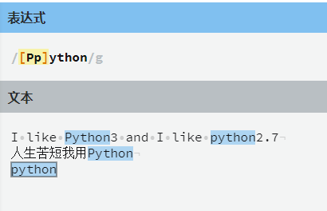


### 区间`[0-9]`、`[a-z]`、`[A-Z]`

如果要匹配从`a-z`的字母呢？我想你肯定不愿意从`a`写到`z`了！

为了适应这一点，正则表达式引擎在字符组中使用**连字符`(-)`代表区间**，依照这个规则，我们可以总结出三点：

1. 要匹配任意数字可以使用`[0-9]`；
2. 如果想要匹配所有小写字母，可以写成`[a-z]`；
3. 想要匹配所有大写字母可以写成`[A-Z]`。

`例子`

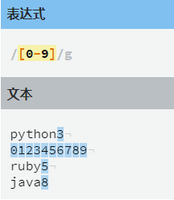

### 匹配特殊字符 `\-`

正则表达使用了 `-` 号代表了**区间**，但是我们有时候需要匹配的符号就是 `-`号，该怎么办呢？

这个时候我们需要对`-`号进行**转义**操作，即 `\-`。

在正则中使用 `\` 就可以进行对特殊符号进行转义，对 `-` 进行转义就可以表示为 `\-`，即 `\-` 就代表了 `-` 号本身。


`例子`

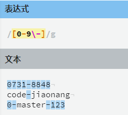

### 取反`^`

通过在字符数组开头使用 `^` 字符实现取反操作，从而可以反转一个字符组（意味着会匹配任何指定字符之外的所有字符）。

`例子`：匹配不包含数字的字符组

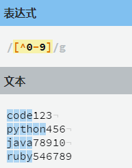

可以通过在字符数组开头使用 `^` 字符实现取反操作，从而可以反转一个字符组（意味着会匹配任何指定字符之外的所有字符）。


`例子`：这里的 `n[^e]` 的意思就是`n`后面的字母不能为 `e`。

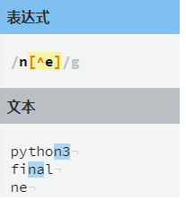


###  快捷匹配数字和`\d`字母`\w`

正则表达式引擎提供了一些快捷方式如：`\w` 可以与**任意单词字符**匹配。

当我们想要**匹配任意数字**的时候也可以使用快捷方式`\d`，`d`即`digit`数字的意思，等价于`[0-9]`

| 快捷方式 | 描述                                                         |
| -------- | ------------------------------------------------------------ |
| \w       | 与任意单词字符匹配，任意单词字符表示 `[A-Z]`、 `[a-z]`、`[0-9]`、`_` |
| \d       | 与任意数字匹配                                               |


### 匹配空白`\s`

`\s`快捷方式可以**匹配空白字符**，比如空格，tab、换行等。 


### 单词边界`\b` 

`\b` 匹配的是单词的边界

`例子`：`\bmaster\b` 就仅匹配有边界的`master`单词。

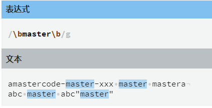

当然其他类型的数据，比如数字也能匹配：

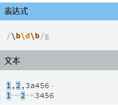


###  快捷方式取反`\W`、`\D`

快捷方式也可以取反，例如对于`\w`的取反为`\W`，将小写改写成大写即可，其他快捷方式也遵循这个规则


### 开始`^`和结束`$`

正则表达式中 `^`指定的是一个字符串的开始，`$`指定的是一个字符串的结束。

例如：

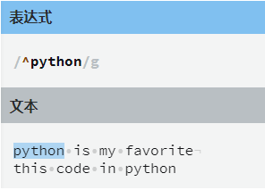

指定字符串的结束：

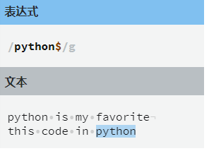

### 任意字符`.`

`.`字符代表匹配任何单个字符，它**只能出现在方括号以外**。

注意：`.`字符只有一个不能匹配的字符，也就是换行符（`\n`）


`例子`：

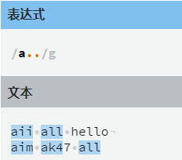


### 可选字符`?`

有时，我们可能想要匹配一个单词的不同写法，比如`color`和`colour`，或者`honor`与`honour`

这个时候我们可以使用 `?` 符号指定一个字符、字符组或其他基本单元可选，这意味着正则表达式引擎将会期望该字符出现**零次或一次**。

`例子`

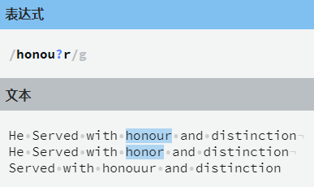


### 重复`{N}` 

到目前为止，我们只是学习了关于仅出现一次的字符串匹配，在实际开发中，肯定不能满足需求，比如要匹配电话号码、身份证的时候就无法满足需求了。

如果遇到这样的情况，我们可能期望一个字符组连续匹配好几次。

在一个字符组后加上`{N}` 就可以表示在它之前的字符组出现`N`次。

`例子`

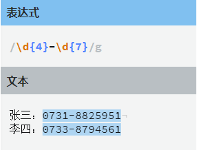

### 重复区间`{M,N}`

可能有时候，我们不知道具体要匹配字符组要重复的次数，比如身份证有`15`位也有`18`位的。

这里重复区间就可以出场了，语法：`{M,N}`，`M`是下限而`N`是上限。

`例子`

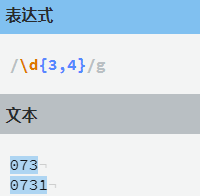

`\d{3,4}` 既可以匹配`3`个数字也可以匹配`4`个数字，不过当有`4`个数字的时候，优先匹配的是`4`个数字，这是因为正则表达式默认是**贪婪模式**，即尽可能的匹配更多字符，而要使用**非贪婪模式**，我们要在**表达式后面加上 `?`号**。

`例子`

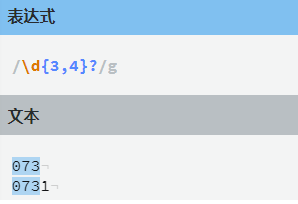


### 开闭区间

有时候我们可能遇到字符组的重复次数没有边界，例如：

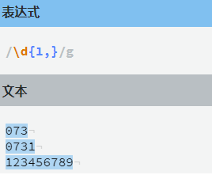

**开闭区间不写即可表示匹配一个或无数个**

#### 速写  `+`等价于`{1,} `         `*`等价于`{0,}` 

还可以使用两个速写字符指定常见的重复情况，可以使用 `+` 匹配`1`个到无数个，使用 `*`代表`0`个到无数个。

即：`+`等价于`{1,}`，`*`等价于`{0,}`。

`+`号示例：

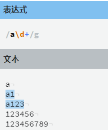

`*`号示例：

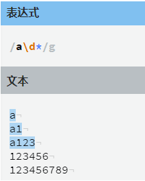


### 例子：匹配所有手机号码

现在请你使用正则表达式匹配手机号码，假设手机号码规则如下：

- 必须是`11`位的数字；

- 第一位数字必须以`1`开头，第二位数字可以是`[3,4,5,7,8]`中的任意一个，后面`9`个数是`[0-9]`中的任意一个数字。

- ```
    ^1[3,4,5,7,8]\d{9}
    ```


### 正则表达式总结

#### 多种匹配模式

| 实例          | 描述                                |
| ------------- | ----------------------------------- |
| `[Pp]ython`   | 匹配 “Python” 或 “python”。         |
| `rub[ye]`     | 匹配 “ruby” 或 “rube”。             |
| `[abcdef]`    | 匹配中括号内的任意一个字母。        |
| `[0-9]`       | 匹配任何数字。类似于 [0123456789]。 |
| `[a-z]`       | 匹配任何小写字母。                  |
| `[A-Z]`       | 匹配任何大写字母。                  |
| `[a-zA-Z0-9]` | 匹配任何字母及数字。                |
| `[^au]`       | 除了au字母以外的所有字符。          |
| `[^0-9]`      | 匹配除了数字外的字符。              |


| 实例 | 描述                                                         |
| ---- | ------------------------------------------------------------ |
| `.`  | 匹配除 “\n” 之外的任何单个字符。要匹配包括 ‘\n’ 在内的任何字符，请使用象 ‘[.\n]’ 的模式。 |
| `?`  | 匹配一个字符零次或一次，另一个作用是非贪婪模式               |
| `+`  | 匹配1次或多次                                                |
| `*`  | 匹配0次或多次                                                |
| `\b` | `\b` 匹配的是单词的边界，匹配整个单词                        |
| `\d` | 匹配一个数字字符。等价于 [0-9]。                             |
| `\D` | 匹配一个非数字字符。等价于 [^0-9]。                          |
| `\s` | 匹配任何空白字符，包括空格、制表符、换页符等等。等价于 [ \f\n\r\t\v]。 |
| `\S` | 匹配任何非空白字符。等价于 [^ \f\n\r\t\v]。                  |
| `\w` | 匹配包括下划线的任何单词字符。等价于’[A-Za-z0-9_]’。         |
| `\W` | 匹配任何非单词字符。等价于 ‘[^A-Za-z0-9_]‘。                 |


## form表单初体验

`例子`

```html
    <!-- 必须需要return才可以实现阻拦form表单跳转 -->
    <form action="success.html" method="get" onsubmit="return a()">
        账号:<input type="text" id="input_text" onblur="zh()" value="Hello world!">
        <span id="span1"></span>
        <br>
        密码:<input type="password" onblur="ps()" id="input_ps">
        <span id="span2"></span>
        <br>
        <input type="submit" value="提交按钮" id="sub">
    </form>
    <script>
        // form表单提交的函数
        function a(){
            // 中间使用 & 相连接
            if(zh()&ps()){
                alert('成功');
                return true;
            }else{
                alert('失败');
                return false;
            }
        }

        // 账号验证
        function zh(){
            var zhValue = document.getElementById('input_text').value;
            var span1  = document.getElementById('span1');
            var zhegnze = /Hello/g;
            if(zhegnze.test(zhValue)){
                span1.innerHTML = "<font color='green'>√</font>";
                return true;
            }else{
                span1.innerHTML = "<font color='red'>请输入和Hello相匹配的字符</font>";
                return false;
            }
        }
        // 密码验证
        function ps(){
            var zhValue = document.getElementById('input_ps').value;
            var span1  = document.getElementById('span2');
            var zhegnze = /Hello/g;
            if(zhegnze.test(zhValue)){
                span1.innerHTML = "<font color='green'>√</font>";
                return true;
            }else{
                span1.innerHTML = "<font color='red'>请输入和Hello相匹配的字符</font>";
                return false;
            }
        }
    </script>
```


### 全选全不选反选（例子）

```html
    <form action="">
        <input type="button" value="全选" id="btn1">
        <input type="button" value="全不选" id="btn2">
        <input type="button" value="反选" id="btn3">
        <br>
        HTML<input type="checkbox" name="a" id="">
        CSS<input type="checkbox" name="a" id="">
        JavaScript<input type="checkbox" name="a" id="">
        jquery<input type="checkbox" name="a" id="" >
    </form>

    <script>
        // 全选
        var btn1 = document.getElementById('btn1');
        btn1.onclick = function(){
            var che = document.getElementsByName('a');
            for(var i = 0;i<che.length;i++){
                che[i].checked = true;
            }
        }
        // 全不选
        var btn2 = document.getElementById('btn2');
        btn2.onclick = function(){
            var che = document.getElementsByName('a');
            for(var i = 0;i<che.length;i++){
                che[i].checked = false;
            }
        }
        // 反选
        var btn3 = document.getElementById('btn3');
        btn3.onclick = function(){
            var che = document.getElementsByName('a');
            for(var i = 0;i<che.length;i++){
                che[i].checked = !che[i].checked;
            }
        }
    </script>
```


### 表单

账号要求：数字，字母 不少于10位，不多与18位

密码要求：数字，字母 不少于10位，不多与18位
