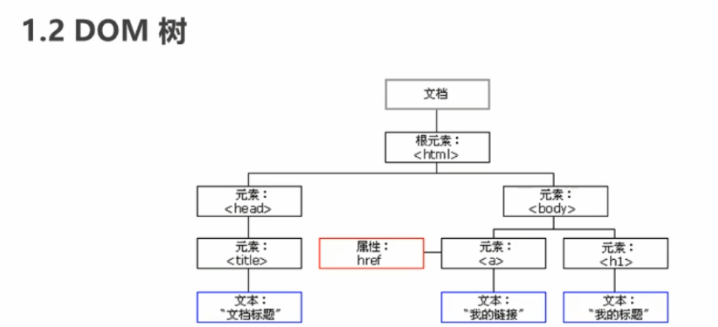

### DOM文档对象模型

文档对象模型（Document Object Model，简称 `DOM`），是 W3C 组织推荐的处理可扩展标记语言（HTML或者XML）的标准`编程接口`

W3C 已经定义了一系列的 DOM 接口，通过这些 DOM 接口可以改变网页的内容、结构和样式。


- 文档：一个页面就是一个文档，DOM中使用doucument来表示
- 元素：页面中的所有标签都是元素，DOM中使用 element 表示
- 节点：网页中的所有内容都是节点（标签，属性，文本，注释等），DOM中使用node表示

### 获取元素(标签)

#### 获取页面元素

获取页面中的元素可以使用以下几种方式:

- 根据 ID 获取
- 根据标签名获取
- 通过 HTML5 新增的方法获取
- 特殊元素获取

#### 根据ID获取

使用 `getElementByld()` 方法可以获取带ID的元素对象

```
doucument.getElementByld('id名')
```

使用 `console.dir()` 可以打印我们获取的元素对象，更好的查看对象里面的属性和方法。

###### 例子：

```
    <div id="time">2022-3-20</div>
    <script>
        // 1.因为我们文档页面从上往下加载，所以得先有标签，所以script写在标签下面
        // 2.get 获得 element 元素 by 通过 驼峰命名法
        // 3.参数 id是大小写敏感的字符串
        // 4.返回的是一个元素对象
        var timer = document.getElementById('time');
        console.log(timer);
        // 5. console.dir 打印我们的元素对象，更好的查看里面的属性和方法
        console.dir(timer);
    </script>
```


#### 根据标签名获取

根据**标签名**获取，使用 `getElementByTagName()` 方法可以返回带有指定标签名的**对象的集合**

```
doucument.getElementsByTagName('标签名');
```

- 因为得到的是一个对象的集合，所以我们想要操作里面的元素就需要遍历
- 得到元素对象是动态的
- 返回的是获取过来元素对象的集合，以伪数组的形式存储
- 如果获取不到元素，则返回为空的伪数组(因为获取不到对象)

```
<ul>
    <li>知否知否，应是等你好久</li>
    <li>知否知否，应是等你好久</li>
    <li>知否知否，应是等你好久</li>
    <li>知否知否，应是等你好久</li>
    <li>知否知否，应是等你好久</li>
</ul>
<script>
    // 1.返回的是获取过来元素对象的集合 以伪数组的形式存储
    var lis = document.getElementsByTagName('li');
    console.log(lis);
    console.log(lis[0]);
    // 2.依次打印,遍历
    for (var i = 0; i < lis.length; i++) {
        console.log(lis[i]);
    }
</script>
```


#### HTML5新增的方法获取

##### getElementsByClassName	，根据类名返回元素对象合集

根据类名返回元素对象合集

```
document.getElementsByClassName('类名')
```

###### 例子：

```
    <div class="box">盒子1</div>
    <div class="box">盒子2</div>
    <div id="nav">
        <ul>
            <li>首页</li>
            <li>产品</li>
        </ul>
    </div>

    <script>
        // etElementsByClassName	，根据类名返回元素对象合集
        var boxs = document.getElementsByClassName('box');
        console.log(boxs);
    </script>
```


##### document.querySelector	，根据指定选择器返回第一个元素对象

根据指定选择器返回`第一个元素`对象

```
document.querySelector('选择器');
```

###### 例子：

```
// 切记里面的选择器需要加符号 
// 类选择器.box 
// id选择器 #nav

    <div class="box">盒子1</div>
    <div class="box">盒子2</div>
    <div id="nav">
        <ul>
            <li>首页</li>
            <li>产品</li>
        </ul>
    </div>

    <script>
        // document.querySelector	，根据指定选择器返回第一个元素对象
        var a = document.querySelector('.box');
        var b = document.querySelector('#nav')
        var c = document.querySelector('li');
        console.log(a);
        console.log(b);
        console.log(c);
    </script>
```

##### document.querySelectorAll    ，根据指定选择器返回所有元素对象

根据指定选择器返回所有元素对象

```
document.querySelectorAll('选择器');
```

###### 例子：

```
    <div class="box">盒子1</div>
    <div class="box">盒子2</div>
    <div id="nav">
        <ul>
            <li>首页</li>
            <li>产品</li>
        </ul>
    </div>

    <script>
        // document.querySelectorAll    ，根据指定选择器返回所有元素对象
        var a = document.querySelectorAll('.box');
        console.log(a);
        var b = document.querySelectorAll('#nav');
        console.log(b);
        var c = document.querySelectorAll('li');
        console.log(c);
    </script>
```

<font color=red>注意：querySelector和querySelectorAll里面的选择器需要加符号,比如:document.querySelector('#nav');</font>


### 获取特殊元素

#### 获取body元素，返回body元素对象

```
document.body;
```

```
    <script>
        // 获取body 元素
        var bodyEle = document.body;
        console.log(bodyEle);
    </script>
```

#### 获取html元素，返回html元素对象

```
document.documentElement;
```

```
    <script>
        // 获取HTML元素
        var HtmlEle = document.documentElement;
        console.log(HtmlEle);
    </script>
```


### 事件基础

概念：JavaScript 使我们有能力创建动态页面，而事件是可以被 JavaScript 侦测到的行为。

网页中的每个元素都可以产生某些可以触发 JavaScript 的事件，例如，我们可以在用户点击某按钮时产生一个事件，然后去执行某些操作。

#### 事件三要素

1. 事件源(谁)
2. 事件类型(什么事件)
3. 事件处理程序(做啥)

```
    <button id="btn">点击按钮</button>
    <script>
        // 点击一个按钮，弹出对话框
        // 1. 事件是有三部分组成  事件源  事件类型  事件处理程序   我们也称为事件三要素
        //(1) 事件源 事件被触发的对象   谁  按钮
        var btn = document.getElementById('btn');
        //(2) 事件类型  如何触发 什么事件 比如鼠标点击(onclick) 还是鼠标经过 还是键盘按下
        //(3) 事件处理程序  通过一个函数赋值的方式 完成
        btn.onclick = function() {
            alert('出现弹窗');
        }
    </script>
```

#### 执行事件的步骤

1. 获取事件源
2. 注册事件(绑定事件)
3. 添加事件处理程序(采取函数赋值形式)

```
    <div>点我</div>
    <script>
        // 执行事件步骤
        // 点击div 控制台输出 我被选中了
        // 1. 获取事件源
        var div = document.querySelector('div');
        // 2.绑定事件 注册事件
        // div.onclick 
        // 3.添加事件处理程序 
        div.onclick = function() {
            console.log('我被选中了');
        }
    </script>
```


#### 鼠标事件

| 鼠标事件    | 触发条件         |
| ----------- | ---------------- |
| onclick     | 鼠标点击左键触发 |
| onmouseover | 鼠标经过触发     |
| onmouseout  | 鼠标离开触发     |
| onfocus     | 获得鼠标焦点触发 |
| onblur      | 失去鼠标焦点触发 |
| onmousemove | 鼠标移动触发     |
| onmouseup   | 鼠标弹起触发     |
| onmousedown | 鼠标按下触发     |


### 操作元素

JavaScript 的 DOM 操作可以改变网页内容、结构和样式，我们可以利用 DOM 操作元素来改变元素里面的内容 、属性等。

注意：以下都是属性

#### 改变元素（标签）内容

##### innerText

从起始位置到终止位置的内容，但它去除html标签，同时空格和换行也会去掉。

```
element.innerText
```

##### element.innerHTML

起始位置到终止位置的全部内容，包括HTML标签，同时保留空格和换行

```
element.innerHTML
```

##### 例子：

```

    <div></div>
    <p>
        我是文字
        <span>123</span>
    </p>

    <script>
        // innerText 和 innerHTML的区别 
        // 1. innerText 不识别html标签,去除空格和换行
        var div = document.querySelector('div');
        div.innerText = '<strong>今天是：</strong> 2019';
        // 2. innerHTML 识别html标签 保留空格和换行的
        div.innerHTML = '<strong>今天是：</strong> 2019';
        // 这两个属性是可读写的  可以获取元素里面的内容
        var p = document.querySelector('p');
        console.log(p.innerText);
        console.log(p.innerHTML);
    </script>

```


##### 案例：当鼠标点击按钮后，网页中出现现在的时间

```
    <button>显示当前系统时间</button>
    <div>某个时间</div>
    <p>123</p>
    <script>
        // 当点击显示当前系统时间按钮，div里面的文字需要发生变化
        // 1.获取元素
        var btn = document.querySelector('button');
        var div = document.querySelector('div');
        // 2.绑定时间
        btn.onclick = function(){
            // div.innerText = '2022-3-20';
            div.innerText = getTimes();
        }
        
        function getTimes() {
            var now = new Date();
            var year = now.getFullYear();   
            var month = now.getMonth() + 1;
            var day = now.getDate();
            var hours = now.getHours();
            var minutes = now.getMinutes();
            var seconds = now.getSeconds();
            // console.log('今天是'+year+'年'+month+'月'+day+'日'+hours+'点'+minutes+'分'+seconds+'秒');    
            return '今天是'+year+'年'+month+'月'+day+'日'+hours+'点'+minutes+'分'+seconds+'秒';
        }
        // 元素也可以不添加事件
        var p = document.querySelector('p');
        p.innerText = getTimes();
    </script>
```


#### 改变常用元素（标签）操作属性

1、src、href

2、alt 、title

###### 例子：img.属性   img.src = "xxx"，利用img属性的src元素，进行图片切换

```
    <button id="a">点击为a图片</button>
    <button id="b">点击为b图片</button>
    

    <script>
        // 修改元素属性src的路径，已替换照片
        // 1、获取元素
        var a = document.getElementById('a');
        var b = document.getElementById('b');
        var img = document.querySelector('img')
        // 2、绑定事件
        b.onclick = function(){
            img.src = './images/B.png';
        }
        a.onclick = function(){
            img.src = 'images/A.png';
        }
    </script>
```

扩展：当鼠标悬浮时，修改图片标签中的`title`属性

```
    <button id="a">点击为a图片</button>
    <button id="b">点击为b图片</button>
    

    <script>
        // 修改元素属性src的路径，已替换照片
        // 1、获取元素
        var a = document.getElementById('a');
        var b = document.getElementById('b');
        var img = document.querySelector('img');
        // 2、绑定事件
        b.onclick = function(){
            img.src = './images/B.png';
            img.title = 'B';
        }
        a.onclick = function(){
            img.src = 'images/A.png';
            img.title = 'A';
        }
    </script>
```


##### 案例：分时显示不同的图片，显示不同的问候语

根据不同时间，页面显示不同图片，同时显示不同的问候语

如果是上午时间打开页面时，显示上午好，显示A图片

如果是下午时间打开页面时，显示下午好，显示B图片

如果是晚上时间打开页面时，显示晚上好，显示C图片


思路：

1、根据系统不同时间来判断，所以需要用到日期内置对象。

2、利用分支语句来设置不同的图片。

3、需要一个图片，并且根据时间修改图片，需要用到操作元素src属性。

4、需要一个div元素，显示不同的问候语，修改元素内容即可。

```

    <div>上午</div>
    <script>
        // 1、根据系统不同时间来判断，所以需要用到日期内置对象
        // 2、利用分支语句来设置不同的图片
        // 3、需要一个图片，并且根据时间修改图片，需要用到操作元素src属性
        // 4、需要一个div元素，显示不同的问候语，修改元素内容即可。
        // 1、获取元素
        var img = document.querySelector('img');
        var div = document.querySelector('div');
        // 2、得到当前的小时数
        var date = new Date();
        var h = date.getHours();
        // 3、判断小时数改变图片和文字信息。
        if( h < 12 ){
            img.src = './images/A.png';
            div.innerHTML = '上午';
        }else if( h < 18){
            img.src = './images/B.png';
            div.innerHTML = '下午';
        }else{
            img.src = './images/C.png';
            div.innerHTML = '晚上';
        }
    </script>
```


##### 修改表单的属性操作

利用DOM可以操作如下表单元素的属性

```
type，value，checked，selected，disabled
```


###### 例子：value ，disabled

```
    <button>按钮</button>
    <input type="text" value="输入内容">
    <script>
        // 1、获取元素
        var btn = document.querySelector('button');
        var input = document.querySelector('input');
        // 2、注册事件，处理程序
        btn.onclick = function(){
            // input.innerHTML = '已经惦记了';  innerHTML仅用于普通盒子，如果div便签里面的内容
            // input.innerHTML = '已经点击了';
            input.value = '被点击';
            // 如果某个表单被禁用，不能再点击 disabled ，需要按钮禁用，可以设置为
            // btn.disabled = true;
            this.disabled = true;   //this 指向的是事件函数的调用者 btn
        }
    </script>
```


#### 改变样式属性操作

我们可以通过 JS 修改元素的大小、颜色、位置等样式。

##### 行内样式操作

语法：

```
// element.style
div.style.backgroundColor = 'pink';
div.style.width = '250px';
```


###### 行内样式操作——案例1：

`css`

```
    <style>
        div{
            width: 200px;
            height: 200px;
            background-color: pink;
        }
    </style>
```

`html`

```
		<div></div>
    <script>
        // 1、获取元素
        var div1 = document.querySelector('div');
        div1.onclick = function(){
            // div.style 里面的属性，采取驼峰命名法
            this.style.backgroundColor = 'red';
            this.style.width = '250px';
        }
    </script>
```


###### 行内样式操作——案例2：

`html`

```
    <div class="box">
        
        <i class="b">x</i>
    </div>
    <script>
        // 1、获取元素
        var btn = document.querySelector('.b');
        var box = document.querySelector('.box');
        // 2、注册事件 ，程序处理
        btn.onclick = function(){
            box.style.display = 'none';
        }
    </script>
```


###### 行内样式操作——案例3：显示隐藏文本框内容

当鼠标点击文本框时，默认文字隐藏，鼠标离开文本框时，里面文字显示

`css`

```
    <style>
        input{
            color: #666;
        }
    </style>
```

`html`

```
<input type="text" value="手机">
    <script>
        // 1、获取元素
        var text1 = document.querySelector('input');
        // 2、绑定事件
        text1.onfocus = function(){
            // console.log('获得焦点');
            if(text1.value === '手机'){
                text1.value = '';
            }
             // 获取焦点，需要把文本框的文字颜色变深
             text1.style.color = 'black';
        } 
        text1.onblur = function(){
            // console.log('失去了焦点');
            if(text1.value === ''){
                text1.value = '手机';   
            }
            // 失去焦点，需要把文本框的文字颜色变浅      
            text1.style.color = 'red';
        }
    </script>
```


##### 类名样式操作

语法：

```
// element.className
```

###### 类名样式操作——案例1：比较使用行内样式和类名样式操作的区别

`css`

```
    <style>
        div{
            width: 100px;
            height: 100px;
            background-color: pink;
        }
        .change{
            background-color: red;
            font-size: 25px;
            color: #fff;
            margin-top: 100px;
        }
    </style>
```

`html`

```
<div>
        <p>文本</p>
    </div>
    <script>
        var div1 = document.querySelector('div');
        div1.onclick = function(){
            // 使用行内样式修改元素样式，但是仅仅适用于样式比较少或者功能简单的情况下使用
            // this.style.backgroundColor = 'red';
            // this.style.color = '#fff';
            // this.style.fontSize = '25px';
            // this.style.marginTop = '100px';
            // 使用类名样式操作来看下，代码会更加简洁，适用于样式比较多的或者功能复杂的情况
            this.className = 'change';
        }
    </script>
```

注意：

1、js里面的样式采取驼峰命名法，比如： fontSize、backgroundColor

2、js修改style样式操作，产生的行内样式，css权重比较高

3、如果样式修改较多，可以采取操作类名方式更改元素样式

4、class 因为是个保留字，因此使用`className`来操作元素类名属性

5、className 会直接更改元素的类名，会`覆盖`原先的类名


###### 类名样式操作——案例1：密码框格式提示错误信息

用户如果离开密码框，里面输入的个数不是6~16，则提示错误信息，否则提示输入信息正确

思路；

①先判断的事件，需要用到表单失去焦点

②如果输入正确则提示正确的信息，颜色使用为绿色

③如果输入不是6~16位，我们采取`className`修改样式

④因为样式可能变化较多，我们采取`className`进行样式修改

`css`

```
    <style>
        .msg{
            color: blue;
        }
        .re{
            color: red;
        }
        .rg{
            color: green;
        }
    </style>
```

`html`

```
<input type="text" class="ipt">
    <span class="msg">请输入6~16为字母</span>
    <script>
        // 1、获取元素
        var ipt1 = document.querySelector('.ipt');
        var msg1 = document.querySelector('.msg');
        // 2、绑定失去焦点事件
        ipt1.onblur = function(){
            // 过去表单里面值的长度 ipt1.value.length
            if(this.value.length < 6 || this.value.length >16){
                msg1.className = 're';
                msg1.innerHTML = '你输入的位数不正确，要求6~16位哦!';
            }else{
                msg1.className = "rg";
                msg1.innerHTML = '恭喜，你终于输入对了。';
            }
        }
    </script>
```


#### 操作元素小结


#### 排他思想

###### 案例：思考，使用操作元素所学内容，完成以下操作

[点击第一个按钮为粉色，其他按钮默认无颜色，点击第二个按钮时，其他按钮默认也是无颜色的状态，依次类推](../DeomCode/S/S0/S06.html)


如果有同一组元素，我们相要某一个元素实现某种样式，需要用到循环的排他思想算法：

1. 所有元素全部清除样式（干掉其他人）
2. 给当前元素设置样式 （留下我自己）
3. 注意顺序不能颠倒，首先干掉其他人，再设置自己

```
    <button>按钮1</button>
    <button>按钮2</button>
    <button>按钮3</button>
    <button>按钮4</button>
    <button>按钮5</button>
    <script>
        // 1. 获取所有按钮元素
        var btns = document.getElementsByTagName('button');
        // btns得到的是伪数组  里面的每一个元素 btns[i]
        for (var i = 0; i < btns.length; i++) {
            btns[i].onclick = function() {
                // (1) 我们先把所有的按钮背景颜色去掉  干掉所有人
                for (var i = 0; i < btns.length; i++) {
                    btns[i].style.backgroundColor = '';
                }
                // (2) 然后才让当前的元素背景颜色为pink 留下我自己
                this.style.backgroundColor = 'pink';

            }
        }
        //2. 首先先排除其他人，然后才设置自己的样式 这种排除其他人的思想我们成为排他思想
    </script>
```


##### 案例：换肤效果

`css`

```
    <style>
        body{
            background: url(./images/A.png) repeat;
        }
        ul{
            display: inline-block;
            border: 3px solid aqua;
        }
    </style>
```

`html`

```
<ul class="box">
        <li>
            
        </li>
        <li>
            
        </li>
        <li>
            
        </li>   
    </ul>
    <script>
        // 1、获取元素
        var img1 = document.querySelector('.box').querySelectorAll('img');
        // console.log(img1);
        for(var i = 0;i<img1.length;i++){
            img1[i].onclick = function(){
                // this.src 就是我们图片的路径， ./images/B.png
                // console.log(this.src);
                // 将this.src 路径设置给 body 上
                document.body.style.backgroundImage = 'url('+this.src+')';
            }
        }
    </script>
```


#### 自定义属性操作

##### 获取属性值的两种方法

```
    <div id="demo"></div>
    <script>
        var div1 = document.querySelector('div');
        // 1.获取元素的属性值 
        // (1) element.属性  
        console.log(div1.id);       //demo
        // (2) element.getAttribute('属性')  get得到获取 attribute 属性的意思，自定义属性，即编程人员自定的属性
        console.log(div1.getAttribute('id'));   //demo
    </script>
```

###### (1) element.属性  	

###### (2) element.getAttribute('属性')

##### 获取属性值两种方法的区别

- element.属性  获取内置属性值(元素本身自带的属性)
- element.getAttribute('属性')：主要用于获取自定义属性的。自定义属性：即编程人员自定的属性。

```
    <div id="demo" index="1" ></div>
    <script>
        var div1 = document.querySelector('div');
        console.log(div1.index);    //undefined
        console.log(div1.getAttribute('index'));    //1
    </script>
```


##### 设置属性值的两种方法

```
    <div id="demo" index="1"></div>
    <script>
        var div1 = document.querySelector('div');
        // 1、设置元素的属性值
        // (1) element.属性名 = '值';
        div1.id = 'test';
        // (2) element.setAttribute('属性名','属性值'),只要针对自定义属性，可以修改，也可以新增。
        div1.setAttribute('index',2);
        div1.setAttribute('class','footer');    //class 比较特殊，必须写class，否则css样式不生效。
    </script>
```

###### (1) element.属性名 = '值';

###### (2) element.setAttribute('属性名','属性值'),只要针对自定义属性，可以修改，也可以新增。

##### 设置属性值两种方法的区别

- element.属性
- element.setAttribute('属性')；  主要用于设置自定义属性。


##### 移出属性值

###### (1)移除属性值 removeAttribute('属性');

```
    <div id="demo" index="1"></div>
    <script>
        var div1 = document.querySelector('div');
        // 1、移除属性值 removeAttribute('属性');
        div1.removeAttribute('index');
    </script>
```


##### 案例：S10-tab栏切换

显示效果：[S10-table栏切换](https://codepen.io/fan-yue/pen/YzYVLeQ)

<iframe height="600" style="width: 100%;" scrolling="no" title="tab栏切换" src="https://codepen.io/fan-yue/embed/YzYVLeQ?default-tab=html%2Cresult" frameborder="no" loading="lazy" allowtransparency="true" allowfullscreen="true">
  See the Pen <a href="https://codepen.io/fan-yue/pen/YzYVLeQ">
  tab栏切换</a> by fan-yue (<a href="https://codepen.io/fan-yue">@fan-yue</a>)
  on <a href="https://codepen.io">CodePen</a>.
</iframe>


思路：


代码：

`CSS`

```
    <style>
        .tab_list ul,.tab_list li{
            margin: 0;
            padding: 0;
        }
        .tab ul li{
            list-style: none;
            float: left;
            border: 1px solid black;
            border-left: none;
            padding: 20px;
        }
        .current{
            color: white;
            background-color: red;
        }
        .item{
            display: none;
        }

    </style>
```

`HTML`

```
<div class="tab">
        <div class="tab_list">
            <ul>
                <li class="current" >商品介绍</li>
                <li>规格与包装</li>
                <li>售后保障</li>
                <li>商品评价(50000)</li>
                <li>手机社区</li>            
            </ul>
        </div>
        <div style="clear: both;"></div>
        <div class="tab_con">
            <div class="item" style="display: block;">商品介绍模块</div>
            <div class="item">规格与包装模块</div>
            <div class="item">售后保障模块</div>
            <div class="item">商品评价模块</div>
            <div class="item">手机社区模块</div>
        </div>
    </div>
    
    <script>
        // 获取元素
        var tab_list = document.querySelector('.tab_list');
        var list = tab_list.querySelectorAll('li');
        var items = document.querySelectorAll('.item');
        // 利用for循环绑定点击事件
        for(var i = 0;i < list.length;i++){
            // 开始给5个li标签设置index属性和值
            list[i].setAttribute('index',i);
            list[i].onclick = function(){
                // 1.模块选项卡，点击某一个，默认第一个li标签的中的底色是红色，其余不变(利用排他思想)修改类名的方式
                // 使用排它思想，将所有li中的class样式current清除
                for(var i = 0;i<list.length;i++){   
                    list[i].className = '';
                }
                // 给自己加样式
                this.className = 'current';
                // 2、选项卡解决了，需要处理内容模块。当点击对应的选项卡，出现对应的内容.
                // 利用li标签中自定义属性的功能，自定义一个属性。
                var index = this.getAttribute('index');
                console.log(index);
                // 使用排它思想，将所有item中的div全部隐藏
                for(var i = 0;i < items.length;i++){
                    items[i].style.display = 'none';
                }
                items[index].style.display = 'block'了;
            }
        }
    </script>
```


##### H5自定义属性

自定义属性目的：

- 保存并保存数据，有些数据可以保存到页面中而不用保存到数据库中
- 有些自定义属性很容易引起歧义，不容易判断到底是内置属性还是自定义的，所以H5有了规定


##### 设置H5自定义属性

H5规定自定义属性 `data-`开头作为属性名并赋值

```
    <!-- 自定义属性 -->
    <div data-index = "1"></div>
    <script>
        var  div1 = document.querySelector('div');
        // 或者使用JavaScript设置
        div1.setAttribute('data-obj',10);
    </script>
```

 

##### 获取H5自定义属性

- 兼容性获取 `element.getAttribute('data-index')`
- H5新增的：`element.dataset.index` 或`element.dataset['index']` IE11才开始支持]

```
		<div getTime="20" data-index="2" data-list-name="andy"></div>
    <script>
        var div1 = document.querySelector('div');
        console.log(div1.getAttribute('getTime'));
        div1.setAttribute('data-time', 20);
        console.log(div1.getAttribute('data-index'));
        console.log(div1.getAttribute('data-list-name'));
        // h5新增的获取自定义属性的方法 它只能获取data-开头的
        // dataset 是一个集合里面存放了所有以data开头的自定义属性
        console.log(div1.dataset);
        console.log(div1.dataset.index);
        console.log(div1.dataset['index']);
        // 如果自定义属性里面有多个-链接的单词，我们获取的时候采取 驼峰命名法
        console.log(div1.dataset.listName);
        console.log(div1.dataset['listName']);
    </script>
```

在以后开发中，一定要知道其代码的写法及意义。


### 节点操作

获取元素通常使用两种方式：

|   1.利用DOM提供的方法获取元素   | 2.利用节点层级关系获取元素 |
| :-----------------------------: | :------------------------: |
|    document.getElementById()    | 利用父子兄节点关系获取元素 |
| document.getElementsByTagName() |  逻辑性强，但是兼容性较差  |
|    document.querySelector 等    |                            |
|        逻辑性不强，繁琐         |                            |

这两种方式都可以获取元素节点，我们后面都会使用，但是节点操作更简单

一般的，节点至少拥有三个基本属性


#### 节点概述

网页中的所有内容都是节点（标签、属性、文本、注释等），在DOM 中，节点使用 node 来表示。

HTML DOM 树中的所有节点均可通过 JavaScript 进行访问，所有 HTML 元素（节点）均可被修改，也可以创建或删除。



一般的，节点至少拥有nodeType（节点类型）、nodeName（节点名称）和nodeValue（节点值）这三个基本属性。

- 元素节点：nodeType 为1

- 属性节点：nodeType 为2

- 文本节点：nodeType 为3(文本节点包括文字、空格、换行等)

  

我们在实际开发中，节点操作主要操作的是**元素节点**

利用 DOM 树可以把节点划分为不同的层级关系，常见的是**父子兄层级关系**。


#### 父级节点

```
node.parentNode
```

- `parentNode`属性可以返回某节点的父结点，注意是最近的一个父结点
- 如果指定的节点没有父结点则返回null

###### 例子：

```
    <!-- 父节点 -->
     <div class="demo">
         <div class="box">
             <span class="erweima">×</span>
         </div>
     </div>
 
     <script>
         // 1. 父节点 parentNode
         var erweima = document.querySelector('.erweima');
         // var box = document.querySelector('.box');
         // 得到的是离元素最近的父级节点(亲爸爸) 如果找不到父节点就返回为 null
         console.log(erweima.parentNode);
     </script>
```


#### 子结点

```
parentNode.childNodes(标准)
```

- `parentNode.childNodes` 返回包含指定节点的子节点的集合，该集合为即时更新的集合
- 返回值包含了所有的子结点，包括元素节点，文本节点等
- 如果只想要获得里面的元素节点，则需要专门处理。所以我们一般不提倡使用`childNodes`

```
parentNode.children(非标准)
```

- `parentNode.children` 是一个只读属性，返回所有的子元素节点
- 它只返回子元素节点，其余节点不返回 （**这个是我们重点掌握的**）
- 虽然 children 是一个非标准，但是得到了各个浏览器的支持，因此我们可以放心使用

```
    <ul>
        <li>我是li</li>
        <li>我是li</li>
        <li>我是li</li>
        <li>我是li</li>
    </ul>
    <ol>
        <li>我是li</li>
        <li>我是li</li>
        <li>我是li</li>
        <li>我是li</li>
    </ol>
    <script>
        // DOM 提供的方法（API）获取
        var ul = document.querySelector('ul');
        var lis = ul.querySelectorAll('li');
        // 1. 子节点  childNodes 所有的子节点 包含 元素节点 文本节点等等
        console.log(ul.childNodes);
        console.log(ul.childNodes[0].nodeType);
        console.log(ul.childNodes[1].nodeType);
        // // 2. children 获取所有的子元素节点 也是我们实际开发常用的
        console.log(ul.children);
    </script>
```


##### 第一个子结点

```
parentNode.firstChild
```

- `firstChild` 返回第一个子节点，找不到则返回null
- 同样，也是包含所有的节点

```
parentNode.firstElementChild
```

- 第一个子结点(兼容性)
- `firstElementChild` 返回第一个子节点，找不到则返回null
- 有兼容性问题，IE9以上才支持


##### 最后一个子结点

```
parentNode.lastChild
```

- `lastChild` 返回最后一个子节点，找不到则返回null
- 同样，也是包含所有的节点

```
parentNode.lastElementChild
```

- 最后一个子结点(兼容性)

- `lastElementChild` 返回最后一个子节点，找不到则返回null

- 有兼容性问题，IE9以上才支持

  ###### 例子：

```
    <ol>
        <li>我是li1</li>
        <li>我是li2</li>
        <li>我是li3</li>
        <li>我是li4</li>
        <li>我是li5</li>
    </ol>
    <script>
        var ol = document.querySelector('ol');
        // 1. firstChild 第一个子节点 不管是文本节点还是元素节点
        console.log(ol.firstChild);
        console.log(ol.lastChild);
        // 2. firstElementChild 返回第一个子元素节点 ie9才支持
        console.log(ol.firstElementChild);
        console.log(ol.lastElementChild);
        // 3. 实际开发的写法  既没有兼容性问题又返回第一个子元素
        console.log(ol.children[0]);			//第一个子元素节点
        console.log(ol.children[ol.children.length - 1]);//最后一个子元素节点
    </script>
```

实际开发中，firstChild 和 lastChild 包含其他节点，操作不方便，而 firstElementChild 和 lastElementChild 又有兼容性问题，那么我们如何获取第一个子元素节点或最后一个子元素节点呢？


##### 使用children索引来获取元素

```
// 数组元素个数减1 就是最后一个元素的索引号
parentNode.chilren[parentNode.chilren.length - 1]
```

- 如果想要第一个子元素节点，可以使用 `parentNode.chilren[0]`

- 如果想要最后一个子元素节点，可以使用

  ###### 例子：

```
<ol>
        <li>我是li1</li>
        <li>我是li2</li>
        <li>我是li3</li>
        <li>我是li4</li>
    </ol>
    <script>
        var ol = document.querySelector('ol');
        // 1.firstChild 获取第一个子结点的，包含文本结点和元素结点
        console.log(ol.firstChild);
        // 返回的是文本结点 #text(第一个换行结点)
        
        console.log(ol.lastChild);
        // 返回的是文本结点 #text(最后一个换行结点)
        // 2. firstElementChild 返回第一个子元素结点
        console.log(ol.firstElementChild);
        // <li>我是li1</li>
        
        // 第2个方法有兼容性问题，需要IE9以上才支持
        // 3.实际开发中，既没有兼容性问题，又返回第一个子元素
        console.log(ol.children[0]);
        // <li>我是li1</li>
        console.log(ol.children[3]);
        // <li>我是li4</li>
        // 当里面li个数不唯一时候，需要取到最后一个结点时这么写
        console.log(ol.children[ol.children.length - 1]);
    </script>
```


##### 案例：S17案例-新浪下拉菜单（使用技术：子节点，鼠标事件，获取元素）

参考网址链接：[新浪首页](https://www.sina.com.cn/)

效果预览如下：[S17案例-新浪下拉菜单](https://codepen.io/fan-yue/pen/LYejxPd)

<iframe height="300" style="width: 100%;" scrolling="no" title="Untitled" src="https://codepen.io/fan-yue/embed/LYejxPd?default-tab=html%2Cresult" frameborder="no" loading="lazy" allowtransparency="true" allowfullscreen="true">
  See the Pen <a href="https://codepen.io/fan-yue/pen/LYejxPd">
  Untitled</a> by fan-yue (<a href="https://codepen.io/fan-yue">@fan-yue</a>)
  on <a href="https://codepen.io">CodePen</a>.
</iframe>

`CSS`

```
*{
    margin: 0;
    padding:0;
}
li{
    list-style: none;
}
.nav{
    background: #fcfcfc;
}
.nav>li{
    float: left;
}
.nav>li a{
    text-decoration: none;
    color: black;
}
.nav_a1{
    display: inline-block;
    padding: 12px 15px 12px 18px;
}
.nav_a1:hover{
    background:#edeef0;
}
/* 平替方法，但是也有bug，鼠标取消悬浮后，会消失，不符合要求 */
/* .nav_a1:hover +.nav_1{
    display: block;
} */
.nav_1{
    border: 1px solid #ebbe7a;
    display: none;

}
.nav_1>li{
    border-bottom: 1px solid #fecc5b;
    text-align: center;
    line-height: 20px;
    padding: 12px 15px;
}
```

`HTML`

```
<!DOCTYPE html>
<html lang="en">
<head>
    <meta charset="UTF-8">
    <meta http-equiv="X-UA-Compatible" content="IE=edge">
    <meta name="viewport" content="width=device-width, initial-scale=1.0">
    <title>Document</title>
    <link rel="stylesheet" href="./S17.css">
    <style>

    </style>
</head>
<body>
    <ul class="nav">
        <li>
            <a href="#" class="nav_a1">微博</a>
            <ul class="nav_1">
                <li>
                    <a href="#">私信</a>
                </li>
                <li>
                    <a href="#">私信</a>
                </li>
                <li>
                    <a href="#">私信</a>
                </li>
            </ul>
        </li>
        <li>
            <a href="#" class="nav_a1">博客</a>
            <ul class="nav_1">
                <li>
                    <a href="#">博客评论</a>
                </li>
                <li>
                    <a href="#">未读提醒</a>
                </li>
            </ul>
        </li>
        <li>
            <a href="#" class="nav_a1">邮箱</a>
            <ul class="nav_1">
                <li>
                    <a href="#">免费邮箱</a>
                </li>
                <li>
                    <a href="#">VIP邮箱</a>
                </li>
            </ul>
        </li>
    </ul>
</body>
</html>
```

`js`

```
<script>
        // 获取元素
        var nav1 = document.querySelector('.nav');
        var lis = nav1.children;
        // console.log(lis);
        for(var i = 0;i<lis.length;i++){
            lis[i].onmouseover = function(){
            this.children[1].style.display = 'block';
            }
            lis[i].onmouseout = function(){
                this.children[1].style.display = 'none';
            }
        }
    </script>
```


#### 兄弟节点

##### 下一个兄弟节点

```
node.nextSibling
```

- `nextSibling` 返回当前元素的下一个兄弟元素节点，找不到则返回null
- 同样，也是包含所有的节点


##### 上一个兄弟节点

```
node.previousSibling
```

- `previousSibling` 返回当前元素上一个兄弟元素节点，找不到则返回null
- 同样，也是包含所有的节点


##### 下一个兄弟节点(兼容性)

```
node.nextElementSibling
```

- `nextElementSibling` 返回当前元素下一个兄弟元素节点，找不到则返回null
- 有兼容性问题，IE9才支持


##### 上一个兄弟节点(兼容性)

```
node.previousElementSibling
```

- `previousElementSibling` 返回当前元素上一个兄弟元素节点，找不到则返回null
- 有兼容性问题，IE9才支持


###### 例子：

```
    <div>我是div</div>
    <span>我是span</span>
    <script>
        var div1 = document.querySelector('div');
        // 1.nextSibling 下一个兄弟节点 包含元素节点或者 文本节点等等
        console.log(div1.nextSibling);		// #text
        // previousSibling 上一个兄弟节点，包含元素节点或者 文本节点等等
        console.log(div1.previousSibling);	// #text
        // 2. nextElementSibling 得到下一个兄弟元素节点
        console.log(div1.nextElementSibling);	//<span>我是span</span>
        // previousElementSibling 得到上一个兄弟元素节点
        console.log(div1.previousElementSibling);//null
    </script>
```


##### 通过封装函数解决兄弟节点的兼容性问题         <font color= yellow>了解</font>

```
function getNextElementSibling(element) {
    var el = element;
    while(el = el.nextSibling) {
        if(el.nodeType === 1){
            return el;
        }
    }
    return null;
}
```


#### 创建节点

```
document.createElement('tagName');
```

- `document.createElement()` 方法创建由 tagName 指定的HTML 元素
- 因为这些元素原先不存在，是根据我们的需求动态生成的，所以我们也称为**动态创建元素节点**


##### 添加节点

```
node.appendChild(child)
```

- `node.appendChild()` 方法将一个节点添加到指定父节点的子节点列表**末尾**。类似于 CSS 里面的 after 伪元素。

  

```
node.insertBefore(child,指定元素)
```

- `node.insertBefore()` 方法将一个节点添加到父节点的指定子节点**前面**。类似于 CSS 里面的 before 伪元素。


###### 例子：

```
    <ul>
        <li>123</li>
    </ul>
    <script>
        // 1. 创建节点元素节点
        var li = document.createElement('li');
        // 2. 添加节点 node.appendChild(child)  node 父级  child 是子级 后面追加元素  类似于数组中的push
        // 先获取父亲ul
        var ul = document.querySelector('ul');
        ul.appendChild(li);
        // // 3. 添加节点 node.insertBefore(child, 指定元素);
        var lili = document.createElement('li');
        ul.insertBefore(lili, ul.children[0]);

        var li1 = document.createElement('li');
        ul.appendChild(li1);
        // // 4. 我们想要页面添加一个新的元素分两步: 1. 创建元素 2. 添加元素
    </script>
```


##### 案例：S1820-简单留言板——发布留言功能

效果预览如下：[S1820-简单留言板——发布留言功能](https://codepen.io/fan-yue/pen/KKZvWBx)

<iframe height="500" style="width: 100%;" scrolling="no" title="S1820案例-简单留言版案例" src="https://codepen.io/fan-yue/embed/KKZvWBx?default-tab=html%2Cresult" frameborder="no" loading="lazy" allowtransparency="true" allowfullscreen="true">
  See the Pen <a href="https://codepen.io/fan-yue/pen/KKZvWBx">
  S1820案例-简单留言版案例</a> by fan-yue (<a href="https://codepen.io/fan-yue">@fan-yue</a>)
  on <a href="https://codepen.io">CodePen</a>.
</iframe>


```
    <textarea>123</textarea>
    <button>发布</button>
    <ul>

    </ul>

    <script>
        var text1 = document.querySelector('textarea');
        var btn1 = document.querySelector('button');
        var ul1 = document.querySelector('ul');
        // 绑定事件
        btn1.onclick = function(){
            if(text1.value == ''){
                alert('你没输入内容，就是在占用资源');
            }else{
                var li1 = document.createElement('li');
                li1.innerHTML = text1.value;
                // 添加元素，从后面添加
                // ul1.appendChild(li1);
                ul1.insertBefore(li1,ul1.children[0]);
            }
        }
    </script>
```


##### 删除节点

```
node.removeChild(child)
```

- `node.removeChild()`方法从 DOM 中删除一个子节点，返回删除的节点

  ###### 例子：

```
    <button>删除</button>
    <ul>
        <li>甲</li>
        <li>乙</li>
        <li>丙</li>
    </ul>
    <script>
        // 获取元素
        var ul1 = document.querySelector('ul');
        var btn1 = document.querySelector('button');
        // 删除元素
        // ul1.removeChild(ul1.children[0]);
        // 点击按钮，依次删除li中的文字，当li标签删除没有后，就会报错。
        // btn1.onclick = function(){
        //     ul1.removeChild(ul1.children[0]);
        // }
        btn1.onclick = function(){
            if(ul1.children.length == 0){
                this.disabled = true;
            }else{
                ul1.removeChild(ul1.children[0]);
            }
        }
    </script>
```


##### 案例：S1822删除留言案例

效果预览如下：[S1822删除留言案例](https://codepen.io/fan-yue/pen/Exowaae)

<iframe height="500" style="width: 100%;" scrolling="no" title="S1822删除留言案例" src="https://codepen.io/fan-yue/embed/Exowaae?default-tab=html%2Cresult" frameborder="no" loading="lazy" allowtransparency="true" allowfullscreen="true">
  See the Pen <a href="https://codepen.io/fan-yue/pen/Exowaae">
  S1822删除留言案例</a> by fan-yue (<a href="https://codepen.io/fan-yue">@fan-yue</a>)
  on <a href="https://codepen.io">CodePen</a>.
</iframe>


`HTML`

```
    <textarea>123</textarea>
    <button>发布</button>
    <ul>
        <li>
            这个案例,没有加js功能
            <a href="#">删除</a>
        </li>
    </ul>

    <script>
        var text1 = document.querySelector('textarea');
        var btn1 = document.querySelector('button');
        var ul1 = document.querySelector('ul');
        // 绑定事件
        btn1.onclick = function(){
            if(text1.value == ''){
                alert('你没输入内容，就是在占用资源');
            }else{
                var li1 = document.createElement('li');
                li1.innerHTML = text1.value + "<a href='javascript:;'>删除</a>";
                // 添加元素，从后面添加
                // ul1.appendChild(li1);
                ul1.insertBefore(li1,ul1.children[0]);
                // 删除元素，删除当前的li元素
                    // 获取a标签的元素
                var as = document.querySelectorAll('a');
                for(var i = 0;i<as.length;i++){
                    as[i].onclick = function(){
                        // node.removeChild(chilld);删除的是li当前a所在的li ，this,parentNode
                        ul1.removeChild(this.parentNode);
                    }
                }
            }
        }
    </script>
```


##### 复制节点(克隆节点)

```
node.cloneNode()
```

- `node.cloneNode()`方法返回调用该方法的节点的一个副本。 也称为克隆节点/拷贝节点

- 如果括号参数为空或者为 false ，则是浅拷贝，即只克隆复制节点本身，不克隆里面的子节点

- 如果括号参数为 true ，则是深度拷贝，会复制节点本身以及里面所有的子节点

  ###### 例子：

```
    <ul>
        <li>1</li>
        <li>2</li>
        <li>3</li>
    </ul>
    
    <script>
        var ul1 = document.querySelector('ul');
        var li1 = ul1.children[0].cloneNode(true);
        // 1、如果括号参数为空或者为FALSE，则是浅拷贝，即只克隆复制节点本身，不克隆里面的字节点。
        // 2、括号参数为 true ，则是深度拷贝，会复制节点本身以及里面所有的子节点
        ul1.appendChild(li1);
    </script>
```


##### 案例：S1824案例-动态生成表格

效果预览如下：[S1824案例-动态生成表格](https://codepen.io/fan-yue/pen/MWrEaME)

<iframe height="500" style="width: 100%;" scrolling="no" title="S1824案例-动态生成表格" src="https://codepen.io/fan-yue/embed/MWrEaME?default-tab=html%2Cresult" frameborder="no" loading="lazy" allowtransparency="true" allowfullscreen="true">
  See the Pen <a href="https://codepen.io/fan-yue/pen/MWrEaME">
  S1824案例-动态生成表格</a> by fan-yue (<a href="https://codepen.io/fan-yue">@fan-yue</a>)
  on <a href="https://codepen.io">CodePen</a>.
</iframe>

`HTML`

```
    <table cellspacing="0" border="1">
        <thead>
            <td>姓名</td>
            <td>考试科目</td>
            <td>考试成绩</td>
            <td>删除</td>
        </thead>
        <tbody>
            <tr>
                <td>我是案例，没有添加</td>
                <td>HTML</td>
                <td>100</td>
                <td>
                    <a href="#">删除</a>
                </td>
            </tr>
        </tbody>
    </table>

    <script>
        // 1、先去准备好学生的数据，使用数组对象，创建数据
        var datas = [
            {
                name:'路人甲',
                subject:'JavaScript',
                score:100
            },
            {
                name:'路人乙',
                subject:'HTML',
                score:90
            },
            {
                name:'路人丙',
                subject:'CSS',
                score:96
            },
            {
                name:'路人丁',
                subject:'Jquery',
                score:80
            }
        ];
        // 2、往tbody 里面创建行，有几个人，就创建几个行
        var tbody1 = document.querySelector('tbody');
        for(var i = 0;i<datas.length;i++){  //外层for循环管行，tr
            // 3、创建tr行
            var tr1 = document.createElement('tr');
            tbody1.appendChild(tr1);
            // 行里面创建单元格(跟数据有关) td 单元格的数量取决于每个对象里面的属性个数， for循环遍历对象
            for(var k in datas[i]){  //里面for循环管列数，td
                // 创建单元格
                var td = document.createElement('td');
                // 插入创建的单元格
                td.innerHTML = datas[i][k];
                tr1.appendChild(td);
                // 把对象里面的属性值给 td
                    //获取对象里面的属性值 datas[i][k]
                // console.log(datas[i][k]);
            }
            // 3、创建有删除2个字对应的单元格
            var td = document.createElement('td');
            td.innerHTML = '<a href="#">删除</a>';
            tr1.appendChild(td);
        }
        /* for(var k in datas){
            k 是属性名
            datas[k] 是属性值
        } */

        // 3、添加删除操作 
        var as = document.querySelectorAll('a');
        for(var i = 0;i<as.length;i++){
            as[i].onclick = function(){
                // 点击a 删除 当前a 所在的行（对应的链接）node.removeChild(child)
                tbody1.removeChild(this.parentNode.parentNode);
            }
        }
    </script>
```


#### 三种动态创建元素的区别

