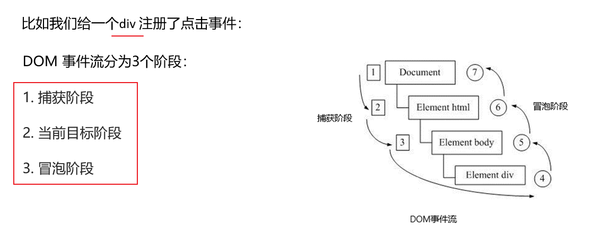
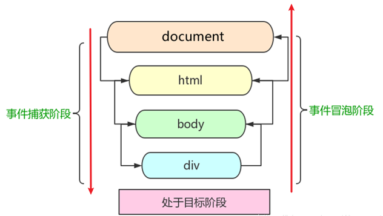

## 注册事件(绑定事件)

给元素添加事件，称为`注册事件`或者`绑定事件`。

注册事件有两种方式：`传统方式`和`方法监听注册方式`

| 传统注册方式                                                 | 方法监听注册方式                                      |
| :----------------------------------------------------------- | :---------------------------------------------------- |
| 利用 on 开头的事件 onclick                                   | w3c 标准推荐方式                                      |
| `<button onclick = "alert("hi")"></button>`                  | addEventListener() 它是一个方法                       |
| btn.onclick = function() {}                                  | IE9 之前的 IE 不支持此方法，可使用 attachEvent() 代替 |
| 特点：注册事件的唯一性                                       | 特点：同一个元素同一个事件可以注册多个监听器          |
| 同一个元素同一个事件只能设置一个处理函数，<br />最后注册的处理函数将会覆盖前面注册的处理函数 | 按注册顺序依次执行                                    |

###### 例子：传统注册方式

```
    <button>传统注册时间</button>
    <button>方法监听注册事件</button>

    <script>
        var btns = document.querySelectorAll('button');
        btns[0].onclick = function(){
            alert('hahahs0');
        }
        btns[0].onclick = function(){
            alert('wuwuw');
        }
    </script>
```


### addEventListener事件监听方式

- `eventTarget.addEventListener()`方法将指定的监听器注册到 eventTarget（目标对象）上

- 当该对象触发指定的事件时，就会执行事件处理函数

  ```
  eventTarget.addEventListener(type,listener[,useCapture])
  ```

  该方法接收三个参数：

  - `type`:事件类型字符串，比如click,mouseover,注意这里不要带`on`
  - `listener`：事件处理函数，事件发生时，会调用该监听函数
  - `useCapture`：可选参数，是一个布尔值，默认是 false。学完 DOM 事件流后，我们再进一步学习


```
    <button>传统注册时间</button>
    <button>方法监听注册事件</button>

    <script>
        var btns = document.querySelectorAll('button');
        btns[1].addEventListener('click',function(){
            alert('哈啊哈');
        })
        btns[1].addEventListener('click',function(){
            alert('555');
        })
    </script>
```


### attachEvent事件监听方式(兼容)  		ie9以前的版本支持		<font color=yellow>了解</font>

- `eventTarget.attachEvent()`方法将指定的监听器注册到 eventTarget（目标对象） 上

- 当该对象触发指定的事件时，指定的回调函数就会被执行

  

```
eventTarget.attachEvent(eventNameWithOn,callback)
```

该方法接收两个参数：

- `eventNameWithOn`：事件类型字符串，比如 onclick 、onmouseover ，这里要带 on
- `callback`： 事件处理函数，当目标触发事件时回调函数被调用
- ie9以前的版本支持


```
    <button>传统注册时间</button>
    <button>方法监听注册事件</button>
    <button>attachEvent方法监听事件</button>

    <script>
        var btns = document.querySelectorAll('button');
        btns[2].attachEvent('onclick',function(){
            console.log('你得找个ie9以下的浏览器。这个代码才能用');
        })
    </script>
```


### 注册事件兼容性解决方案		<font color=yellow>了解</font>

兼容性处理的原则：首先照顾大多数浏览器，再处理特殊浏览器

```
function addEventListener(element, eventName, fn) {
      // 判断当前浏览器是否支持 addEventListener 方法
      if (element.addEventListener) {
        element.addEventListener(eventName, fn);  // 第三个参数 默认是false
      } else if (element.attachEvent) {
        element.attachEvent('on' + eventName, fn);
      } else {
        // 相当于 element.onclick = fn;
        element['on' + eventName] = fn;
 } 
```


## 删除事件(解绑事件)


### removeEventListener删除事件方式

```
eventTarget.removeEventListener(type,listener[,useCapture]);
```

该方法接收三个参数：

- `type`:事件类型字符串，比如click,mouseover,注意这里不要带on
- `listener`：事件处理函数，事件发生时，会调用该监听函数
- `useCapture`：可选参数，是一个布尔值，默认是 false。学完 DOM 事件流后，我们再进一步学习


### detachEvent删除事件方式(兼容)			<font color=yellow>了解</font>

```
eventTarget.detachEvent(eventNameWithOn,callback);
```

该方法接收两个参数：

- `eventNameWithOn`：事件类型字符串，比如 onclick 、onmouseover ，这里要带 on
- `callback`： 事件处理函数，当目标触发事件时回调函数被调用
- ie9以前的版本支持


### 传统事件删除方式

```
eventTarget.onclick = null;
```


###### 例子：

```
		<div>1</div>
    <div>2</div>
    <div>3</div>
    <script>
        var divs = document.querySelectorAll('div');
        divs[0].onclick = function(){
            alert('hahah');
            // 1、传统方式删除事件，不删除事件，点击事件的方法就可以一直被点击
            divs[0].onclick = null;
        }
        // 2、传统方式添加事件
        // divs[1].addEventListener('click',function(){
        //     alert('wuwu');
        // })
            // 将方法分割出来，使用函数调用的方法，但是里面的fn调用时不需要加小括号
            divs[1].addEventListener('click',fn);
            function fn(){
                alert('1123');
                // 使用removeEventListener()方法删除事件
                divs[1].removeEventListener('click',fn);
            }

        // detachEvent删除事件方式(兼容), 你得找个ie9以下的浏览器。这个代码才能用。
        divs[2].attachEvent('onclick',fn1);
        function fn1(){
            alert('你得找个ie9以下的浏览器。这个代码才能用');
            //  使用detachEvent()方法删除事件，你得找个ie9以下的浏览器。这个代码才能用。
            divs[2].detachEvent('onclick',fn1);
        }
    </script>
```


### 删除事件兼容性解决方案

```
function removeEventListener(element, eventName, fn) {
      // 判断当前浏览器是否支持 removeEventListener 方法
      if (element.removeEventListener) {
        element.removeEventListener(eventName, fn);  // 第三个参数 默认是false
      } else if (element.detachEvent) {
        element.detachEvent('on' + eventName, fn);
      } else {
        element['on' + eventName] = null;
 } 
```


## DOM事件流

- 事件流描述的是从页面中接收事件的顺序
- 事件发生时会在元素节点之间按照特定的顺序传播，这个传播过程即DOM事件流



- **事件冒泡**： IE 最早提出，事件开始时由最具体的元素接收，然后逐级向上传播到到 DOM 最顶层节点的过程。
- **事件捕获**： 网景最早提出，由 DOM 最顶层节点开始，然后逐级向下传播到到最具体的元素接收的过程。


**加深理解**：

我们向水里面扔一块石头，首先它会有一个下降的过程，这个过程就可以理解为从最顶层向事件发生的最具体元素（目标点）的捕获过程；之后会产生泡泡，会在最低点（ 最具体元素）之后漂浮到水面上，这个过程相当于事件冒泡。



### 事件捕获代码流验证

- document -> html -> body -> father -> son

两个盒子嵌套，一个父盒子一个子盒子，我们的需求是当点击父盒子时弹出 father ，当点击子盒子时弹出 son


###### 例子：

```
        .father{
            width: 200px;
            height: 200px;
            background-color: aqua;
        }
        .son{
            width: 100px;
            height: 100px;
            background-color: olivedrab;
        }
    </style>
</head>
<body>
    <div class="father">
        <div class="son">son盒子</div>
    </div>

    <script>
        // dom 事件流 三个阶段
        // 1. JS 代码中只能执行捕获或者冒泡其中的一个阶段。
        // 2. onclick 和 attachEvent（ie） 只能得到冒泡阶段。
        // 3. 捕获阶段 如果addEventListener 第三个参数是 true 那么则处于捕获阶段  document -> html -> body -> father -> son
        var son1 = document.querySelector('.son');
        son1.addEventListener('click',function(){
            alert('儿子');
        },true);
        var father1 = document.querySelector('.father');
        father1.addEventListener('click',function(){
            alert('父亲');
        },true);
    </script>
```

因为DOM流的影响，我们点击子盒子，会先弹出 father，之后再弹出 son

这是因为捕获阶段由 DOM 最顶层节点开始，然后逐级向下传播到到最具体的元素接收

document -> html -> body -> father -> son

先看 document 的事件，没有；再看 html 的事件，没有；再看 body 的事件，没有；再看 father 的事件，有就先执行；再看 son 的事件，再执行。


### 事件冒泡代码流验证

###### 例子：

```
    <style>
        .father{
            width: 200px;
            height: 200px;
            background-color: aqua;
        }
        .son{
            width: 100px;
            height: 100px;
            background-color: olivedrab;
        }
    </style>
</head>
<body>
    <div class="father">
        <div class="son">son盒子</div>
    </div>

    <script>
        // dom 事件流 三个阶段
        // 1. JS 代码中只能执行捕获或者冒泡其中的一个阶段。
        // 2. onclick 和 attachEvent（ie） 只能得到冒泡阶段。
        
        
        // 4、冒泡阶段，如果addEventListener 第三个参数是 false 那或者省略 则处于冒泡阶段  son -> father ->body -> html -> document
        var son1 = document.querySelector('.son');
        son1.addEventListener('click',function(){
            alert('儿子');
        },false);
        
        var father1 = document.querySelector('.father');
        father1.addEventListener('click',function(){
            alert('父亲');
        },false);
        
        document.addEventListener('click',function(){
            alert('document');
        })
    </script>
```

我们点击子盒子，会弹出 son、father、document


这是因为冒泡阶段开始时由最具体的元素接收，然后逐级向上传播到到 DOM 最顶层节点

- son -> father ->body -> html -> document


### 小结

JS 代码中只能执行捕获或者冒泡其中的一个阶段

onclick 和 attachEvent只能得到冒泡阶段

addEventListener(type,listener[,useCapture])第三个参数如果是 true，表示在事件捕获阶段调用事件处理程序；如果是 false (不写默认就是false),表示在事件冒泡阶段调用事件处理程序

实际开发中我们很少使用`事件捕获`，我们更关注**事件冒泡**。

有些事件是没有冒泡的，比如 `onblur`、`onfocus`、`onmouseenter`、`onmouseleave`


## 事件对象

```
eventTarget.onclick = function(event) {
   // 这个 event 就是事件对象，我们还喜欢的写成 e 或者 evt 
} 
eventTarget.addEventListener('click', function(event) {
   // 这个 event 就是事件对象，我们还喜欢的写成 e 或者 evt  
})
```

- 官方解释：event 对象代表事件的状态，比如键盘按键的状态、鼠标的位置、鼠标按钮的状态
- 简单理解：
  - 事件发生后，跟事件相关的一系列信息数据的集合都放到这个对象里面
  - 这个对象就是事件对象 event，它有很多属性和方法，比如“
    - 谁绑定了这个事件
    - 鼠标触发事件的话，会得到鼠标的相关信息，如鼠标位置
    - 键盘触发事件的话，会得到键盘的相关信息，如按了哪个键
- 这个 event 是个形参，系统帮我们设定为事件对象，不需要传递实参过去
- 当我们注册事件时， event 对象就会被系统自动创建，并依次传递给事件监听器（事件处理函数）


###### 例子：

```
    <style>
        div{
            width: 100px;
            height: 100px;
            background-color: pink;
        }
    </style>
</head>
<body>
    <div></div>
    <script>
        // 事件对象
        var div1 = document.querySelector('div');
        
        div1.onclick = function(e) {
                // console.log(e);
                // console.log(window.event);
                    // 兼容ie6、7、8 的写法
                // e = e || window.event;
                console.log(event);
            }
        // 1. event 就是一个事件对象 写到我们侦听函数的 小括号里面 当形参来看
        // 2. 事件对象只有有了事件才会存在，它是系统给我们自动创建的，不需要我们传递参数
        // 3. 事件对象 是 我们事件的一系列相关数据的集合 跟事件相关的 比如鼠标点击里面就包含了鼠标的相关信息，鼠标坐标啊，如果是键盘事件里面就包含的键盘事件的信息 比如 判断用户按下了那个键
        // 4. 这个事件对象我们可以自己命名 比如 event 、 evt、 e
        // 5. 事件对象也有兼容性问题 ie6、7、8 通过 window.event 兼容性的写法  e = e || window.event;
    </script>
```


### 事件对象的兼容性方案			<font color=yellow>了解</font>

事件对象本身的获取存在兼容问题：

1. 标准浏览器中是浏览器给方法传递的参数，只需要定义形参 e 就可以获取到。

2. 在 IE6~8 中，浏览器不会给方法传递参数，如果需要的话，需要到 window.event 中获取查找

   解决：

   ```
   e = e || window.event;
   ```


### 事件对象的常见属性和方法

| 事件对象属性方法    | 说明                                          |
| ------------------- | --------------------------------------------- |
| e.target            | 返回触发事件的对象 标准                       |
| e.srcElement        | 返回触发事件的对象 非标准 ie6-8使用           |
| e.type              | 返回事件的类型 比如`click` `mouseover` 不带on |
| e.cancelBubble      | 该属性阻止冒泡，非标准，ie6-8使用             |
| e.returnValue       | 该属性阻止默认行为 非标准，ie6-8使用          |
| e.preventDefault()  | 该方法阻止默认行为 标准 比如不让链接跳转      |
| e.stopPropagation() | 阻止冒泡 标准                                 |


#### e.target			返回触发事件的对象标准

###### 例子：

```
    <div style="width: 100px;height: 100px;background-color: pink;"></div>
    
    <script>
        var div1 = document.querySelector('div');
        // 1. e.target 返回的是触发事件的对象（元素）  this 返回的是绑定事件的对象（元素）
        // 区别 ： e.target 点击了那个元素，就返回那个元素 this 那个元素绑定了这个点击事件，那么就返回谁
        div1.addEventListener('click',function(e){
            console.log(e.target);
            console.log(this);
        })
    </script>
```


#### e.target 和 this 的区别

###### 例子：

```
    <ul>
        <li>123</li>
        <li>456</li>
        <li>789</li>
    </ul>
    <script>
        var ul1 = document.querySelector('ul');
        ul1.addEventListener('click',function(e){
            // 1. e.target 返回的是触发事件的对象（元素）  this 返回的是绑定事件的对象（元素）
            // 区别 ： e.target 点击了那个元素，就返回那个元素 ,   this 那个元素绑定了这个点击事件，那么就返回谁
            // 我们给ul绑定了事件，那么this 就指向 ul ，但是我们点击的是li标签，结果却返回了 ul 元素
            console.log(this);
            // e.target 指向我们点击的那个对象，谁触发了这个事件，我们点击的是 li  ，e.target  指向的就是 li 标签
            console.log(e.target);
        })
    </script>
```


#### e.srcElement    返回触发事件的对象 非标准 ie6-8使用		<font color=yellow>了解</font>

###### 例子：

```
    <div style="width: 100px;height: 100px;background-color: pink;"></div>

    <script>
        var div1 = document.querySelector('div');
        // 因为ie浏览器不识别 addEventListener() 方法，所以我们需要使用  传统注册方法进行事件绑定
        div1.onclick = function(e){
            e = e || window.event;
            var target = e.target || e.srcElement;
            console.log(target);
        }
    </script>
```


#### e.type  返回事件的类型    比如`click` `mouseover` 不带on

###### 例子：

```
    <div>123</div>

    <script>
        var div1 = document.querySelector('div');
        div1.addEventListener('click',fn);
        div1.addEventListener('mouseover',fn);
        div1.addEventListener('mouseout',fn);
        function fn(e){
            // e.type  返回事件的类型    比如`click` `mouseover` 不带on
            console.log(e.type);
        }
    </script>
```


#### 事件对象阻止默认行为

###### 例子：

```
<a href="http://www.baidu.com">百度</a>
    <form action="http://www.baidu.com">
        <input type="submit" value="提交" name="sub">
    </form>

    <script>
        // 阻止默认行为(事件) 让链接不跳转，或者让提交按钮不提交
        /* var a1 = document.querySelector('a');
        a1.addEventListener('click',function(e){
            e.preventDefault();     //dom标准写法
        }) */

        // 传统的注册方式
        var a1 = document.querySelector('a');
        a1.onclick = function(e){
            // 普通浏览器方法 preventDefault();  方法
            // e.preventDefault();
            // 低版本浏览器 ie 6、7、8  属性，低版本ie 6、7、8浏览器才会生效
            // e.returnValue;
            // 利用 return false 也能阻止默认行为，没有兼容性问题，特点：return 后面的代码不执行，而且只限于传统的注册方式
            return false;
                // 特点：return 后面的代码不执行
            alert('哈哈');
        }
    </script>
```

