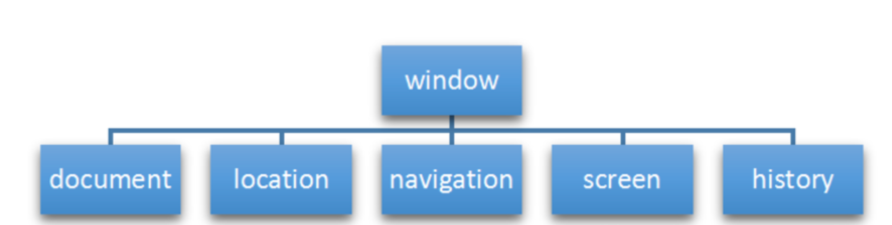

## BOM浏览器对象模型

### BOM概述

- BOM = Browser Object Model 👉浏览器对象模型
- 提供了独立于内容而与浏览器窗口进行交互的对象，其核心对象是 window
- BOM 由一系列相关的对象构成，并且每个对象都提供了很多方法与属性
- BOM 缺乏标准，JavaScript 语法的标准化组织是 ECMA, DOM 的标准化组织是 W3C, BOM最初是Netscape 浏览器标准的一部分

| DOM                                | BOM                                              |
| ---------------------------------- | ------------------------------------------------ |
| 文档对象模型                       | 浏览器对象模型                                   |
| DOM 就是把 文档 当作一个对象来看待 | 把 浏览器当作一个对象来看待                      |
| DOM 的顶级对象是 document          | BOM 的顶级对象是 window                          |
| DOM 主要学习的是操作页面元素       | BOM 学习的是浏览器窗口交互的一些对象             |
| DOM 是 W3C 标准规范                | BOM 是浏览器厂商在各自浏览器上定义的，兼容性较差 |


#### BOM的构成




- BOM 比 DOM 更大。它包含 DOM。

- window 对象是浏览器的顶级对象，它具有双重角色

- 它是 JS 访问浏览器窗口的一个接口

- 它是一个全局对象。定义在全局作用域中的变量、函数都会变成 window 对象的属性和方法

- 在调用的时候可以省略 window，前面学习的对话框都属于 window 对象方法，如 `alert()、prompt()`等。

- **注意**：window下的一个特殊属性 window.name

  

  `例子：`

  ```
      <script>
          var num1 = 10;
          console.log(num1);      //10
          console.log(window.num1);   //10
  
          function fn1(){
              console.log('函数');
          }
          fn1();  //函数
          window.fn1();   //函数
  
          console.log(window);    //输出一个window对象的集合，里面包含了alert()方法和许多我们需要后面学习的方法
      </script>
  ```

  


### window 对象的常见事件

#### 窗口加载事件   onload

概念：`window.onload`是窗口（页面）加载事件，当文档内容完全加载完成会触发该事件（包括图像，脚本文件，CSS文件等），就调用的处理函数。

 

在没有接触`window.onload`事件之前，我们必须严格遵守代码读写的先后顺序，从上往下执行，如果js内容放置的位置不对，就会出现代码加载不成功或者报错的状态。

`例子——————js内容放置的位置不对，代码加载不成功`

```
    <script>
        var btn1 = document.querySelector('button');
        btn1.onclick = function(){
            alert('弹窗');
        }
    </script>
    <button>按钮</button>
```


当使用了`window.onload`事件后，我们可以不考虑代码执行的先后顺序来使用`JavaScript`代码

`例子——————使用window.onload事件后，js代码可以放在<head>中，也可以放在<html>标签的最初始位置，使用如下`

```
    <script>
        window.onload = function(){
            var btn1 = document.querySelector('button');
            btn1.onclick = function(){
                alert('按下按钮出现弹窗');
            }
        }
        // 
        window.onload = function(){
            var btn1 = document.querySelector('button');
            btn1.onclick = function(){
                alert('因为 window.onload 是传统注册事件，只能写一次，如果有多个，会按照最后一个 window.onload 为准');
            }
        }
    </script>
    <button>按钮</button>
```


`window.onload`窗口加载事件语法如下：<font color=red>重点</font>

```
//winow.onload 属于传统注册事件，只能写一次，如果写入多个，会按照最后一个  window.onload 为准
window.onload = function(){
		//执行代码语句	
}

//使用window.addEventListener 添加事件,因为addEventListener(),是一个方法监听事件，可以在一个元素中设置多个事件
window.addEventListener('load',function(){
		//执行代码语句
})
```


`例子————使用   window.addEventListener  在同一个元素中添加多个事件`

```
    <script>
        // 使用window.addEventListener 添加事件,因为addEventListener(),是一个方法监听事件，可以在一个元素中设置多个事件
        window.addEventListener('load',function(){
            var btn1 = document.querySelector('button');
            btn1.addEventListener('click',function(){
                alert('使用window.addEventListener 添加事件,因为addEventListener(),是一个方法监听事件，可以在一个元素中设置多个事件');
            })
        })
        window.addEventListener('load',function(){
            var btn1 = document.querySelector('button');
            btn1.addEventListener('click',function(){
                alert('使用window.addEventListener 添加事件,看，这就是同一个元素中的第二个事件');
            })
        })
    </script>
    <button>按钮</button>
```


概念：`window.onload`是窗口（页面）加载事件，当文档内容完全加载完成会触发该事件（包括图像，脚本文件，CSS文件等），就调用的处理函数。

总结：

- 有了`window.onload`就可以把JS代码写到页面元素的上方
- 因为`onload`是等页面内容全部加载完毕，再去执行处理函数
- `window.onload` 传统注册事件方式，只能写一次
- 如果有多个，会以最后一个`window.onload`为准
- 如果使用addEventListener 则没有限制，可以在一个元素添加多个事件


#### 窗口加载事件   DOMContentLoaded 

概念：窗口（页面）加载事件，当DOM加载完毕，不包含图片 flash css 等就可以执行。

语法：

```
window.addEventListener('DOMContentLoaded',function(){})
```


`例子————使用  DOMContentLoaded 和 window.onload 进行比较`3

```
    <script>
        window.addEventListener('load',function(){
            var btn1 = document.querySelector('button');
            btn1.addEventListener('click',function(){
                alert('我用了 window.addEventListener, 中的 load 事件');
            })
        })
        window.addEventListener('load',function(){
            var btn1 = document.querySelector('button');
            btn1.addEventListener('click',function(){
                alert('我用了 window.addEventListener, 中的 load 事件');
            })
        })
        window.addEventListener('DOMContentLoaded',function(){
            var btn1 = document.querySelector('button');
            // DOMContentLoade  是DOM 加载完毕后，不包图片 flash css等就可以执行的窗口加载事件，加载速度比load更改一些
            btn1.addEventListener('click',function(){
                alert('DOMContentLoaded  是DOM 加载完毕后，不包图片 flash css等就可以执行的窗口加载事件，加载速度比load更改一些');
            }) 
        })
    </script>
    <button>按钮</button>
```

总结；

- 如果页面的图片很多的话, 从用户访问到onload触发可能需要较长的时间，此时可以将优先显示的`JavaScript`函数提前。
- 交互效果就不能实现，必然影响用户的体验，此时用 `DOMContentLoaded`事件比较合适。


#### onload  和    DOMContentLoaded  的区别

- `load`等页面内容全部加载完毕，包括页面dom元素，图片，flash，css等
- `DOMContentLoaded` 是DOM加载完毕，不包含图片 flash css 等就可以执行，加载速度比load更快一些


#### 调整窗口大小事件	window.onresize 

概念：`window.onresize` 是调整窗口大小加载事件，当触发时就调用的处理函数

语法；

```
window.onresize = function() {}

// 或者
window.addEventListener('resize',function(){});
```

- 只要窗口大小发生像素变化，就会触发这个事件
- 我们经常利用这个事件完成响应式布局。`window.innerWidth` 当前屏幕的宽度


`例子—————利用resize事件，模拟CSS中的多媒体查询`

```
    <script>
        window.addEventListener('load',function(){
            var div1 = document.querySelector('div');
            // resize 事件，窗口大小发生像素变化，就会触发这个事件
            window.addEventListener('resize',function(){
                // innerWidth  , window中的一个属性，获取屏幕对应的宽度
                console.log(window.innerWidth);
                // 利用resize事件，模拟CSS中的多媒体查询,检测屏幕当前宽度是否小于900px，如果小于，则  div  由  aqua  变为  blue ,大于则为  aqua
                if(window.innerWidth <= 900){
                    div1.style.backgroundColor = 'blue';
                }else{
                    div1.style.backgroundColor = 'aqua';
                }
            })
        })
    </script>
    <div style="width: 100px;height: 100px;background-color: aqua;"></div>
```


### window 对象  定时器

- `setTimeout()`
- `setInterval()`


#### setTimeout()定时器   （单次触发定时器）

概念：`setTimeout()`方法用于设置一个定时器，该定时器在定时器到期后执行调用函数。

语法:

```
window.setTimeout(调用函数,[延迟的毫秒数]);
```


`例子————练习setTimeout()`

```
    <script>
        // 1、语法规范， window.setTimeout(调用的函数，延时时间)
        window.setTimeout(function(){
            console.log('3秒过后，我会被输出');
        },3000)
        // 2、window 在代码中可以被省略，
        setTimeout(function(){
            console.log('3秒过后，我会被输出');
        },3000)
        // 3、延时时间也可以省略，如果没有设置，默认是 0 ，
        setTimeout(function(){
            console.log('0秒过后，我会被输出');
        })
        // 4、调用函数可以直接写函数，也可以写函数名，外部调用
        setTimeout(fn1,5000);
        function fn1(){
            console.log('5秒过后，我会被输出，使用的是函数外部调用');
        }
            // 4.1另外一种写法是 '函数名()',知道写法就可以了，不推荐。
        setTimeout('fn1()',1000);
        function fn1(){
            console.log("1秒过后，我会被输出，使用的是'函数名()'调用");
        }
    </script>
```


```
    <script>
        // 5、常规网页中会有很多定时器，我们需要给定时器加名字，进行区别。
        function fn2(){
            console.log('一个函数，出现两次输出');
        }
        var time1 = setTimeout(fn2,1000);
        var time2 = setTimeout(fn2,2000);
    </script>
```

总结：

1、语法规范， window.setTimeout(调用的函数，延时时间)

2、window 在代码中可以被省略，

3、延时时间也可以省略，如果没有设置，默认是 0 ，

4、调用函数可以直接写函数，也可以写函数名，外部调用

​			4.1另外一种写法是 '函数名()',知道写法就可以了，不推荐。

5、常规网页中会有很多定时器，我们需要给定时器加名字，进行区别。


##### setTimeout()定时器 —— 回调函数

- `setTimeout()` 这个调用函数我们也称为**回调函数** callback

- 普通函数是按照代码顺序直接调用，而这个函数，需要等待时间，时间到了才会去调用这个函数，因此称为回调函数。

  

`提问例子————利用setTimeOut()函数，实现弹窗广告自动关闭`

```
    
    <script>
        var ad1 = document.querySelector('img');
        setTimeout(function(){
            ad1.style.display = 'none';
        },2000);
    </script>
```


#### clearTimeout()   停止 setTimeout() 定时器

概念：`clearTimeout()`方法用于取消先前通过调用 `setTimeout()`建立的定时器

**注意：**

- `window`可以省略

- 里面的参数就是定时器的标识符

  

`例子————利用clearTimeout()练习 停止广告弹窗案例`

```
    
    <button>我不看广告</button>
    <script>
        var ad1 = document.querySelector('img');
        var btn1 = document.querySelector('button');

        var adtime = setTimeout(function(){
            ad1.style.display = 'block';
        },3000);

        // 设置停止定时器
        btn1.addEventListener('click',function(){
            clearTimeout(adtime);
        })
    </script>
```


#### setInterval()    定时器（重复定时器）

概念：`setInterval()`方法`重复调用`一个函数，每隔这个时间，就去调用一次回调函数

语法：

```
window.setInterval(回调函数,[间隔的毫秒数]);
```

注意：

- 这个回调函数:
  - 可以直接写函数
  - 或者写函数名
  - 或者采取字符 ‘函数名()
- 第一次执行也是间隔毫秒数之后执行，之后每隔毫秒数就执行一次


`例子`

```
    <script>
        setInterval(function(){
            console.log('每隔1s显示一次');
        },1000)
    </script>
```


`例子————使用setInterval()  完成倒计时效果`

```
    <div>
        <span class="day">0</span><b>天</b>
        <span class="hour">0</span><b>小时</b>
        <span class="minute">0</span><b>分钟</b>
        <span class="second">0</span><b>秒</b>
    </div>

    <script>
        // 获取元素
        var day1 = document.querySelector('.day');
        var hour1 = document.querySelector('.hour');
        var minute1 = document.querySelector('.minute');
        var second1 = document.querySelector('.second');
         
        function demo(time) { 
            var nowTime = +new Date();          //获取现在距离1970年的总毫秒数
            var input = +new Date('2022-5-1 18:00:00');        //获取活动截止日期距离1970年的总毫秒数
            var times = (input - nowTime) / 1000;   //活动截止日期 - 现在时间 = 距离活动截止的倒计时
            var d = parseInt(times/60/60/24);  //计算天数
            d = d < 10 ? '0' + d : d;
            day1.innerHTML = d;     //将原先span中的值替换
            var h = parseInt(times/60/60%24);  //计算小时
            h = h < 10 ? '0' + h : h;
            hour1.innerHTML = h;
            var m = parseInt(times/60%60);    //计算分数
            m = m < 10 ? '0' + m : m;
            minute1.innerHTML = m;
            var s = parseInt(times%60);    //计算当前秒数
            s = s < 10 ? '0' + s : s;
            second1.innerHTML = s;
        }
         //解决方法就是单独设置函数先调用一下
        demo();
        // 开启定时器 setInterval()，每隔1s触发一次,但是单独调用会有一个延迟效果，延迟效果根据你设置的时间而定，因为setInterval 是回调函数。解决方法就是单独设置函数先调用一下
        setInterval(demo,5000);
    </script>
```


#### clearInterval() 停止定时器

概念：`clearInterval ( )` 方法取消了先前通过调用 `setInterval()` 建立的定时器

**注意：**

- `window`可以省略

- 里面的参数就是定时器的标识符

  

`例子————创建全局变量，完成clearInterval()事件`

```
    <button class="strat">开启重复定时器</button>
    <button class="stop">关闭重复定时器</button>
    
    <script>
        // 获取元素
        var strat1 = document.querySelector('.strat');
        var stop1 = document.querySelector('.stop');

/*         // 添加事件,，使用 clearInterval ('定时器的名字') 方法  ,但是在运行中会报错。因为停止计时器clearInterval ('定时器的名字') ，中的「定时器名字」，和开始的定时器变量不在同一个作用域，所以会报错。
        strat1.addEventListener('click',function(){
            var time = setInterval(function(){
                console.log('开启定时器时，每1s加载一次');
            },1000);
        })
        stop1.addEventListener('click',function(){
            clearInterval(time);
        }) */

        // 解决 因为停止计时器clearInterval ('定时器的名字') ，中的「定时器名字」，和开始的定时器变量不在同一个作用域，导致报错的解决方法
        // 定义一个全局变量为空的对象
        var time = null;
        strat1.addEventListener('click',function(){
            time = setInterval(function(){
                console.log('开启定时器时，每1s加载一次');
            },1000)
        })
        stop1.addEventListener('click',function(){
            clearInterval(time);
        })
    </script>
```


#### this指向    <font color=aqua	>了解</font>

`this`的指向在函数定义的时候是确定不了的，只有函数执行的时候才能确定`this`到底指向谁

目前所学阶段，我们先需要了解如下几个`this`指向

- 全局作用域或者普通函数中`this`指向全局对象`window`(注意定时器里面的this指向window)
- 方法调用中谁调用`this`指向谁
- 构造函数中`this`指向构造函数实例


`例子————研究  this   指向的相关问题`

```
    <button>点击</button>
    <script>
        // 1、全局作用域或者普通函数中 this  指向全局对象  window (注意定时器里面的this指向window)
        console.log(this);      // window
        
        function fn1(){
            console.log(this);  // window
        }
        fn1();

        setTimeout(function(){
            console.log(this);
        },1000)

        // 2、方法调用中谁调用  this 指向谁
        var a = {
            SayHi: function(){
                console.log(this);      // this 指向的是 a 这个对象
            }
        }
        a.SayHi();

        var btn1 = document.querySelector('button');
            //传统点击事件
        /* btn1.onclick = function(){
            console.log(this);  //this 指向的是 btn 按这个按钮元素
        } */
    
        btn1.addEventListener('click',function(){
            console.log(this);  //this 指向的是 btn 按这个按钮元素
        })

        // 3、构造函数中 this 指向构造函数实例
        function Fun(){
            console.log(this);  // this 指向的是 fun 实例的对象
        }
        var fun1 = new Fun();
    </script>
```

