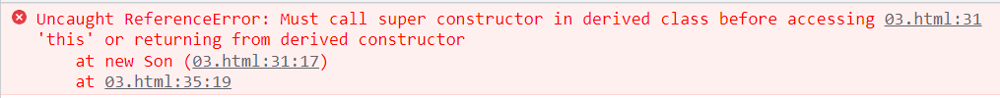

## ES6中的类和对象

### 面向对象

面向对象更贴近我们的实际生活，可以使用面向对象描述现实世界事物，但是事物分为具体的事物和抽象的事物。


面向对象的思维特点：

1. 抽取（抽象）对象共用的属性和行为组织（封装）成一个类（模板）
2. 对类进行实例化，获取类的对象


面向对象编程我们考虑的是有哪些对象，按照面向对象的思维特点，不断的创建对象，使用对象，指挥对象做事情。


#### 对象

现实生活中：万物皆对象，对象是**一个具体的事物**，看得见摸得着的实物。例如：一本书、一辆汽车、一个人可以是“对象”


在JavaScript中，**对象是一组无序的相关属性和方法的集合，所有事物都是对象**，例如字符串、数值、数组、函数等。


对象是由属性和方法组成的：

- 属性：事物的特征，在对象中用属性来表示（常用名词）

- 方法：事物的行为，在对象中用方法来表示（常用动词）

  

#### 类class

在ES6中新增加了类的概念，可以**class**关键字声明一个类，之后以这个类来实例化对象

**类**抽象了对象的公共部分，**泛指**某一大类（class）

**对象**特指某一个，通过类实例化一个具体的对象


#### 创建类

语法：

```
class name{
    // class body
}
```

创建实例：

```
var xx = new name();
```

<font color=red>注意：类必须使用new 实例化对象</font>


#### 类`constructor`构造函数

`constructor()`方法是类的构造函数（默认方法），**用于传递参数，返回实例对象**，通过new命令生成对象实例时，自动调用该方法。如果没有显示定义，类内部会自动给我们创建一个`constructor()`


#### 实例：

```
<script> 
    /* 1、创建类 class 创建一个明星类 */
    class Star{
        constructor(uname,age){
            this.uname = uname;
            this.age = age;
        }
    }

    /* 2、利用类创建对象 new */
    var ldh = new Star("刘德华",20);
    var lm = new Star("黎明",22);
    console.log(ldh);
    console.log(lm);

</script>
```


#### 注意事项：

```
(1)通过class关键字创建类，类名习惯性定义首字母大写
(2)类里面有个 constructor 函数，可以接受传递过来的参数，同时返回实例对象
(3)constructor 函数 只要 new 生成实例时，就会自动调用这个函数，如果我们不写这个函数，类也会自动生成这个函数
(4)生成实例 new 不能省略
(5)最后注意语法规范，创建类，类名后面不加小括号，生成实例，类名后面加小括号，构造函数不需要加 function
```


#### 类添加方法

语法：

```
class Star{
    constructor(uname,age){     //constructor   构造器或者构造函数
        this.uname = uname;
        this.age = age;
    }
    say(){
        console.log(this.uname+'你好');
    }
}
```


例子：

```
<script> 
    /* 1、创建类 class 创建一个明星类 */
    class Star{
        constructor(uname,age){     //constructor   构造器或者构造函数
            this.uname = uname;
            this.age = age;
        }
        say(song){
            console.log(this.uname + song);
        }
    }

    /* 2、利用类创建对象 new */
    var ldh = new Star("刘德华",20);
    var lm = new Star("黎明",22);
    console.log(ldh);
    console.log(lm);
    /* 
    (1) 类里面所有函数不需要写function
    (2)多个函数之间不需要添加逗号分隔
    */
    ldh.say('是天王');
    lm.say('是歌手');
</script>
```


注意事项：

```
(1) 类里面所有函数不需要写function
(2)多个函数之间不需要添加逗号分隔
```


<hr>

## 类的继承

### 继承

现实中的继承：子承父业，比如我们都继承了父亲的姓

程序中的继承：子类可以继承父类的一些属性和方法。

**语法：**

```
<script>
    /* 父类 */
    class Father{

    }

    /* 子类继承父类 */
    class Son extends Father{

    }
</script>
```


**例子：**

```
<script>
    /* 父类 */
    class Father{
        constructor(){

        }
        money(){
            console.log(100);
        }
    }

    /* 子类继承父类 */
    class Son extends Father{

    }
    var son = new Son();
    son.money();
</script>
```


#### 错误例子引用

```
<body>
    <!-- 
    @MethodAuthor: fan

    类的继承-错误例子引用
    -->
    <script>
        /* 父类 */
        class Father{
            constructor(x,y){
                this.x = x;
                this.y = y;
            }
            money(){
                console.log(this.x + this.y);
            }
        }

        /* 子类继承父类 */
        class Son extends Father{
            constructor(x,y){
                this.x = x;
                this.y = y;
            }
        }
        var son = new Son(1,2);
        son.money();
    </script>
</body>
```




### super关键字

​		**super**关键字用于访问和调用对象父类上的函数，**可以调用父类的构造函数**，也可以调用父类的普通函数。

```
<body>
    <!-- 
    @MethodAuthor: fan

    类的继承-super关键字

    -->
    <script>
        /* 父类 */
        class Father{
            constructor(x,y){
                this.x = x;
                this.y = y;
            }
            money(){
                console.log(this.x + this.y);
            }
        }

        /* 子类继承父类 */
        class Son extends Father{
            constructor(x,y){
                super(x,y);     //调用了父类中的构造函数
            }
        }
        var son = new Son(1,2);
        son.money();
    </script>
</body>
```

