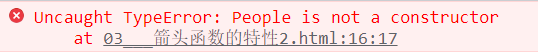
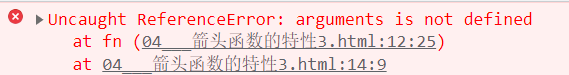

## ECMA第一章：

### let变量声明及声明特性

#### 声明变量

```js
// 声明变量
let a;
let b,c,d;
let e = 100;
let f = 521,g = 'one',h = [];
```


#### 1.let变量不能重复声明

```
// let star = '测试';
// let star = '123';
```


#### 2.块级作用域，全局，函数，eval

```

// 块级作用域，全局，函数，eval
// if else while for

{
    let girl = '测试';
    // 块级外部，无法访问
    console.log(girl);
}

```


#### 3.不存在变量提升

```
let son = '儿子';
console.log(son);
```


#### 4.不影响作用域链

```

// 不影响作用域链
{
    let school = '金科';
    function fn(){
        console.log(school);
    }
    fn();
}
```


### ES6案例实践：判断`var`为变量和`let`为变量的区别

```html
    <style>
        .item{
            width: 100px;
            height: 50px;
            border: 1px solid black;
            display: inline-block;
        }
    </style>
</head>
<body>
    <div class="con">
        <h2>点击切换颜色</h2>
        <div class="item"></div>
        <div class="item"></div>
        <div class="item"></div>
    </div>
    <script>
        // 获取元素
        let itmes= document.querySelectorAll('.item');


        //  遍历并绑定事件
        for(let i = 0;i<itmes.length;i++){
            itmes[i].onclick = function(){
                // 修改当前背景颜色,变量为var, 指向为this
                // this.style.background = 'pink';
                // 变量为let
                itmes[i].style.background = 'pink';
            }
        }
        
    </script>
```


### const声明常量以及特点

#### 声明常量，值不能修改的为常量

```
const SCHOOL = '金科';
```


#### 1.一定要赋初始值

```
const A;
```


#### 2.一般常量使用大写（默认规则）

```
const a = 100;
```


#### 3.常量的值不能修改

```
SCHOOL = '康博尔';
```


#### 4.块级作用域

```
{
    const PALYER = 'KEKE';
}
console.log(PALYER);
```


#### 5.对于数组和对象的元素修改，不算做对常量的修改，不会报错

```
const TEAM = ['a','b','c','d'];
TEAM.push('e');
console.log(TEAM);
```


### 变量的结构赋值

#### 解构赋值：ES6 允许按照一定模式从数组和对象中提取值，对变量进行赋值

#### 1.数组的结构赋值

```js
const F4 = ['赵云','典韦','司马懿','曹操'];
let [a,b,c,d] = F4;
console.log(a);
console.log(b);
console.log(c);
console.log(d);
```


#### 2.对象的结构赋值

```js
const zhao = {
    name:'张三',
    age:29,
    xiaopin: function(){
        console.log('测试');
    }
}
let {name,age,xiaopin} = zhao;
console.log(name);
console.log(age);
console.log(xiaopin);
```


## ECMA第二章：

### 模板字符串

```
ES6引入新的声明字符串的方式 [``] '' "" 
```


#### 1.声明

```
let str = `我是一个字符串`;
console.log(str,typeof str);
```


#### 2.内容中可以直接出现换行

```
let str = `
        <ul>
            <li>1</li>
            <li>2</li>
            <li>3</li>
        </ul>
`;
document.write(str);
```


#### 3.变量拼接

```
let star = '甲';
let out = `${star}是路人`;
console.log(out);
```


<hr>

### 对象的简化写法

ES6 允许在大括号里面，直接写入变量和函数，作为对象的属性和方法

```js
<script>
    // ES6 允许在大括号里面，直接写入变量和函数，作为对象的属性和方法
    let name = '金科';
    let change = function(){
        console.log('这是一个函数');
    }

    const school = {
        name,
        change,
        // 方法的简写版本
        import(){
            console.log('常量对象中的函数简写版本');
        }
    }
    console.log(school);
</script>
```


<hr>

### 箭头函数以及声明特点：ES6允许使用 [箭头] ( `=>` ) 定义函数


#### 箭头函数的声明

```js
    <script>
        // 常规的函数声明和调用
        let fn = function(a,b){
            return a+b;
        }
        console.log(fn(1,2));           //3

        // 箭头函数的声明和调用
        let fn1 = (c,d) => {
            return c+d;
        };
        console.log(fn1(10,10));        //20
    </script>
```


#### 箭头函数的特性

##### `this`是静态的，`this`始终指向函数声明时所在作用域下的`this`的值。

```js
    <!-- `this`是静态的，`this`始终指向函数声明时所在作用域下的`this`的值。 -->
    <script>
        function getName(){
            console.log(this.name);
        }
        let getName2 = () => {
            console.log(this.name);
        }
        // 设置 window对象的 name 属性
        window.name = '金科教育';
        const SCHOOL = {
            name:'康博尔'
        }

        // 直接调用
        getName();      //金科教育
        getName2();     //金科教育

        // call方法调用，call方法：更改this的指向。
        getName.call(SCHOOL);       //康博尔
        getName2.call(SCHOOL);      //金科教育
    </script>
```

##### **箭头函数**不能作为构造实例化对象

```js
    <script>
        // 不能作为构造实例化对象
        let People = (name,age) =>{
            this.name = name;
            this.age = age;
        }
        let me =new People('小胡',20);
        console.log(me);	//// Uncaught TypeError: Person is not a constructor
    </script>
```



##### 箭头函数中，不能使用`arguments`变量

```js
    <script>
        // 箭头函数中，不能使用arguments变量
        let fn = () => {
            console.log(arguments);
        }
        fn(1,2,3);
    </script>    
```




#### 箭头函数的简写形式

##### 省略小括号，当形参有且只有一个的时候

```js
    let add = (n) =>{
        return n+n;
    }
    // 1.省略小括号，当形参有且只有一个的时候
    let add1 = n =>{
        return n+n;
    }
    console.log(add(10));       //20
    console.log(add1(9));       //18
```

##### 省略花括号，当代码体只有一条语句的时候，此时 reutrn 必须省略，而且语句的执行结果就是函数的返回值。

```js
    let add2 = n =>{
        return n*n;
    }
    // 2.省略花括号，当代码体只有一条语句的时候，此时 reutrn 必须省略，而且语句的执行结果就是函数的返回值。
    let add3 = n => n*n;

    console.log(add2(8));       //64
    console.log(add3(8));       //64
```

#### 箭头函数的实践与应用场景

##### 案例1：点击`div` **2s**后颜色变为 `红色`

```js
    <style>
        #ad{
            width: 200px;
            height: 200px;
            background-color: aqua;
        }
    </style>
</head>
<body>
    <div id="ad"></div>

    <script>
        let ad = document.getElementById('ad');
        /* ad.addEventListener('click',function(){
            // this.style.background = 'red';
            setTimeout(function(){
                // console.log(123);
                console.log(this);                  //而是指向window

                // this.style.background = 'red';      //报错,this指向不到本身，而是指向window
            },2000)
        }) */

        ad.addEventListener('click',function(){
            // this.style.background = 'red';
            setTimeout( () =>{
                console.log(this);          //指向本身的元素
                this.style.background = 'red';
            },2000)
        })
    </script>
```


##### 从数组中返回偶数的元素

```js
    <!-- 从数组中返回偶数的元素 -->
    <script>
        const ARR = [1,6,9,10,100,25]
        // 原js求偶数的方法
        // const RESULT = ARR.filter(function(item){
        //     if(item % 2 === 0){
        //         return true;
        //     }else{
        //         return false;
        //     }
        // })
        // console.log(RESULT);


        // 箭头函数精简版
        // const RESULT = ARR.filter(item =>{
        //     if(item % 2 ===0){
        //         return true
        //     }else{
        //         return false
        //     }
        // })
        // console.log(RESULT);

        // 极简版
        const RESULT = ARR.filter(item => item % 2 === 0);
        console.log(RESULT);
    </script>
```


#### 箭头函数总结：

1. 箭头函数**适合**与`this`无关的回调，定时器，数组的方法回调
2. 箭头函数**不适合**与`this`有关的回调，事件回调，对象的方法。


