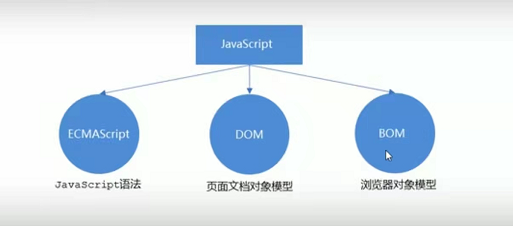

## 01JavaScript初映像

### JavaScript是什么

1、JavaScript是世界上最流行的语言之一，是一种运行在客户端的脚本语言（Script是脚本的意思）

2、脚本语言：不需要编译，运行过程中由js解释器（浏览器）==逐行==来进行解释并执行

3、现在也可以基于Node.js技术进行服务器端编程

### JavaScript的作用

- 表单动态校验（密码强度检测）==js最初的目的==

  

  例子：网易邮箱表单注册，文本框输入内容进行判定，文本框的内容是否符合规范要求。

  

  https://mail.163.com/register/index.htm?from=163mail&utm_source=163mail

  

  

- 网页特效

  例子：小米官网轮播图		https://www.mi.com/

  

  

- 服务端开发（node.js）

- 桌面程序（Electron）

- App开发

- 控制硬件-物联网

- 游戏开发


### HTML/CSS/JS的关系

#### HTML/CSS标记语言-描述类语言

- HTML决定网页结构和内容（决定看到什么），相当于人的身体骨架。
- CSS决定网页呈现给用户的模样（决定好不好看），相当于穿衣打扮。

#### JS脚本语言-编程类语言

- 实现业务逻辑和页面控制（决定功能），相当于人的各种动作。


## 02浏览器执行js过程和js三部分组成

### 浏览器执行js简介

浏览器分成两部分：渲染引擎和js引擎

- ==渲染引擎==：用来解析HTML和CSS，俗称内核，比如Chrome浏览器的blink内核，老版本中的webkit
- ==JS引擎==：也称为JS解释器，用来读取网页中的JavaScript代码，对其处理后运行，比如Chrome浏览器中的V8引擎。


浏览器本身并不会执行js代码，而是通过内置JavaScript引擎（解释器）来执行js代码。js引擎执行代码时逐行解释每一句源码（转化为机器语言），然后由计算机去执行，所以JavaScript语言归为脚本语言，会==逐行==解释执行。


例子：

```
    <script>
        alert("这是使用js中的alert进行弹窗的文字，第一条");
        alert("这是使用js中的alert进行弹窗的文字，第二条");
    </script>
```


### js三部分的组成




#### 1、ECMAScript

ECMAScript是由ECMA国际（原欧洲计算机制造商协会）进行标准化的一门编程语言，这种语言在万维网上应用广泛，它往往被称为JavaScript或JScript，但实际上规定了JS的编程语法和基础核心知识，是所有浏览器厂商共同遵守的一套JS语法工业标准。


ECMAScript：ECMAScript规定了JS的编程语法和基础核心知识，是所有浏览器厂商共同遵守的一套JS语法工业标准。


#### 2、DOM——文档对象模型

==文档对象模型==（Document Object Model，简称DOM），是W3C组织推荐的处理可扩展标记语言的标准编程接口。

通过DOM提供的接口可以对页面上的各种元素进行操作（大小、位置、颜色等）


#### 3、BOM——浏览器对象模型

BOM（Browser Object Model，简称BOM）是指==浏览器对象模型==，它提供了独立于内容的、可以与浏览器窗口进行互动的对象结构。通过BOM可以操作浏览器窗口，比如弹出框、控制浏览器跳转、获取分辨率等。


## 03js初识——js初体验


### js三种书写方式

js有三种书写位置，==行内、内嵌、外部==（类似css的三种引入方式）


例子：行内式的js，注意双引号内用之后使用单引号


```
<body>
    <input type="button" value="点击出现弹窗" onclick="alert('点击按钮，出现文字')";>
</body>
```

#### 行内式的js

- 可以将单行或少量js代码写在HTML标签的事件属性中（以on开头的属性），如：onclick。
- 注意单双引号的使用：在HTML中我们推荐使用双引号，js中我们推荐使用==单引号== 。
- 可读性差，在html中编写JS大量代码时，不方便阅读。
- 引号容易出错，引号多层嵌套匹配时，非常容易弄混。
- 行内式js建议在特殊情况下使用。


例子：


```
<head>
    <meta charset="UTF-8">
    <meta http-equiv="X-UA-Compatible" content="IE=edge">
    <meta name="viewport" content="width=device-width, initial-scale=1.0">
    <title>Document</title>
    <script>
        alert("沙漠骆驼");
    </script>
</head>
```


#### 内嵌式的js

- 可以将多行js代码写到script标签中
- 内嵌js是学习时常用的方式

例子：


```
<head>
    <meta charset="UTF-8">
    <meta http-equiv="X-UA-Compatible" content="IE=edge">
    <meta name="viewport" content="width=device-width, initial-scale=1.0">
    <title>Document</title>
    <script src="./02.js"></script>
</head>
```

#### 外部引入式js文件

- 利于HTML页面代码结构化，把大段js代码独立到HTML页面之外，既美观，也方便文件级别的复用。
- 利用外部js文件的script标签中间不可以写代码。
- 适合于js代码量比较大的情况。


### js注释

#### 单行注释	两个斜杠	==//== 

语法：

```
<script>
	//	js代码
</script>
```

例子：

```
    <script>
        //1.单行注释
        // alert("这是一个弹窗");
    </script>
```

==快捷键：ctrl + /==


#### 多行注释	==/*  js 代码  */==

语法：

```
    <script>
            /* js代码
            js代码 */
    </script>
```

例子：

```
    <script>
        /* alert("这个一个弹窗");
        alert("这个一个弹窗"); */
    </script>
```

默认==快捷键：shift+alt+A==


推荐修改一下快捷键为==shift+ctrl+/==，vscode中修改快捷键的方法


1、点击左下角的设置按钮，选择键盘快捷方式。


###### 


2、输入js默认设置多行代码的键位 ==shift+alt+A==


3、鼠标双击改行，出现此此页面。


4、按下推荐设置==shift+ctrl+/==组合键，出现此页面，点击回车，即设置成功。


## 04js输入输出语句

为了方便信息的输入输出，JS中提供了一些输入输出语句，其常用的语句如下：

| 方法               | 说明                           | 归属   |
| ------------------ | ------------------------------ | ------ |
| alert（msg）       | 浏览器弹出警示框               | 浏览器 |
| console.log（msg） | 浏览器控制台打印输出信息       | 浏览器 |
| prompt（info）     | 浏览器弹出输入框，用户可以输入 | 浏览器 |

### alert

==浏览器弹出警示框==，多个alert弹窗可以==依次==在浏览器弹出

```
    <script>
        // 浏览器窗口会弹出一个弹窗
        alert('alert是一个弹窗');
    </script>
```

### console.log

==浏览器控制台打印输出信息==

```
    <script>
        // 此信息可以在F12控制台查看，
        console.log('这个信息可以在控制台显示出来');   
    </script>
```

### prompt

==浏览器弹出输入框，用户可以输入==

```
    <script>
        // 浏览器窗口会弹出一个输入框。
        prompt('请输入您的年龄');
    </script>
```

## 05变量

### 变量使用

变量在使用时分为两步：

1、声明变量

2、赋值


#### 1、声明变量

```
<script>
      // 声明变量
      var age;    //声明一个名称为age的变量
</script>
```

- var是一个js关键字，用来声明变量(variable变量的意思)。使用该关键字声明变量。
- age是程序员定义的变量名，我们要通过变量名来访问内存中分配的空间。


#### 2、赋值

```
    <script>
        //声明一个名称为age的变量
        var age;    
        // 赋值，给age这个变量赋值为19
        age = 19;
        // 输出变量
        console.log(age);
    </script>
```

- =====用来把右边的值赋给左边的变量空间中，代表赋值的意思
- 变量值是保存到变量空间的值。


#### 3、变量初始化

```
  <script>
      // 声明变量赋值为20
      var age = 20;
      console.log(age);
      var myname = '这是我的名字';
      console.log(myname);
  </script>
```

- 声明一个变量并赋值，我们称之为==变量的初始化==
- 写法简介，代码量少。

注意：变量不要使用==name==，name是关键字。


#### 4、案例


1、使用所学知识，做出以下效果。


```
    <script>
        var a = '这个是第一条文本';
        var b = '这个是第二条文本';
        var c = 1990;
        var d = '这个是第三条文本';
        var e = '这个是第四条文本';
        var f = '这个是第五条文本';
        console.log(a);
        console.log(b);
        console.log(c);
        console.log(d);
        console.log(e);
        console.log(f);
    </script>
```


2、完成以下效果

- 弹出一个输入框，提示用户输入姓名。

- 然后弹出一个提示框，输出用户刚才输入的名字。

  

  

  

  

  

  ```
      <script>
          var myname = prompt('输入你的名字');
        	alert(myname);
      </script>
  ```

  

#### 5、变量的语法拓展

##### 		5.1更新变量

一个变量被重新赋值后，它原有的值就会被覆盖，变量值将以最后一次赋的值为准。

```
    <script>
        var myname = '测试';
        //console.log(demo);
        myname = '第二个测试';
        console.log(demo);
    </script>
```

##### 5.2同时声明多个变量

同时声明多个变量时，只需要写一个var，多个变量名之间使用英文逗号隔开。

```
    <script>
        // 声明多个变量写法1
        var demo1 = '测试1',demo3 = '测试2',demo3 = '测试3';
        // 声明多个变量的写法2
        var demo1 = '测试1',
            demo2 = '测试2',
            demo3 = '测试3';
        console.log(demo1);
        console.log(demo2);
        console.log(demo3);
    </script>
```

##### 5.3声明变量的特殊情况

###### 只声明，不赋值，输出结果为==undefined==

```
    <script>
        var a;
        console.log(a); //结果为undefined
    </script>
```

###### 不声明，不赋值，直接使用，输出结果显示为==报错==

```
    <script>
        console.log(a);
    </script>
```


###### 不声明，只赋值，输出结果为==本身的值==，因为JavaScript语言是一个弱类型语言。

```
    <script>
        a = '这个一个没有声明的变量';
        console.log(a);
    </script>
```


| 情况                                 | 说明                       | 结果      |
| ------------------------------------ | -------------------------- | --------- |
| var age;<br />console.log（age）;    | 只声明   不赋值            | undefined |
| console.log(age);                    | 不声明   不赋值   直接使用 | 报错      |
| age = 10；<br />console.log（age）； | 不声明   只赋值            | 10        |


#### 6、变量的命名规范

- 由字母(A-Za-2)、数字(09)、下划线（)、美元符号(＄)組成，如：UsTAge,num01, _name

- 变量名之间不能加空格，例如：var a b;

- 严格区分大小写。var app;和 var App;是两个变量

- 不能以数字开头。例子：18age 是错误的

- 不能 是关键字、保留字。例如：var、 for、 while

- 变量名必须有意义。nl （年龄）——> age，少用中文简写，用英文比较符合规范。

- 遵守宛峰命名法。首字母小写，后面单词的首字母需要大写。myFirstName

- 推荐翻译网站：有道 爱词霸

- 尽量不要使用==name==进行变量命名。

  ```
      <script>
          var tel;
          var name;
          console.log(tel);
          console.log(name);
      </script>
  ```

  

  

  ##### 以下变量名哪些为符合规范的变量名

  | 第一组    | 第二组       | 第三组        |
  | --------- | ------------ | ------------- |
  | var a     | var userName | var theWorld  |
  | var 1     | var $name    | var the world |
  | var age18 | var _sex     | var the_world |
  | var 18age | var &sex     | var for       |


#### 课堂练习

交换两个变量的值（实现思路：使用一个临时变量来做中间存储）。


```
    <script>
        //1、首先先建立一个临时变量
        // 2、把a给临时变量temp
        // 3、把b给临时变量a
        // 4、把temp变量再给b
        var a = '第一个变量';
        var b = '第二个变量';
        var temp;   //声明一个为空的变量
        temp = a;   //把a给临时变量temp
        a = b;      //把b给临时变量a
        b = temp;   //把temp变量再给b
        console.log(a);
        console.log(b);
    </script>
```


### 学完该节应该了解的内容

- 学会创建变量

- 明白变量的命名规范

- 学会交换变量


## 06数据类型——数据类型


### 为什么需要数据类型

在计算机中，不同的数据所需占用的存储空间是不同的，为了便于把数据分成所需内存大小不同的数据，充分利用存储空间，于是定义了不同的数据类型。

简单来说，数据类型就是数据的类别型号。比如姓名“张三”，年龄18，这些数据的类型是不一样的。

### 变量的数据类型

变量是用来存储值的所在处，它们有名字和数据类型。变量的数据类型决定了如何将代表这些值的位存储到计算机的内存中。==JavaScript 是一种弱类型或者说动态语言==。这意味着不用提前声明变量的类型。在程序运行过程中，类型会被自动确定，

```
    <script>
        var age = 10;                       //这是一个数字类型
        var str = '这是一个字符串类型';       //这是一个字符串类型
    </script>
```

在代码运行时，变量的数据类型是由JS 引擎 根据==等号==右边变量值的类型来判断的，运行完毕之后，变量就确定
了数据类型。

JavaScript 拥有==动态类型==，同时也意味着==相同的变量可用作不同的类型。==

```
    <script>
        var a = 10;
        a = 'a变量由数字类型变为字符串类型';
    </script>
```

### 数据类型的分类

js数据类型分为两类

- 基本数据类型（Number，String，Boolean，Undefined，Null）
- 复杂数据类型（object）

## 基本数据类型


| 简单数据类型 | 说明                                                   | 默认值    |
| ------------ | ------------------------------------------------------ | --------- |
| Number       | 数字型，包含整形值和浮点型的值，如21、0.21             | 0         |
| Boolean      | 布尔值类型，如true、false，等价与1和0                  | false     |
| String       | 字符串类型，如'张三'，注意js中，字符串类型都是带引号的 |           |
| Undefined    | var a;声明变量但是没有赋值，输出变量就是undefined      | undefined |
| Null         | var a = null;声明变量a为空值                           | null      |

### 数字型==Number==（重要）

JavaScript数字类型可以保存整数值，也可以保存小数（浮点类型）

```
    <script>
        var age = 18;   //整数
        var age = 18.5; //小数，浮点类型
        console.log(age);
    </script>
```

##### 1、数字类型的进制（了解）

最常见的进制有二进制、八进制、十进制、十六进制

js中设置数字类型时，==八进制前面加0，十六进制前面加0x==

```
    <script>
        var age = 022;
        console.log(age);   //输出18
        var age1 = 0x9;     //输出9
        var age1 = 0xa;     //输出10
        console.log(age1);
    </script>
```

注意：在设置数字类型时，如果不要设置此类型，避免使用==0开头==或者==0x开头==，除非数值类型中需要用到进制。

##### 2、数字型范围（了解）

JavaScript中数字类型的最大值（MAX_VALUE）和最小值（MIN_VALUE）

```
    <script>
        console.log(Number.MAX_VALUE);  // 1.7976931348623157e+308
        console.log(Number.MIN_VALUE);  // 5e-324
    </script>
```

##### 3、数字型的三个特殊值

```
    <script>
        console.log(Infinity);  //Infinity
        console.log(Number.MAX_VALUE*2);    //Infinity
        console.log(-Infinity); //-Infinity
        console.log(-Number.MAX_VALUE*2);  //-Infinity
        console.log('字符串类型'-123);  //NaN
        console.log(12-11); //1
    </script>
```

- Infinity，无穷大，大于任何数值

- -Infinity，无穷小，小于任何数值

- NaN，Not a Number ,不是一个数值


##### isNaN()

这个方法用来判断==值==是否为==非数字==，并且返回一个值，如果是数字返回的是false，如果不是数字返回的是true


```
    <script>
        console.log(isNaN('数字')); //true
        console.log(isNaN(123123)); //false
    </script>
```

### 字符串型String

字符串型可以是引号中的任意文本，其语法为 “**双引号**” 和 "**单引号**’’

```
var strMsg = "我爱北京天安门~";		//使用双引号表示字符串
var strMsg = '我爱北京';			  //使用单引号表示字符串
```

因为 HTML 标签里面的属性使用的是双引号，JS 这里我们更推荐**使用单引号**。


#### 字符串引号嵌套

JS可以用 **单引号嵌套双引号**，或者用 **双引号嵌套单引号**（**外双内单，外单内双**）

```
    <script>
        // var a = '这是一个'字符串'文本'; //报错
        // console.log(a);
        //外单内双
        var b = '这是一个"字符串"文本';    //这是一个"字符串"文本
        console.log(b);
        //外双内单
        var c = "这是一个'字符串'文本";    //这是一个'字符串'文本
        console.log(c);
    </script>
```


提问：如何让控制台的文本有换行效果？

```
var d = "这是一个'字<br/>符串'文本";    //这是一个'字<br/>符串'文本
```


#### 字符串转义符

类似HTML里面的特殊字符，字符串中也有特殊字符，我们称之为转义符。

转义符都是 \ 开头的，常用的转义符及其说明如下：

| 转义符 | 解释说明             |
| ------ | -------------------- |
| \n     | 换行符，n是newline   |
| \ \    | 斜杠\                |
| \ ’    | ’ 单引号             |
| \ ‘’   | ‘’ 双引号            |
| \ t    | tab 缩进             |
| \ b    | 空格，b是blank的意思 |

举例：使用==\n==转义符来看是否有换行效果

```
        var d = "这是一个'字\n'符串'文本";
        console.log(d);
```


##### 案例：弹出网页警示框


文本测试，到这儿需要换行了,然后没有然后了，只是试一试转义字符罢了！


#### 字符串的长度

字符串是由若干字符组成的，这些字符的数量就是字符串的长度。通过字符串的 **length** 属性可以获取整个字符串的长度。

```
    <script>
        var a = "这是一个字符串，一共有15个字";     //15
        console.log(a.length);
    </script>
```

注意：字符串内的**空格**也属于字符串中的长度

```
    <script>
        var a = "这是一个   字符串，一共有18个字";     //18
        console.log(a.length);
    </script>
```

#### 字符串的拼接

- 多个字符串之间可以使用 + 进行拼接，其拼接方式为 **字符串 + 任何类型 = 拼接之后的新字符串**
- 拼接前会把与字符串相加的任何类型转成字符串，再拼接成一个新的字符串

```
    <script>
        //字符串+字符串
        console.log('这是一个字符串'+'后面加了一串字'); //这是一个字符串后面加了一串字
        //字符串+数字的字符串
        console.log('字符串'+'110');//字符串110
        //字符串+数值类型
        console.log('字符串'+100);//字符串110
        //数值类型+数值类型
        console.log(100+100);   //200
        //数字的字符串+数值类型
        console.log('100'+100); //?
    </script>
```

**注意**：字符串 + 任何类型 =拼接之后的新字符串

- `+` 号总结口诀：**数值相加，字符相连**

  

#### 字符串拼接加强

```
    <script>
        var age1 = 10;
        console.log('测试今年age1岁了');    //测试今年age1岁了
        var age2 = 10;
        console.log('测试今年'+age2);   //测试今年10岁了
        // 引引加加 
        var age = 20;
        console.log('测试'+20+'岁');
    </script>
```

- 我们经常会将字符串和变量来拼接，因为变量可以很方便地修改里面的值
- 变量是不能添加引号的，因为加引号的变量会变成字符串
- 如果变量两侧都有字符串拼接，口诀"引引加加"，删掉数字，变量写在加号中间


#### 案例：显示年龄案例

要求：

1、弹出一个输入框（prompt），让用户输入年龄

2、随后使用alert语句弹出一个警示框（我今年多少岁了）


```
    <script>
        var age = prompt("请输入年龄");
        var str = '您今年已经'+age+'岁了';
        alert(str);
    </script>
```


### 布尔型Boolean 

- 布尔类型有两个值：true 和 false ，其中 true 表示真（对），而 false 表示假（错）。
- 布尔型和数字型相加的时候， true 的值为 1 ，false 的值为 0。

```
    <script>
        var flag = true;    //true为真，在加法运算中为1
        var flag1 = false;  //false为假，加法运算中为0
        console.log(flag+1);    //2
        console.log(flag1+1);   //1
    </script>
```

### undefined未定义

- 一个**声明后没有被赋值**的变量会有一个默认值 undefined

```
    <script>
        var a;
        console.log(a);     //undefined
    </script>
```

如果进行相连或者相加时，注意结果

1.undefined 和 字符串 相加，会==拼接字符串==

```
    <script>
        console.log(undefined+'字符串');    //undefined字符串
    </script>
```

2.undefined 和 数字相加，最后结果是**NaN**

```
    <script>
        console.log(undefined+123); //NaN
    </script>
```

### Null空值

- 一个声明变量给 null 值，里面存的值为空

```
    <script>
        var a = null;
        console.log(a); //null
        console.log(a+'字符串');    //null字符串
        console.log(a+12);  //12
    </script>
```

1.null和字符串相加，拼接字符串

2.null和数字相加，为空值加数字


## 07typeof检测变量数据类型和字面量

### ==typeof==检测变量的数据类型

**typeof** 可用来获取检测变量的数据类型

```
    <script>
        var num = 12;
        console.log(typeof num);    //number
        var str = ' a string';
        console.log(typeof str);    //  string
        var flag = true;
        console.log(true);          //true
        var un  = undefined;
        console.log(undefined);     //undefined
        var time = null;
        console.log(typeof time);     //object
    </script>
```

不同类型的返回值

| 类型      | 例               | 结果        |
| --------- | ---------------- | ----------- |
| string    | typeof “小白”    | “string”    |
| number    | typeof 18        | “number”    |
| boolean   | typeof true      | “boolean”   |
| undefined | typeof undefined | “undefined” |
| null      | typeof null      | “object”    |

**注意：prompt文本输入框的值，使用typeof检测全显示为字符串。**

```
var pr = prompt('请输入字符内容');
alert( typeof pr);		//string
```


### 字面量

字面量是在源代码中一个固定值的表示法，通俗来说，就是字面量表示如何表达这个值。

- 数字字面量：8，9，10
- 字符串字面量：‘大前端’，‘后端’
- 布尔字面量：true、false

例如：数字类型在**控制台**是蓝色，字符串是黑色，布尔值是蓝色、undefined和null是灰色。

```
    <script>
        console.log(20);
        console.log('22');
        console.log(true);
        console.log(undefined);
        console.log(null);
    </script>
```


通过**控制台**的颜色判断属于哪种数据类型

| 黑色 | 字符串            |
| ---- | ----------------- |
| 蓝色 | 数值和布尔值      |
| 灰色 | undefined 和 null |


## 08数据类型转换

使用**表单、prompt** 获取过来的数据默认是**字符串类型**的，此时就不能直接简单的进行加法运算，而需要转换变量的数据类型。通俗来说，**就是把一种数据类型的变量转换成另外一种数据类型**。


我们通常会实现3种方式的转换：

- 转换为字符串类型
- 转换为数字型
- 转换为布尔型


### 转换为字符串型

| 方式             | 说明                         | 案例                                 |
| ---------------- | ---------------------------- | ------------------------------------ |
| toString()       | 转成字符串                   | var num = 1; alert(num.toString());  |
| String()强制转换 | 转成字符串                   | var num = 1; alert(String(num));     |
| 加号拼接字符串   | 和字符串拼接的结果都是字符串 | var num =1; alert(num+“我是字符串”); |


```
    <script>
        var a = 123;
        console.log(a.toString());
        var b = 456;
        console.log(String(b));
        var c = 789;
        console.log('我是一个字符串'+c);
    </script>
```

- **toString()** 和 **String()** 使用方式不一样
- 三种转换方式，我们更喜欢用第三种**加号拼接字符串转换**方式，这一方式也称为**隐士转换**


### 转换为数字型

#### parselnt(string)函数

将**string类型**转成**==整数==数值型**

```
    <script>
     		//parselnt(string)函数,将string类型转成整数数值型
        var a = '字符串';
        console.log(parseInt(a));   //NaN
        var b = '123123';
        console.log(parseInt(b));   //123123,数值类型
        var c = '3.1415926';
        console.log(parseInt(c));   //3,因为parseInt是取整
        consolo.log(parseInt('120px'));  //120,会去掉单位值
        consolo.log(parseInt('px120px'));   //NaN
    </script>
```

#### parseFloat(string)函数

将**string类型**转成**浮点数**数值型

```
    <script>
        // parseFloat(string)函数,将string类型转成浮点数数值型
        var a = '3.141592612312312312312312312331212312321334';         //3.141592612312312
        console.log(parseFloat(a));
        var b = '0.1111111';            
        console.log(parseFloat(b));                                     //0.1111111
    </script>
```

#### Number()强制转换函数

将string类型转换为数值型

```
    <script>
        // Number()强制转换函数,将string类型转换为数值型
        var a = '123';
        console.log(Number(a)); //123
    </script>
```

#### js 隐式转换(- * /)

利用算术运算隐式转换为数值型

```
    <script>
        // 字符串通过算术运算符进行隐式转换
        var a = '12'-0;
        var b = '10' * 2;
        var c = '10' /5;
        var d = '100' - '80';  
        console.log(a); //12
        console.log(b); //20
        console.log(c); //2
    </script>
```


| 方式                       | 说明                         | 案例                |
| -------------------------- | ---------------------------- | ------------------- |
| **parselnt(string)函数**   | 将string类型转成整数数值型   | parselnt(‘78’)      |
| **parseFloat(string)函数** | 将string类型转成浮点数数值型 | parseFloat(‘78.21’) |
| Number()强制转换函数       | 将string类型转换为数值型     | Number(‘12’)        |
| js 隐式转换(- * /)         | 利用算术运算隐式转换为数值型 | ‘12’-0              |

1.注意 parseInt 和 parseFloat ，这两个是重点。

2.隐式转换是我们在进行算数运算的时候，JS自动转换了数据类型。

#### 案例一：计算年龄案例

流程：

​	弹出一个输入框，让用户输入出生年份

​	用现在的年份减去用户输入的年份，就是现在的年龄

​	弹出警示框，把计算的结果输出

```
    <script>
        //弹出一个输入框，让用户输入出生年份
        var age = prompt('你出生的年份');
        //用现在的年份减去用户输入的年份，就是现在的年龄
        var year = 2021 - age;
        //弹出警示框，把计算的结果输出
        alert(year);
    </script>
```

#### 案例二：简易加法处理

计算两个数的值，用户输入第一个值后，继续弹出第二个输入框并输入第二个值，最后通过弹窗显示出两个值相加的结果。

流程：

​	弹出第一个输入框，输入第一个值

​	弹出第二个输入框，输入第二个值

​	把这两个值相加

​	弹出警示框，并在警示框输出结果。

```
    <script>
        var a = prompt('输入的第一个值');
        var b = prompt('输入的第二个值');  
        //因为字符串算术运算符中没有设置加号，所以无法通过隐式转换。所以需要进行函数进行转换。
        var c = parseFloat(a)+parseFloat(b);
        console.log(c);     //2
    </script>
```

### 转换为布尔型

| 方法          | 说明               | 案例             |
| ------------- | ------------------ | ---------------- |
| Boolean()函数 | 其他类型转成布尔值 | Boolean(‘true’); |

- 代表空，否定的值会被转换为false，如 ’ ’ , 0, NaN , null , undefined
- 其余的值都会被被转换为true

```
console.log(Boolean('')); //false
console.log(Boolean(0));  //false
console.log(Boolean(NaN)); //false
console.log(Boolean(null)); //false
console.log(Boolean(undefined)); //false
console.log(Boolean('小白')); //true
console.log(Boolean(12));   //true
```

## 09运算符

运算符（operator）也被称为**操作符**，是用于实现赋值、比较和执行算数运算等功能的符号

JavaScript 中常用的运算符有：

- 算术运算符
- 递增和递减运算符
- 比较运算符
- 逻辑运算符
- 赋值运算符

### 算术运算符

概念：算术运算使用的符号，用于执行两个变量或值的算术运算。

| 运算符 |      描述      |          实例           |
| :----: | :------------: | :---------------------: |
|   +    |       加       |       10 + 20 =30       |
|   -    |       减       |      10 - 20 =-10       |
|   *    |       乘       |      10 * 20 =200       |
|   /    |       除       |      10 / 20 =0.5       |
|   %    | 取余数（取模） | 返回出发的余数 9 % 2 =1 |

#### 	浮点数的精度问题

浮点数值的最高精度是**17位小数**，但在进行算数计算时其精确度远远不如整数

```
    <script>
        var a = 0.1+0.2;
        console.log(a);     //0.30000000000000004
    </script>
```

所以**不要直接判断两个浮点数是否相等**

### 递增和递减运算符

递增（++）

递减（- -）

放在变量前面时，我们称为**前置递增(递减)运算符**

放在变量后面时，我们称为**后置递增(递减)运算符**

**注意**：递增和递减运算符必须和变量配合使用。


#### 	前置递增运算符

++num	展示效果等于	 num = num + 1

使用口诀:**先自加，后返回值**

```
    <script>
        var num = 10;
        alert (++num + 10); // 21
    </script>
```

先自加 10+1=11，返回11，此时num=11


#### 	后置递增运算符

num ++   展示效果等于   num = num +1

使用口诀:**先返回原值，后自加**

```
    <script>
        var num = 10;
        alert(10 + num++); // 20
    </script>
```

#### 	总结

- 前置递增和后置递增运算符可以简化代码的编写，让变量的值 + 1 比以前写法更简单

- 单独使用时，运行结果相同，与其他代码联用时，执行结果会不同

- 开发时，大多使用后置递增/减，并且代码独占一行

  

### 比较（关系）运算符

比较运算符是**两个数据进行比较时所使用的运算符**，比较运算后，会**返回一个布尔值**(true / false)作为比较运算的结果。

| 运算符名称 | 说明                        | 案例        | 结果  |
| ---------- | --------------------------- | ----------- | ----- |
| <          | 小于号                      | 1 < 2       | true  |
| >          | 大于号                      | 1 > 2       | false |
| >=         | 大于等于号(大于或者等于)    | 2 >= 2      | true  |
| <=         | 小于等于号(小于或者等于)    | 3 <= 2      | false |
| ==         | 判等号(会转型)              | 37 == 37    | true  |
| !=         | 不等号                      | 37 != 37    | false |
| === ! ==   | 全等 要求值和数据类型都一致 | 37 === ‘37’ | false |

#### 	= = = = = 小结

| 符号 | 作用 | 用法                                   |
| ---- | ---- | -------------------------------------- |
| =    | 赋值 | 把右边给左边                           |
| ==   | 判断 | 判断两边值是否相等(注意此时有隐士转换) |
| ===  | 全等 | 判断两边的值和数据类型是否完全相同     |

```
    <script>
        console.log(18 == '18');		//true
        console.log(18 === '18');		//false
    </script>
```

### 逻辑运算符

逻辑运算符是用来进行布尔值运算的运算符，其返回值也是布尔值

| 逻辑运算符 | 说明                   | 案例            |
| ---------- | ---------------------- | --------------- |
| &&         | “逻辑与”，简称"与" and | true && false   |
| \|\|       | “逻辑或”，简称"或" or  | true \|\| false |
| ！         | “逻辑非”，简称"非" not | ！true          |

逻辑与：两边都是 true才返回 true，否则返回 false


逻辑或：两边都为 false 才返回 false，否则都为true


逻辑非：逻辑非（!）也叫作取反符，用来取一个布尔值相反的值，如 true 的相反值是 false

```
    <script>
        var isOk = !true;
        console.log(isOk);  // false
        //逻辑非（!）也叫作取反符，用来取一个布尔值相反的值，如 true 的相反值是 false
    </script>
```

#### 	短路运算(逻辑中断)

短路运算的原理：当有多个表达式（值）时,左边的表达式值可以确定结果时,就不再继续运算右边的表达式的值

##### 		逻辑与

- 语法：表达式1 && 表达式2

- 如果第一个表达式的值为真，则返回表达式2

- 如果第一个表达式的值为假，则返回表达式1

  例子：

  ```
  console.log(123 && 456);   //456
  console.log(0 && 456);     //0
  console.log(123 && 456 && 789);  //789
  ```

##### 		逻辑或

- 语法：表达式1 || 表达式2

- 如果第一个表达式的值为真，则返回表达式1

- 如果第一个表达式的值为假，则返回表达式2

  ```
  console.log(123 || 456); //123
  console.log(0 || 456);   //456
  console.log(123 || 456 || 789);  //123
  ```

  ```
  var num = 0;
  console.log(123 || num++);
  // 先返回在加，相当于 (123 || 0)
  console.log(num);    // 123
  ```

### 赋值运算符

概念：用来把数据赋值给变量的运算符。

| 赋值运算符 | 说明                 | 案例                        |
| ---------- | -------------------- | --------------------------- |
| =          | 直接赋值             | var usrName = ‘我是值’      |
| += ，-=    | 加，减一个数后再赋值 | var age = 10； age+=5；//15 |
| *=，/=，%= | 成，除，取模后再赋值 | var age = 2; age*=5; //10   |

```
var age = 10;
age += 5;  // 相当于 age = age + 5;
age -= 5;  // 相当于 age = age - 5;
age *= 10; // 相当于 age = age * 10;
```


### 运算符优先级

| 优先级 |   运算符   |             顺序              |
| :----: | :--------: | :---------------------------: |
|   1    |   小括号   |              ()               |
|   2    | 一元运算符 |            ++ – ！            |
|   3    | 算数运算符 |      **先 \* / 后 + -**       |
|   4    | 关系运算符 |      **>, >= , < , <=**,      |
|   5    | 相等运算符 |        ，！=，=，！==         |
|   6    | 逻辑运算符 | **先 && 后 \|\|（先与后或）** |
|   7    | 赋值运算符 |               =               |
|   8    | 逗号运算符 |              ，               |

1.一元运算符里面的**逻辑非**优先级很高

2.**逻辑与** 比 **逻辑或** 优先级高

#### 	练习题：

```
console.log( 4 >= 6 || '人' != '阿凡达' && !(12 * 2 == 144) && true)	// true
```

```
var a = 3 > 5 && 2 < 7 && 3 == 4; 
console.log(a); 	//false 

var b = 3 <= 4 || 3 > 1 || 3 != 2; 
console.log(b); 	//true

var c = 2 === "2"; 
console.log(c);  	//false

var d = !c || b && a ;
console.log(d);		//true
```

